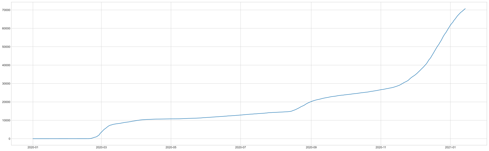
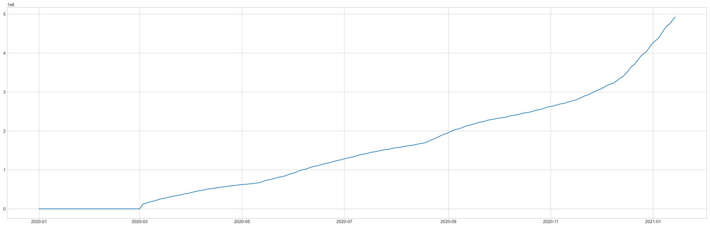
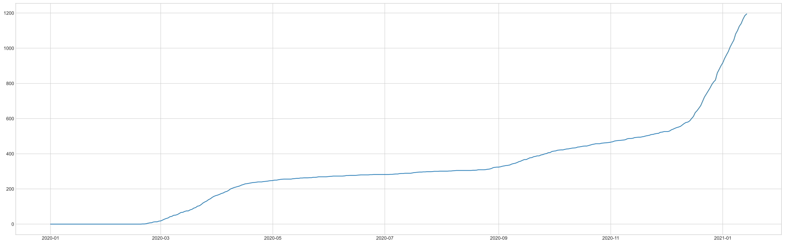
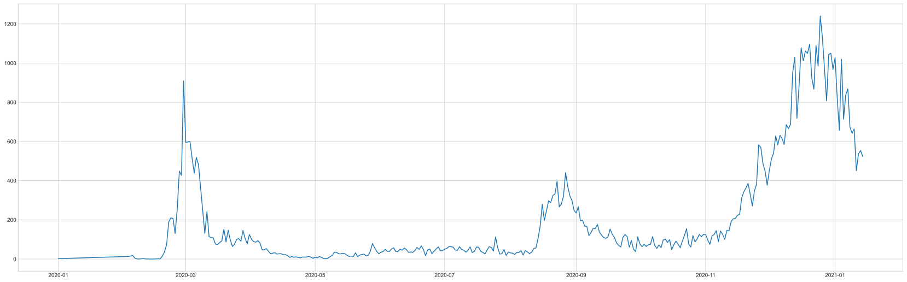
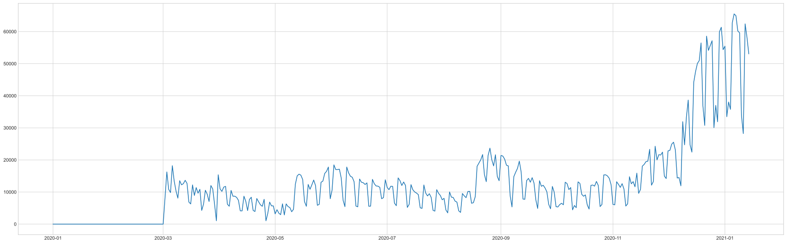

## 공공 데이터 api를 사용하여 코로나 관련 데이터 얻기.
### 자신의 api_key 준비.
### https://www.data.go.kr/tcs/dss/selectApiDataDetailView.do?publicDataPk=15043376 
### 여기서 신청 가능 !!


## api에 조회 시작일과 종료일을 입력한다.
```python
from urllib.request import urlopen
from urllib.parse import urlencode, unquote, quote_plus
import urllib
import requests
import json
import pandas as pd
from datetime import datetime,timedelta

yester = datetime.today() - timedelta(380)
yseter =  yester.strftime("%Y%m%d")
now_today = datetime.today() - timedelta(0)
now_today = now_today.strftime("%Y%m%d") 
print(yseter)
print(now_today)
my_api_key = '__input your api key__'

url = 'http://openapi.data.go.kr/openapi/service/rest/Covid19/getCovid19InfStateJson'
queryParams = '?' + \
'ServiceKey=' + '{}'.format(my_api_key) + \
'&pageNo='+ '1' + \
'&numOfRows='+ '999' + \
'&startCreateDt={}&endCreateDt={}'.format(yseter,now_today)

```
    시작일
    20191231
    종료일
    20210114
    


### xml  >> json >> 데이터 파싱 >> pandas

```python
import xmltodict


result = requests.get(url + queryParams)
# print(result)
result = result.content 
jsonString = json.dumps(xmltodict.parse(result), indent = 4)
jsonString = jsonString.replace('resultCode', '결과코드').replace('resultMsg', '결과메세지').replace('numOfRows', '한 페이지 결과 수').replace('pageNo', '페이지 수').replace('totalCount', '전체 결과 수').replace('seq', '게시글번호(감염현황 고유값)').replace('stateDt', '기준일').replace('stateTime', '기준시간').replace('decideCnt', '누적 확진자 수').replace('clearCnt', '격리해제 수').replace('examCnt', '검사진행 수').replace('deathCnt', '누적 사망자 수').replace('careCnt', '치료중 환자 수').replace('resutlNegCnt', '결과 음성 수').replace('accExamCnt', '누적 검사 수').replace('accExamCompCnt', '누적 검사 완료 수').replace('accDefRate', '누적 확진률').replace('createDt', '등록일시분초').replace('updateDt', '수정일시분초')

js = json.loads(jsonString)
# print(js)
js_check_count = js["response"]['body']['items']['item'][0]['검사진행 수']
js = js["response"]['body']['items']['item']
all_data = pd.DataFrame(js)


```


```python

```

### 필요한 데이터 선택 >> nan 값 0으로 치환 >> 데이터 정렬

```python
select_data = all_data[['기준일','누적 사망자 수','누적 검사 수', '누적 확진자 수']]
# nan 값을 0으로 치환
select_data = select_data.fillna(0)
select_data.sort_values(by = '기준일', inplace = True, ascending = True)
select_data = select_data.reset_index(drop = True)
select_data
```


<div>
<style scoped>
    .dataframe tbody tr th:only-of-type {
        vertical-align: middle;
    }

    .dataframe tbody tr th {
        vertical-align: top;
    }

    .dataframe thead th {
        text-align: right;
    }
</style>
<table border="1" class="dataframe">
  <thead>
    <tr style="text-align: right;">
      <th></th>
      <th>기준일</th>
      <th>누적 사망자 수</th>
      <th>누적 검사 수</th>
      <th>누적 확진자 수</th>
    </tr>
  </thead>
  <tbody>
    <tr>
      <th>0</th>
      <td>20200101</td>
      <td>0</td>
      <td>0</td>
      <td>0</td>
    </tr>
    <tr>
      <th>1</th>
      <td>20200202</td>
      <td>2</td>
      <td>0</td>
      <td>2</td>
    </tr>
    <tr>
      <th>2</th>
      <td>20200203</td>
      <td>0</td>
      <td>0</td>
      <td>15</td>
    </tr>
    <tr>
      <th>3</th>
      <td>20200204</td>
      <td>0</td>
      <td>0</td>
      <td>0</td>
    </tr>
    <tr>
      <th>4</th>
      <td>20200205</td>
      <td>0</td>
      <td>0</td>
      <td>19</td>
    </tr>
    <tr>
      <th>...</th>
      <td>...</td>
      <td>...</td>
      <td>...</td>
      <td>...</td>
    </tr>
    <tr>
      <th>379</th>
      <td>20210110</td>
      <td>1125</td>
      <td>4723463</td>
      <td>68663</td>
    </tr>
    <tr>
      <th>380</th>
      <td>20210111</td>
      <td>1140</td>
      <td>4751685</td>
      <td>69114</td>
    </tr>
    <tr>
      <th>381</th>
      <td>20210112</td>
      <td>1165</td>
      <td>4814085</td>
      <td>69650</td>
    </tr>
    <tr>
      <th>382</th>
      <td>20210113</td>
      <td>1185</td>
      <td>4872312</td>
      <td>70204</td>
    </tr>
    <tr>
      <th>383</th>
      <td>20210114</td>
      <td>1195</td>
      <td>4925359</td>
      <td>70728</td>
    </tr>
  </tbody>
</table>
<p>384 rows × 4 columns</p>
</div>


### 데이터 집계 데이터의 타입 변경

```python
select_data['누적 확진자 수'] = pd.to_numeric(select_data['누적 확진자 수'])
select_data['기준일'] = pd.to_datetime(select_data['기준일'])

# groupby를 사용하여 집계를 할 때 기준 연산을 설정.. 
f = {'누적 확진자 수':'min','누적 검사 수':'max','누적 사망자 수':'max'}
# 기준일을 기준으로 집계
data1 = select_data.groupby('기준일').agg(f)
# 기준일을 기준으로 정렬
data1.sort_values(by = '기준일', inplace=True, ascending = True)
pdata = data1.reset_index(drop = False)
pdata.columns = ['기준일', '누적 확진자 수', '누적 검사 수', '누적 사망자 수']
pdata
```


<div>
<style scoped>
    .dataframe tbody tr th:only-of-type {
        vertical-align: middle;
    }

    .dataframe tbody tr th {
        vertical-align: top;
    }

    .dataframe thead th {
        text-align: right;
    }
</style>
<table border="1" class="dataframe">
  <thead>
    <tr style="text-align: right;">
      <th></th>
      <th>기준일</th>
      <th>누적 확진자 수</th>
      <th>누적 검사 수</th>
      <th>누적 사망자 수</th>
    </tr>
  </thead>
  <tbody>
    <tr>
      <th>0</th>
      <td>2020-01-01</td>
      <td>0</td>
      <td>0</td>
      <td>0</td>
    </tr>
    <tr>
      <th>1</th>
      <td>2020-02-02</td>
      <td>2</td>
      <td>0</td>
      <td>2</td>
    </tr>
    <tr>
      <th>2</th>
      <td>2020-02-03</td>
      <td>15</td>
      <td>0</td>
      <td>0</td>
    </tr>
    <tr>
      <th>3</th>
      <td>2020-02-04</td>
      <td>0</td>
      <td>0</td>
      <td>0</td>
    </tr>
    <tr>
      <th>4</th>
      <td>2020-02-05</td>
      <td>18</td>
      <td>0</td>
      <td>0</td>
    </tr>
    <tr>
      <th>...</th>
      <td>...</td>
      <td>...</td>
      <td>...</td>
      <td>...</td>
    </tr>
    <tr>
      <th>344</th>
      <td>2021-01-10</td>
      <td>68663</td>
      <td>4723463</td>
      <td>1125</td>
    </tr>
    <tr>
      <th>345</th>
      <td>2021-01-11</td>
      <td>69114</td>
      <td>4751685</td>
      <td>1140</td>
    </tr>
    <tr>
      <th>346</th>
      <td>2021-01-12</td>
      <td>69650</td>
      <td>4814085</td>
      <td>1165</td>
    </tr>
    <tr>
      <th>347</th>
      <td>2021-01-13</td>
      <td>70204</td>
      <td>4872312</td>
      <td>1185</td>
    </tr>
    <tr>
      <th>348</th>
      <td>2021-01-14</td>
      <td>70728</td>
      <td>4925359</td>
      <td>1195</td>
    </tr>
  </tbody>
</table>
<p>349 rows × 4 columns</p>
</div>


```python
# 코로나 데이터가 일일 한번 저장되나, 정보의 변경으로 인한 업데이트 등이 일어날수 있다.
# 그래서 정보의 순서를 알지 못하기 때문에 데이터를 비교하여 큰수에서 작은 수를 빼는 함수를 정의했다.
```

### 큰수에서 작은수를 빼는 함수 정의
```python
def compare_sub(a,b):
    if a > b :
        c = a-b
        return c
    else :
        c = b-a
        return c
```

### 일일 검사자, 확진자 수의 데이터가 없으므로
### 누적데이터의 차이로 계산
```python
daily_crn_cnt = []
daily_check_cnt = []
for row in range(0,len(pdata['누적 확진자 수'])-1):
    daily_crn_cnt.append(compare_sub(int(pdata.loc[row+1][1]), int(pdata.loc[row][1])))
    # print(pdata['기준일'][row],',',int(pdata.loc[row+1][1]) ,'-', int(pdata.loc[row][1]) ,'=', compare_sub(int(pdata.loc[row+1][1]), int(pdata.loc[row][1])))
    daily_check_cnt.append(compare_sub(int(pdata.loc[row+1][2]),int(pdata.loc[row][2])))
    # print(pdata['기준일'][row],',',int(pdata.loc[row+1][2]),'-',int(pdata.loc[row][2]), '=', compare_sub(int(pdata.loc[row+1][2]),int(pdata.loc[row][2])))
pdata = pdata.drop(1)
pdata['일일 확진자 수'] = daily_crn_cnt
pdata['일일 검사 수'] = daily_check_cnt
pdata['일일 검사 수'] = pd.to_numeric(pdata["일일 검사 수"])
pdata['누적 사망자 수'] = pd.to_numeric(pdata['누적 사망자 수'])
```


## 그래프 표출하기
## pandas 시리즈 데이터를 numeric 으로 변경

```python
import matplotlib.pyplot as plt
import numpy as np

## 3월 초에 집계가 시작되어 이전 검사수를 모두 더한 데이터가 api상에 저장되있어 
## 그래프 표출시 오해의 소지가 있기 때문에 제거.
print(pdata.keys())
pdata = pdata[pdata["일일 검사 수"] <100000]
for a in pdata.keys():
    if a != '기준일':
        plt.style.use('seaborn-whitegrid')
        plt.figure(figsize=(29,9))
        plt.plot(pdata['기준일'],pdata[a])
        plt.show()


```

    Index(['기준일', '누적 확진자 수', '누적 검사 수', '누적 사망자 수', '일일 확진자 수', '일일 검사 수'], dtype='object')
    


## 누적 확진자 수

    


## 누적 검사 수(십만단위)

    


## 누적 사망자 수    

    


## 일일 확진자 수    

    


## 일일 검사 수 

    


```python
pdata.to_csv("save_corona_data.csv")
```

