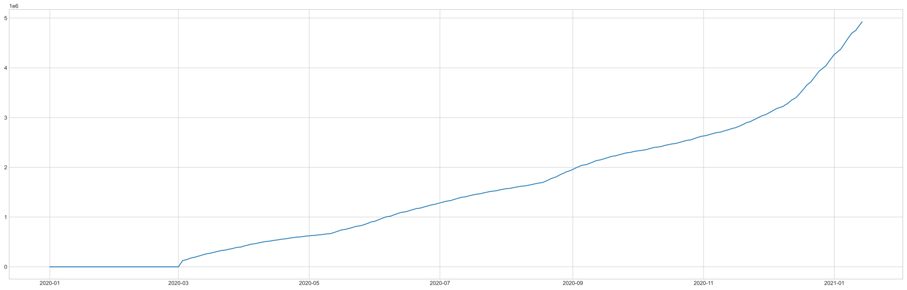
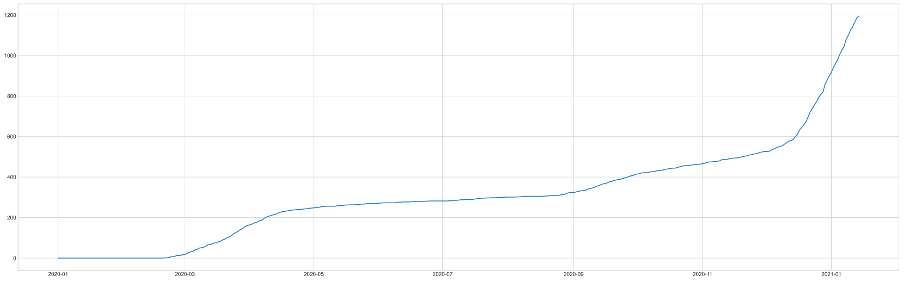
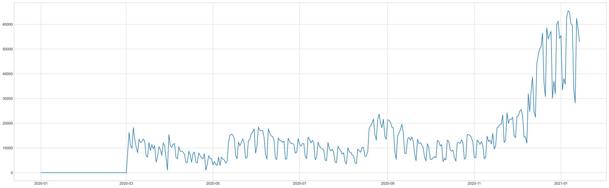

```python
from urllib.request import urlopen
from urllib.parse import urlencode, unquote, quote_plus
import urllib
import requests
import json
import pandas as pd
from datetime import datetime,timedelta

yester = datetime.today() - timedelta(380)
yseter =  yester.strftime("%Y%m%d")
now_today = datetime.today() - timedelta(0)
now_today = now_today.strftime("%Y%m%d") 
print(yseter)
print(now_today)
my_api_key = 'BkVECcgm%2BMWCUGNoYYnEM3j4L4OxbvFI4%2Fjv6G3WrqIWghuXVV1RufSxvrlIp3yq5JZaW%2BjHnSCvyHzZqlbrFw%3D%3D'

url = 'http://openapi.data.go.kr/openapi/service/rest/Covid19/getCovid19InfStateJson'
queryParams = '?' + \
'ServiceKey=' + '{}'.format(my_api_key) + \
'&pageNo='+ '1' + \
'&numOfRows='+ '999' + \
'&startCreateDt={}&endCreateDt={}'.format(yseter,now_today)

```

    20191231
    20210114
    


```python
import xmltodict


result = requests.get(url + queryParams)
# print(result)
result = result.content 
jsonString = json.dumps(xmltodict.parse(result), indent = 4)
jsonString = jsonString.replace('resultCode', '결과코드').replace('resultMsg', '결과메세지').replace('numOfRows', '한 페이지 결과 수').replace('pageNo', '페이지 수').replace('totalCount', '전체 결과 수').replace('seq', '게시글번호(감염현황 고유값)').replace('stateDt', '기준일').replace('stateTime', '기준시간').replace('decideCnt', '누적 확진자 수').replace('clearCnt', '격리해제 수').replace('examCnt', '검사진행 수').replace('deathCnt', '누적 사망자 수').replace('careCnt', '치료중 환자 수').replace('resutlNegCnt', '결과 음성 수').replace('accExamCnt', '누적 검사 수').replace('accExamCompCnt', '누적 검사 완료 수').replace('accDefRate', '누적 확진률').replace('createDt', '등록일시분초').replace('updateDt', '수정일시분초')

js = json.loads(jsonString)
# print(js)
js_check_count = js["response"]['body']['items']['item'][0]['검사진행 수']
js = js["response"]['body']['items']['item']
all_data = pd.DataFrame(js)


```


```python

```


```python
select_data = all_data[['기준일','누적 사망자 수','누적 검사 수', '누적 확진자 수']]
# nan 값을 0으로 치환
select_data = select_data.fillna(0)
select_data.sort_values(by = '기준일', inplace = True, ascending = True)
select_data = select_data.reset_index(drop = True)
select_data
```


<div>
<style scoped>
    .dataframe tbody tr th:only-of-type {
        vertical-align: middle;
    }

    .dataframe tbody tr th {
        vertical-align: top;
    }

    .dataframe thead th {
        text-align: right;
    }
</style>
<table border="1" class="dataframe">
  <thead>
    <tr style="text-align: right;">
      <th></th>
      <th>기준일</th>
      <th>누적 사망자 수</th>
      <th>누적 검사 수</th>
      <th>누적 확진자 수</th>
    </tr>
  </thead>
  <tbody>
    <tr>
      <th>0</th>
      <td>20200101</td>
      <td>0</td>
      <td>0</td>
      <td>0</td>
    </tr>
    <tr>
      <th>1</th>
      <td>20200202</td>
      <td>2</td>
      <td>0</td>
      <td>2</td>
    </tr>
    <tr>
      <th>2</th>
      <td>20200203</td>
      <td>0</td>
      <td>0</td>
      <td>15</td>
    </tr>
    <tr>
      <th>3</th>
      <td>20200204</td>
      <td>0</td>
      <td>0</td>
      <td>0</td>
    </tr>
    <tr>
      <th>4</th>
      <td>20200205</td>
      <td>0</td>
      <td>0</td>
      <td>19</td>
    </tr>
    <tr>
      <th>...</th>
      <td>...</td>
      <td>...</td>
      <td>...</td>
      <td>...</td>
    </tr>
    <tr>
      <th>379</th>
      <td>20210110</td>
      <td>1125</td>
      <td>4723463</td>
      <td>68663</td>
    </tr>
    <tr>
      <th>380</th>
      <td>20210111</td>
      <td>1140</td>
      <td>4751685</td>
      <td>69114</td>
    </tr>
    <tr>
      <th>381</th>
      <td>20210112</td>
      <td>1165</td>
      <td>4814085</td>
      <td>69650</td>
    </tr>
    <tr>
      <th>382</th>
      <td>20210113</td>
      <td>1185</td>
      <td>4872312</td>
      <td>70204</td>
    </tr>
    <tr>
      <th>383</th>
      <td>20210114</td>
      <td>1195</td>
      <td>4925359</td>
      <td>70728</td>
    </tr>
  </tbody>
</table>
<p>384 rows × 4 columns</p>
</div>


```python
select_data['누적 확진자 수'] = pd.to_numeric(select_data['누적 확진자 수'])
select_data['기준일'] = pd.to_datetime(select_data['기준일'])

# groupby를 사용하여 집계를 할 때 기준 연산을 설정.. 
f = {'누적 확진자 수':'min','누적 검사 수':'max','누적 사망자 수':'max'}
# 기준일을 기준으로 집계
data1 = select_data.groupby('기준일').agg(f)
# 기준일을 기준으로 정렬
data1.sort_values(by = '기준일', inplace=True, ascending = True)
pdata = data1.reset_index(drop = False)
pdata.columns = ['기준일', '누적 확진자 수', '누적 검사 수', '누적 사망자 수']
pdata
```


<div>
<style scoped>
    .dataframe tbody tr th:only-of-type {
        vertical-align: middle;
    }

    .dataframe tbody tr th {
        vertical-align: top;
    }

    .dataframe thead th {
        text-align: right;
    }
</style>
<table border="1" class="dataframe">
  <thead>
    <tr style="text-align: right;">
      <th></th>
      <th>기준일</th>
      <th>누적 확진자 수</th>
      <th>누적 검사 수</th>
      <th>누적 사망자 수</th>
    </tr>
  </thead>
  <tbody>
    <tr>
      <th>0</th>
      <td>2020-01-01</td>
      <td>0</td>
      <td>0</td>
      <td>0</td>
    </tr>
    <tr>
      <th>1</th>
      <td>2020-02-02</td>
      <td>2</td>
      <td>0</td>
      <td>2</td>
    </tr>
    <tr>
      <th>2</th>
      <td>2020-02-03</td>
      <td>15</td>
      <td>0</td>
      <td>0</td>
    </tr>
    <tr>
      <th>3</th>
      <td>2020-02-04</td>
      <td>0</td>
      <td>0</td>
      <td>0</td>
    </tr>
    <tr>
      <th>4</th>
      <td>2020-02-05</td>
      <td>18</td>
      <td>0</td>
      <td>0</td>
    </tr>
    <tr>
      <th>...</th>
      <td>...</td>
      <td>...</td>
      <td>...</td>
      <td>...</td>
    </tr>
    <tr>
      <th>344</th>
      <td>2021-01-10</td>
      <td>68663</td>
      <td>4723463</td>
      <td>1125</td>
    </tr>
    <tr>
      <th>345</th>
      <td>2021-01-11</td>
      <td>69114</td>
      <td>4751685</td>
      <td>1140</td>
    </tr>
    <tr>
      <th>346</th>
      <td>2021-01-12</td>
      <td>69650</td>
      <td>4814085</td>
      <td>1165</td>
    </tr>
    <tr>
      <th>347</th>
      <td>2021-01-13</td>
      <td>70204</td>
      <td>4872312</td>
      <td>1185</td>
    </tr>
    <tr>
      <th>348</th>
      <td>2021-01-14</td>
      <td>70728</td>
      <td>4925359</td>
      <td>1195</td>
    </tr>
  </tbody>
</table>
<p>349 rows × 4 columns</p>
</div>


```python
# 코로나 데이터가 일일 한번 저장되나, 정보의 변경으로 인한 업데이트 등이 일어날수 있다.
# 그래서 정보의 순서를 알지 못하기 때문에 데이터를 비교하여 큰수에서 작은 수를 빼는 함수를 정의했다.
```


```python
def compare_sub(a,b):
    if a > b :
        c = a-b
        return c
    else :
        c = b-a
        return c
```


```python
daily_crn_cnt = []
daily_check_cnt = []
for row in range(0,len(pdata['누적 확진자 수'])-1):
    daily_crn_cnt.append(compare_sub(int(pdata.loc[row+1][1]), int(pdata.loc[row][1])))
    # print(pdata['기준일'][row],',',int(pdata.loc[row+1][1]) ,'-', int(pdata.loc[row][1]) ,'=', compare_sub(int(pdata.loc[row+1][1]), int(pdata.loc[row][1])))
    daily_check_cnt.append(compare_sub(int(pdata.loc[row+1][2]),int(pdata.loc[row][2])))
    # print(pdata['기준일'][row],',',int(pdata.loc[row+1][2]),'-',int(pdata.loc[row][2]), '=', compare_sub(int(pdata.loc[row+1][2]),int(pdata.loc[row][2])))
pdata = pdata.drop(1)
pdata['일일 확진자 수'] = daily_crn_cnt
pdata['일일 검사 수'] = daily_check_cnt
pdata['일일 검사 수'] = pd.to_numeric(pdata["일일 검사 수"])
pdata['누적 사망자 수'] = pd.to_numeric(pdata['누적 사망자 수'])
```


```python
## 출력하기
## pandas 시리즈 데이터를 numeric 으로 변경
```


```python
import matplotlib.pyplot as plt
import numpy as np

## 3월 초에 집계가 시작되어 이전 검사수를 모두 더한 데이터가 api상에 저장되있어 
## 그래프 표출시 오해의 소지가 있기 때문에 제거.
print(pdata.keys())
pdata = pdata[pdata["일일 검사 수"] <100000]
for a in pdata.keys():
    if a != '기준일':
        plt.style.use('seaborn-whitegrid')
        plt.figure(figsize=(29,9))
        plt.plot(pdata['기준일'],pdata[a])
        plt.show()


```

    Index(['기준일', '누적 확진자 수', '누적 검사 수', '누적 사망자 수', '일일 확진자 수', '일일 검사 수'], dtype='object')
    


    

    


    

    


    

    


    

    


    

    


```python
pdata.to_csv("save_corona_data.csv")
```


```python
x_data = []
y_data = []
x_list = []
data = pdata['일일 확진자 수']
data =list(data)
# print(data)
for repeat_cnt in range(len(data)-8):

    x_data.append(data[repeat_cnt:repeat_cnt+7])
    y_data.append([data[repeat_cnt+7]])


```


```python
from sklearn.model_selection import train_test_split


x_train, x_test, y_train, y_test = train_test_split(x_data,y_data, test_size =0.3, random_state=123, shuffle =True)
x_valid, x_test, y_valid, y_test = train_test_split(x_test,y_test, test_size =0.3, random_state=123, shuffle =True)

print("count_x_train :",len(x_train),',',"count_x_test :",len(x_test),',',"count_x_valid :",len(x_valid),',',"count_y_train :",len(y_train),',',"count_y_test :",len(y_test),',',"count_y_valid :",len(y_valid))
## shape 과 type확인.
```

    count_x_train : 194 , count_x_test : 26 , count_x_valid : 58 , count_y_train : 194 , count_y_test : 26 , count_y_valid : 58
    


```python
import urllib.request
import zipfile
import numpy as np
from IPython.display import Image

import tensorflow as tf
from tensorflow.keras.layers import Conv2D, MaxPooling2D, Flatten, Dropout, Dense,BatchNormalization
from tensorflow.keras.models import Sequential
from tensorflow.keras.callbacks import ModelCheckpoint


model = Sequential([
        Dense(16,activation='relu',input_shape=(None,7)),
        # BatchNormalization(),
        Dropout(0.1),
        Dense(8,activation='relu'),
        Dense(4,activation='relu'),
        Dense(1),
])

checkpoint_path = 'model_checkpoin.ckpt'
checkpoint = ModelCheckpoint(checkpoint_path, 
                             save_weights_only=True, 
                             save_best_only=True, 
                             monitor='val_loss',
                             verbose=2)
model.compile(loss='mse', optimizer='adam', metrics=['accuracy'])


history = model.fit(x_train, y_train,
                    # batch_size=10,
                    epochs =1000,
                    validation_data=(x_valid, y_valid),
                    verbose=2,
                    callbacks=[checkpoint],)


```

    Epoch 1/1000
    WARNING:tensorflow:Model was constructed with shape (None, None, 7) for input Tensor("dense_4_input:0", shape=(None, None, 7), dtype=float32), but it was called on an input with incompatible shape (None, 7).
    WARNING:tensorflow:Model was constructed with shape (None, None, 7) for input Tensor("dense_4_input:0", shape=(None, None, 7), dtype=float32), but it was called on an input with incompatible shape (None, 7).
    WARNING:tensorflow:Model was constructed with shape (None, None, 7) for input Tensor("dense_4_input:0", shape=(None, None, 7), dtype=float32), but it was called on an input with incompatible shape (None, 7).
    
    Epoch 00001: val_loss improved from inf to 49667.34375, saving model to model_checkpoin.ckpt
    7/7 - 0s - loss: 45443.1484 - accuracy: 0.0000e+00 - val_loss: 49667.3438 - val_accuracy: 0.0000e+00
    Epoch 2/1000
    
    Epoch 00002: val_loss improved from 49667.34375 to 48393.87109, saving model to model_checkpoin.ckpt
    7/7 - 0s - loss: 45061.1641 - accuracy: 0.0000e+00 - val_loss: 48393.8711 - val_accuracy: 0.0000e+00
    Epoch 3/1000
    
    Epoch 00003: val_loss improved from 48393.87109 to 46785.08594, saving model to model_checkpoin.ckpt
    7/7 - 0s - loss: 42946.0430 - accuracy: 0.0000e+00 - val_loss: 46785.0859 - val_accuracy: 0.0000e+00
    Epoch 4/1000
    
    Epoch 00004: val_loss improved from 46785.08594 to 44746.25000, saving model to model_checkpoin.ckpt
    7/7 - 0s - loss: 40989.9297 - accuracy: 0.0000e+00 - val_loss: 44746.2500 - val_accuracy: 0.0000e+00
    Epoch 5/1000
    
    Epoch 00005: val_loss improved from 44746.25000 to 42348.38672, saving model to model_checkpoin.ckpt
    7/7 - 0s - loss: 38782.4102 - accuracy: 0.0000e+00 - val_loss: 42348.3867 - val_accuracy: 0.0000e+00
    Epoch 6/1000
    
    Epoch 00006: val_loss improved from 42348.38672 to 39992.39062, saving model to model_checkpoin.ckpt
    7/7 - 0s - loss: 37219.2930 - accuracy: 0.0000e+00 - val_loss: 39992.3906 - val_accuracy: 0.0000e+00
    Epoch 7/1000
    
    Epoch 00007: val_loss improved from 39992.39062 to 37663.48828, saving model to model_checkpoin.ckpt
    7/7 - 0s - loss: 34437.9570 - accuracy: 0.0000e+00 - val_loss: 37663.4883 - val_accuracy: 0.0000e+00
    Epoch 8/1000
    
    Epoch 00008: val_loss improved from 37663.48828 to 35205.84766, saving model to model_checkpoin.ckpt
    7/7 - 0s - loss: 33019.9414 - accuracy: 0.0000e+00 - val_loss: 35205.8477 - val_accuracy: 0.0000e+00
    Epoch 9/1000
    
    Epoch 00009: val_loss improved from 35205.84766 to 32306.49219, saving model to model_checkpoin.ckpt
    7/7 - 0s - loss: 30780.6211 - accuracy: 0.0000e+00 - val_loss: 32306.4922 - val_accuracy: 0.0000e+00
    Epoch 10/1000
    
    Epoch 00010: val_loss improved from 32306.49219 to 29030.57031, saving model to model_checkpoin.ckpt
    7/7 - 0s - loss: 27494.2148 - accuracy: 0.0000e+00 - val_loss: 29030.5703 - val_accuracy: 0.0000e+00
    Epoch 11/1000
    
    Epoch 00011: val_loss improved from 29030.57031 to 25559.00391, saving model to model_checkpoin.ckpt
    7/7 - 0s - loss: 24814.2793 - accuracy: 0.0000e+00 - val_loss: 25559.0039 - val_accuracy: 0.0000e+00
    Epoch 12/1000
    
    Epoch 00012: val_loss improved from 25559.00391 to 21709.72461, saving model to model_checkpoin.ckpt
    7/7 - 0s - loss: 21980.9785 - accuracy: 0.0000e+00 - val_loss: 21709.7246 - val_accuracy: 0.0000e+00
    Epoch 13/1000
    
    Epoch 00013: val_loss improved from 21709.72461 to 17615.34961, saving model to model_checkpoin.ckpt
    7/7 - 0s - loss: 18826.6328 - accuracy: 0.0000e+00 - val_loss: 17615.3496 - val_accuracy: 0.0000e+00
    Epoch 14/1000
    
    Epoch 00014: val_loss improved from 17615.34961 to 13658.74316, saving model to model_checkpoin.ckpt
    7/7 - 0s - loss: 14584.9062 - accuracy: 0.0000e+00 - val_loss: 13658.7432 - val_accuracy: 0.0000e+00
    Epoch 15/1000
    
    Epoch 00015: val_loss improved from 13658.74316 to 9960.63672, saving model to model_checkpoin.ckpt
    7/7 - 0s - loss: 11556.2783 - accuracy: 0.0000e+00 - val_loss: 9960.6367 - val_accuracy: 0.0000e+00
    Epoch 16/1000
    
    Epoch 00016: val_loss improved from 9960.63672 to 6956.38477, saving model to model_checkpoin.ckpt
    7/7 - 0s - loss: 8967.6621 - accuracy: 0.0000e+00 - val_loss: 6956.3848 - val_accuracy: 0.0000e+00
    Epoch 17/1000
    
    Epoch 00017: val_loss improved from 6956.38477 to 4736.46484, saving model to model_checkpoin.ckpt
    7/7 - 0s - loss: 6215.1206 - accuracy: 0.0000e+00 - val_loss: 4736.4648 - val_accuracy: 0.0000e+00
    Epoch 18/1000
    
    Epoch 00018: val_loss improved from 4736.46484 to 3559.18506, saving model to model_checkpoin.ckpt
    7/7 - 0s - loss: 3755.6523 - accuracy: 0.0000e+00 - val_loss: 3559.1851 - val_accuracy: 0.0000e+00
    Epoch 19/1000
    
    Epoch 00019: val_loss improved from 3559.18506 to 2992.13892, saving model to model_checkpoin.ckpt
    7/7 - 0s - loss: 4504.1113 - accuracy: 0.0000e+00 - val_loss: 2992.1389 - val_accuracy: 0.0000e+00
    Epoch 20/1000
    
    Epoch 00020: val_loss did not improve from 2992.13892
    7/7 - 0s - loss: 4204.0278 - accuracy: 0.0000e+00 - val_loss: 3048.0845 - val_accuracy: 0.0000e+00
    Epoch 21/1000
    
    Epoch 00021: val_loss did not improve from 2992.13892
    7/7 - 0s - loss: 4348.6680 - accuracy: 0.0000e+00 - val_loss: 3240.9683 - val_accuracy: 0.0000e+00
    Epoch 22/1000
    
    Epoch 00022: val_loss did not improve from 2992.13892
    7/7 - 0s - loss: 3846.4880 - accuracy: 0.0000e+00 - val_loss: 3154.9834 - val_accuracy: 0.0000e+00
    Epoch 23/1000
    
    Epoch 00023: val_loss did not improve from 2992.13892
    7/7 - 0s - loss: 4779.2661 - accuracy: 0.0000e+00 - val_loss: 2997.3833 - val_accuracy: 0.0000e+00
    Epoch 24/1000
    
    Epoch 00024: val_loss improved from 2992.13892 to 2964.68286, saving model to model_checkpoin.ckpt
    7/7 - 0s - loss: 3305.8713 - accuracy: 0.0000e+00 - val_loss: 2964.6829 - val_accuracy: 0.0000e+00
    Epoch 25/1000
    
    Epoch 00025: val_loss did not improve from 2964.68286
    7/7 - 0s - loss: 3921.5532 - accuracy: 0.0000e+00 - val_loss: 3007.1194 - val_accuracy: 0.0000e+00
    Epoch 26/1000
    
    Epoch 00026: val_loss did not improve from 2964.68286
    7/7 - 0s - loss: 6199.1553 - accuracy: 0.0000e+00 - val_loss: 3046.8977 - val_accuracy: 0.0000e+00
    Epoch 27/1000
    
    Epoch 00027: val_loss did not improve from 2964.68286
    7/7 - 0s - loss: 3631.3701 - accuracy: 0.0000e+00 - val_loss: 3047.0964 - val_accuracy: 0.0000e+00
    Epoch 28/1000
    
    Epoch 00028: val_loss did not improve from 2964.68286
    7/7 - 0s - loss: 4086.2124 - accuracy: 0.0000e+00 - val_loss: 3079.6116 - val_accuracy: 0.0000e+00
    Epoch 29/1000
    
    Epoch 00029: val_loss did not improve from 2964.68286
    7/7 - 0s - loss: 3344.3005 - accuracy: 0.0000e+00 - val_loss: 3058.0789 - val_accuracy: 0.0000e+00
    Epoch 30/1000
    
    Epoch 00030: val_loss did not improve from 2964.68286
    7/7 - 0s - loss: 3121.9990 - accuracy: 0.0000e+00 - val_loss: 3035.2932 - val_accuracy: 0.0000e+00
    Epoch 31/1000
    
    Epoch 00031: val_loss did not improve from 2964.68286
    7/7 - 0s - loss: 3858.1606 - accuracy: 0.0000e+00 - val_loss: 2984.5476 - val_accuracy: 0.0000e+00
    Epoch 32/1000
    
    Epoch 00032: val_loss did not improve from 2964.68286
    7/7 - 0s - loss: 3270.0693 - accuracy: 0.0000e+00 - val_loss: 2975.6021 - val_accuracy: 0.0000e+00
    Epoch 33/1000
    
    Epoch 00033: val_loss did not improve from 2964.68286
    7/7 - 0s - loss: 3534.9578 - accuracy: 0.0000e+00 - val_loss: 3097.5127 - val_accuracy: 0.0000e+00
    Epoch 34/1000
    
    Epoch 00034: val_loss did not improve from 2964.68286
    7/7 - 0s - loss: 3550.4927 - accuracy: 0.0000e+00 - val_loss: 3115.5461 - val_accuracy: 0.0000e+00
    Epoch 35/1000
    
    Epoch 00035: val_loss did not improve from 2964.68286
    7/7 - 0s - loss: 5360.9019 - accuracy: 0.0000e+00 - val_loss: 3083.8423 - val_accuracy: 0.0000e+00
    Epoch 36/1000
    
    Epoch 00036: val_loss did not improve from 2964.68286
    7/7 - 0s - loss: 2928.8118 - accuracy: 0.0000e+00 - val_loss: 3065.1794 - val_accuracy: 0.0000e+00
    Epoch 37/1000
    
    Epoch 00037: val_loss did not improve from 2964.68286
    7/7 - 0s - loss: 3535.9705 - accuracy: 0.0000e+00 - val_loss: 2998.7661 - val_accuracy: 0.0000e+00
    Epoch 38/1000
    
    Epoch 00038: val_loss improved from 2964.68286 to 2912.11182, saving model to model_checkpoin.ckpt
    7/7 - 0s - loss: 3347.7844 - accuracy: 0.0000e+00 - val_loss: 2912.1118 - val_accuracy: 0.0000e+00
    Epoch 39/1000
    
    Epoch 00039: val_loss improved from 2912.11182 to 2909.95386, saving model to model_checkpoin.ckpt
    7/7 - 0s - loss: 3420.6541 - accuracy: 0.0000e+00 - val_loss: 2909.9539 - val_accuracy: 0.0000e+00
    Epoch 40/1000
    
    Epoch 00040: val_loss improved from 2909.95386 to 2907.12280, saving model to model_checkpoin.ckpt
    7/7 - 0s - loss: 4439.7422 - accuracy: 0.0000e+00 - val_loss: 2907.1228 - val_accuracy: 0.0000e+00
    Epoch 41/1000
    
    Epoch 00041: val_loss improved from 2907.12280 to 2903.55444, saving model to model_checkpoin.ckpt
    7/7 - 0s - loss: 2705.8740 - accuracy: 0.0000e+00 - val_loss: 2903.5544 - val_accuracy: 0.0000e+00
    Epoch 42/1000
    
    Epoch 00042: val_loss improved from 2903.55444 to 2900.86157, saving model to model_checkpoin.ckpt
    7/7 - 0s - loss: 3225.3689 - accuracy: 0.0000e+00 - val_loss: 2900.8616 - val_accuracy: 0.0000e+00
    Epoch 43/1000
    
    Epoch 00043: val_loss improved from 2900.86157 to 2894.38135, saving model to model_checkpoin.ckpt
    7/7 - 0s - loss: 3225.6282 - accuracy: 0.0000e+00 - val_loss: 2894.3813 - val_accuracy: 0.0000e+00
    Epoch 44/1000
    
    Epoch 00044: val_loss improved from 2894.38135 to 2888.57715, saving model to model_checkpoin.ckpt
    7/7 - 0s - loss: 3805.5220 - accuracy: 0.0000e+00 - val_loss: 2888.5771 - val_accuracy: 0.0000e+00
    Epoch 45/1000
    
    Epoch 00045: val_loss did not improve from 2888.57715
    7/7 - 0s - loss: 3518.1484 - accuracy: 0.0000e+00 - val_loss: 2900.5942 - val_accuracy: 0.0000e+00
    Epoch 46/1000
    
    Epoch 00046: val_loss did not improve from 2888.57715
    7/7 - 0s - loss: 4921.4922 - accuracy: 0.0000e+00 - val_loss: 2941.4915 - val_accuracy: 0.0000e+00
    Epoch 47/1000
    
    Epoch 00047: val_loss did not improve from 2888.57715
    7/7 - 0s - loss: 2730.9973 - accuracy: 0.0000e+00 - val_loss: 2962.8948 - val_accuracy: 0.0000e+00
    Epoch 48/1000
    
    Epoch 00048: val_loss did not improve from 2888.57715
    7/7 - 0s - loss: 3191.2136 - accuracy: 0.0000e+00 - val_loss: 2967.7007 - val_accuracy: 0.0000e+00
    Epoch 49/1000
    
    Epoch 00049: val_loss did not improve from 2888.57715
    7/7 - 0s - loss: 3788.7874 - accuracy: 0.0000e+00 - val_loss: 2972.1899 - val_accuracy: 0.0000e+00
    Epoch 50/1000
    
    Epoch 00050: val_loss did not improve from 2888.57715
    7/7 - 0s - loss: 3145.5305 - accuracy: 0.0000e+00 - val_loss: 2999.5659 - val_accuracy: 0.0000e+00
    Epoch 51/1000
    
    Epoch 00051: val_loss did not improve from 2888.57715
    7/7 - 0s - loss: 2865.1096 - accuracy: 0.0000e+00 - val_loss: 3005.3721 - val_accuracy: 0.0000e+00
    Epoch 52/1000
    
    Epoch 00052: val_loss did not improve from 2888.57715
    7/7 - 0s - loss: 3344.2043 - accuracy: 0.0000e+00 - val_loss: 2998.3330 - val_accuracy: 0.0000e+00
    Epoch 53/1000
    
    Epoch 00053: val_loss did not improve from 2888.57715
    7/7 - 0s - loss: 3063.3408 - accuracy: 0.0000e+00 - val_loss: 2989.6006 - val_accuracy: 0.0000e+00
    Epoch 54/1000
    
    Epoch 00054: val_loss did not improve from 2888.57715
    7/7 - 0s - loss: 4392.3433 - accuracy: 0.0000e+00 - val_loss: 2950.3870 - val_accuracy: 0.0000e+00
    Epoch 55/1000
    
    Epoch 00055: val_loss improved from 2888.57715 to 2880.77808, saving model to model_checkpoin.ckpt
    7/7 - 0s - loss: 4421.1113 - accuracy: 0.0000e+00 - val_loss: 2880.7781 - val_accuracy: 0.0000e+00
    Epoch 56/1000
    
    Epoch 00056: val_loss did not improve from 2880.77808
    7/7 - 0s - loss: 3743.8599 - accuracy: 0.0000e+00 - val_loss: 2938.4810 - val_accuracy: 0.0000e+00
    Epoch 57/1000
    
    Epoch 00057: val_loss did not improve from 2880.77808
    7/7 - 0s - loss: 2923.5869 - accuracy: 0.0000e+00 - val_loss: 2944.7551 - val_accuracy: 0.0000e+00
    Epoch 58/1000
    
    Epoch 00058: val_loss did not improve from 2880.77808
    7/7 - 0s - loss: 4284.0791 - accuracy: 0.0000e+00 - val_loss: 2900.7886 - val_accuracy: 0.0000e+00
    Epoch 59/1000
    
    Epoch 00059: val_loss improved from 2880.77808 to 2839.46558, saving model to model_checkpoin.ckpt
    7/7 - 0s - loss: 3867.5989 - accuracy: 0.0000e+00 - val_loss: 2839.4656 - val_accuracy: 0.0000e+00
    Epoch 60/1000
    
    Epoch 00060: val_loss did not improve from 2839.46558
    7/7 - 0s - loss: 3818.8284 - accuracy: 0.0000e+00 - val_loss: 2848.8801 - val_accuracy: 0.0000e+00
    Epoch 61/1000
    
    Epoch 00061: val_loss did not improve from 2839.46558
    7/7 - 0s - loss: 3091.4519 - accuracy: 0.0000e+00 - val_loss: 2897.2925 - val_accuracy: 0.0000e+00
    Epoch 62/1000
    
    Epoch 00062: val_loss did not improve from 2839.46558
    7/7 - 0s - loss: 3163.7383 - accuracy: 0.0000e+00 - val_loss: 2924.7256 - val_accuracy: 0.0000e+00
    Epoch 63/1000
    
    Epoch 00063: val_loss did not improve from 2839.46558
    7/7 - 0s - loss: 3608.4758 - accuracy: 0.0000e+00 - val_loss: 2919.9146 - val_accuracy: 0.0000e+00
    Epoch 64/1000
    
    Epoch 00064: val_loss did not improve from 2839.46558
    7/7 - 0s - loss: 3458.3042 - accuracy: 0.0000e+00 - val_loss: 2969.5728 - val_accuracy: 0.0000e+00
    Epoch 65/1000
    
    Epoch 00065: val_loss did not improve from 2839.46558
    7/7 - 0s - loss: 2934.7236 - accuracy: 0.0000e+00 - val_loss: 3014.4639 - val_accuracy: 0.0000e+00
    Epoch 66/1000
    
    Epoch 00066: val_loss did not improve from 2839.46558
    7/7 - 0s - loss: 3819.3401 - accuracy: 0.0000e+00 - val_loss: 3006.6306 - val_accuracy: 0.0000e+00
    Epoch 67/1000
    
    Epoch 00067: val_loss did not improve from 2839.46558
    7/7 - 0s - loss: 2874.0471 - accuracy: 0.0000e+00 - val_loss: 2898.0122 - val_accuracy: 0.0000e+00
    Epoch 68/1000
    
    Epoch 00068: val_loss did not improve from 2839.46558
    7/7 - 0s - loss: 2818.3860 - accuracy: 0.0000e+00 - val_loss: 2841.5786 - val_accuracy: 0.0000e+00
    Epoch 69/1000
    
    Epoch 00069: val_loss improved from 2839.46558 to 2806.81885, saving model to model_checkpoin.ckpt
    7/7 - 0s - loss: 4628.9590 - accuracy: 0.0000e+00 - val_loss: 2806.8188 - val_accuracy: 0.0000e+00
    Epoch 70/1000
    
    Epoch 00070: val_loss improved from 2806.81885 to 2797.94824, saving model to model_checkpoin.ckpt
    7/7 - 0s - loss: 3230.7327 - accuracy: 0.0000e+00 - val_loss: 2797.9482 - val_accuracy: 0.0000e+00
    Epoch 71/1000
    
    Epoch 00071: val_loss improved from 2797.94824 to 2792.24219, saving model to model_checkpoin.ckpt
    7/7 - 0s - loss: 4084.8772 - accuracy: 0.0000e+00 - val_loss: 2792.2422 - val_accuracy: 0.0000e+00
    Epoch 72/1000
    
    Epoch 00072: val_loss improved from 2792.24219 to 2788.06250, saving model to model_checkpoin.ckpt
    7/7 - 0s - loss: 2929.3538 - accuracy: 0.0000e+00 - val_loss: 2788.0625 - val_accuracy: 0.0000e+00
    Epoch 73/1000
    
    Epoch 00073: val_loss improved from 2788.06250 to 2785.09473, saving model to model_checkpoin.ckpt
    7/7 - 0s - loss: 3118.6191 - accuracy: 0.0000e+00 - val_loss: 2785.0947 - val_accuracy: 0.0000e+00
    Epoch 74/1000
    
    Epoch 00074: val_loss improved from 2785.09473 to 2783.18945, saving model to model_checkpoin.ckpt
    7/7 - 0s - loss: 4243.8281 - accuracy: 0.0000e+00 - val_loss: 2783.1895 - val_accuracy: 0.0000e+00
    Epoch 75/1000
    
    Epoch 00075: val_loss improved from 2783.18945 to 2780.99561, saving model to model_checkpoin.ckpt
    7/7 - 0s - loss: 4282.3945 - accuracy: 0.0000e+00 - val_loss: 2780.9956 - val_accuracy: 0.0000e+00
    Epoch 76/1000
    
    Epoch 00076: val_loss did not improve from 2780.99561
    7/7 - 0s - loss: 3021.4932 - accuracy: 0.0000e+00 - val_loss: 2781.8899 - val_accuracy: 0.0000e+00
    Epoch 77/1000
    
    Epoch 00077: val_loss did not improve from 2780.99561
    7/7 - 0s - loss: 4887.4658 - accuracy: 0.0000e+00 - val_loss: 2791.3835 - val_accuracy: 0.0000e+00
    Epoch 78/1000
    
    Epoch 00078: val_loss did not improve from 2780.99561
    7/7 - 0s - loss: 3325.0898 - accuracy: 0.0000e+00 - val_loss: 2796.2856 - val_accuracy: 0.0000e+00
    Epoch 79/1000
    
    Epoch 00079: val_loss did not improve from 2780.99561
    7/7 - 0s - loss: 4571.4697 - accuracy: 0.0000e+00 - val_loss: 2782.4521 - val_accuracy: 0.0000e+00
    Epoch 80/1000
    
    Epoch 00080: val_loss improved from 2780.99561 to 2767.73486, saving model to model_checkpoin.ckpt
    7/7 - 0s - loss: 4131.8281 - accuracy: 0.0000e+00 - val_loss: 2767.7349 - val_accuracy: 0.0000e+00
    Epoch 81/1000
    
    Epoch 00081: val_loss did not improve from 2767.73486
    7/7 - 0s - loss: 2800.7407 - accuracy: 0.0000e+00 - val_loss: 2770.4651 - val_accuracy: 0.0000e+00
    Epoch 82/1000
    
    Epoch 00082: val_loss did not improve from 2767.73486
    7/7 - 0s - loss: 2802.3884 - accuracy: 0.0000e+00 - val_loss: 2830.0564 - val_accuracy: 0.0000e+00
    Epoch 83/1000
    
    Epoch 00083: val_loss did not improve from 2767.73486
    7/7 - 0s - loss: 2740.4014 - accuracy: 0.0000e+00 - val_loss: 2915.6309 - val_accuracy: 0.0000e+00
    Epoch 84/1000
    
    Epoch 00084: val_loss did not improve from 2767.73486
    7/7 - 0s - loss: 3953.7456 - accuracy: 0.0000e+00 - val_loss: 2910.4897 - val_accuracy: 0.0000e+00
    Epoch 85/1000
    
    Epoch 00085: val_loss did not improve from 2767.73486
    7/7 - 0s - loss: 3528.0452 - accuracy: 0.0000e+00 - val_loss: 2797.9746 - val_accuracy: 0.0000e+00
    Epoch 86/1000
    
    Epoch 00086: val_loss improved from 2767.73486 to 2754.43384, saving model to model_checkpoin.ckpt
    7/7 - 0s - loss: 2642.6304 - accuracy: 0.0000e+00 - val_loss: 2754.4338 - val_accuracy: 0.0000e+00
    Epoch 87/1000
    
    Epoch 00087: val_loss did not improve from 2754.43384
    7/7 - 0s - loss: 3130.0627 - accuracy: 0.0000e+00 - val_loss: 2875.4817 - val_accuracy: 0.0000e+00
    Epoch 88/1000
    
    Epoch 00088: val_loss did not improve from 2754.43384
    7/7 - 0s - loss: 2511.6414 - accuracy: 0.0000e+00 - val_loss: 2823.5669 - val_accuracy: 0.0000e+00
    Epoch 89/1000
    
    Epoch 00089: val_loss did not improve from 2754.43384
    7/7 - 0s - loss: 3108.3545 - accuracy: 0.0000e+00 - val_loss: 2756.2866 - val_accuracy: 0.0000e+00
    Epoch 90/1000
    
    Epoch 00090: val_loss improved from 2754.43384 to 2698.44580, saving model to model_checkpoin.ckpt
    7/7 - 0s - loss: 4188.5659 - accuracy: 0.0000e+00 - val_loss: 2698.4458 - val_accuracy: 0.0000e+00
    Epoch 91/1000
    
    Epoch 00091: val_loss improved from 2698.44580 to 2657.66577, saving model to model_checkpoin.ckpt
    7/7 - 0s - loss: 4131.0771 - accuracy: 0.0000e+00 - val_loss: 2657.6658 - val_accuracy: 0.0000e+00
    Epoch 92/1000
    
    Epoch 00092: val_loss improved from 2657.66577 to 2638.99023, saving model to model_checkpoin.ckpt
    7/7 - 0s - loss: 3249.6707 - accuracy: 0.0000e+00 - val_loss: 2638.9902 - val_accuracy: 0.0000e+00
    Epoch 93/1000
    
    Epoch 00093: val_loss did not improve from 2638.99023
    7/7 - 0s - loss: 3419.7380 - accuracy: 0.0000e+00 - val_loss: 2730.0652 - val_accuracy: 0.0000e+00
    Epoch 94/1000
    
    Epoch 00094: val_loss did not improve from 2638.99023
    7/7 - 0s - loss: 3440.5251 - accuracy: 0.0000e+00 - val_loss: 2933.0857 - val_accuracy: 0.0000e+00
    Epoch 95/1000
    
    Epoch 00095: val_loss did not improve from 2638.99023
    7/7 - 0s - loss: 3377.5107 - accuracy: 0.0000e+00 - val_loss: 2867.5879 - val_accuracy: 0.0000e+00
    Epoch 96/1000
    
    Epoch 00096: val_loss did not improve from 2638.99023
    7/7 - 0s - loss: 3394.0767 - accuracy: 0.0000e+00 - val_loss: 2745.2554 - val_accuracy: 0.0000e+00
    Epoch 97/1000
    
    Epoch 00097: val_loss did not improve from 2638.99023
    7/7 - 0s - loss: 2677.7881 - accuracy: 0.0000e+00 - val_loss: 2687.8542 - val_accuracy: 0.0000e+00
    Epoch 98/1000
    
    Epoch 00098: val_loss did not improve from 2638.99023
    7/7 - 0s - loss: 2730.1172 - accuracy: 0.0000e+00 - val_loss: 2699.0234 - val_accuracy: 0.0000e+00
    Epoch 99/1000
    
    Epoch 00099: val_loss did not improve from 2638.99023
    7/7 - 0s - loss: 2954.2019 - accuracy: 0.0000e+00 - val_loss: 2721.4048 - val_accuracy: 0.0000e+00
    Epoch 100/1000
    
    Epoch 00100: val_loss did not improve from 2638.99023
    7/7 - 0s - loss: 3247.2754 - accuracy: 0.0000e+00 - val_loss: 2719.5002 - val_accuracy: 0.0000e+00
    Epoch 101/1000
    
    Epoch 00101: val_loss did not improve from 2638.99023
    7/7 - 0s - loss: 3067.2058 - accuracy: 0.0000e+00 - val_loss: 2690.7390 - val_accuracy: 0.0000e+00
    Epoch 102/1000
    
    Epoch 00102: val_loss did not improve from 2638.99023
    7/7 - 0s - loss: 3462.8777 - accuracy: 0.0000e+00 - val_loss: 2668.4858 - val_accuracy: 0.0000e+00
    Epoch 103/1000
    
    Epoch 00103: val_loss improved from 2638.99023 to 2632.61133, saving model to model_checkpoin.ckpt
    7/7 - 0s - loss: 3552.6484 - accuracy: 0.0000e+00 - val_loss: 2632.6113 - val_accuracy: 0.0000e+00
    Epoch 104/1000
    
    Epoch 00104: val_loss improved from 2632.61133 to 2607.94263, saving model to model_checkpoin.ckpt
    7/7 - 0s - loss: 2783.3418 - accuracy: 0.0000e+00 - val_loss: 2607.9426 - val_accuracy: 0.0000e+00
    Epoch 105/1000
    
    Epoch 00105: val_loss improved from 2607.94263 to 2585.31030, saving model to model_checkpoin.ckpt
    7/7 - 0s - loss: 4267.0435 - accuracy: 0.0000e+00 - val_loss: 2585.3103 - val_accuracy: 0.0000e+00
    Epoch 106/1000
    
    Epoch 00106: val_loss improved from 2585.31030 to 2540.67017, saving model to model_checkpoin.ckpt
    7/7 - 0s - loss: 3247.1472 - accuracy: 0.0000e+00 - val_loss: 2540.6702 - val_accuracy: 0.0000e+00
    Epoch 107/1000
    
    Epoch 00107: val_loss improved from 2540.67017 to 2457.11108, saving model to model_checkpoin.ckpt
    7/7 - 0s - loss: 3825.5474 - accuracy: 0.0000e+00 - val_loss: 2457.1111 - val_accuracy: 0.0000e+00
    Epoch 108/1000
    
    Epoch 00108: val_loss improved from 2457.11108 to 2426.90576, saving model to model_checkpoin.ckpt
    7/7 - 0s - loss: 3084.0505 - accuracy: 0.0000e+00 - val_loss: 2426.9058 - val_accuracy: 0.0000e+00
    Epoch 109/1000
    
    Epoch 00109: val_loss improved from 2426.90576 to 2393.56323, saving model to model_checkpoin.ckpt
    7/7 - 0s - loss: 5893.8442 - accuracy: 0.0000e+00 - val_loss: 2393.5632 - val_accuracy: 0.0000e+00
    Epoch 110/1000
    
    Epoch 00110: val_loss improved from 2393.56323 to 2381.80371, saving model to model_checkpoin.ckpt
    7/7 - 0s - loss: 3061.6975 - accuracy: 0.0000e+00 - val_loss: 2381.8037 - val_accuracy: 0.0000e+00
    Epoch 111/1000
    
    Epoch 00111: val_loss improved from 2381.80371 to 2339.23145, saving model to model_checkpoin.ckpt
    7/7 - 0s - loss: 4344.0679 - accuracy: 0.0000e+00 - val_loss: 2339.2314 - val_accuracy: 0.0000e+00
    Epoch 112/1000
    
    Epoch 00112: val_loss improved from 2339.23145 to 2300.28442, saving model to model_checkpoin.ckpt
    7/7 - 0s - loss: 2012.3262 - accuracy: 0.0000e+00 - val_loss: 2300.2844 - val_accuracy: 0.0000e+00
    Epoch 113/1000
    
    Epoch 00113: val_loss improved from 2300.28442 to 2264.54517, saving model to model_checkpoin.ckpt
    7/7 - 0s - loss: 3630.6140 - accuracy: 0.0000e+00 - val_loss: 2264.5452 - val_accuracy: 0.0000e+00
    Epoch 114/1000
    
    Epoch 00114: val_loss improved from 2264.54517 to 2250.07764, saving model to model_checkpoin.ckpt
    7/7 - 0s - loss: 3524.1482 - accuracy: 0.0000e+00 - val_loss: 2250.0776 - val_accuracy: 0.0000e+00
    Epoch 115/1000
    
    Epoch 00115: val_loss improved from 2250.07764 to 2244.45801, saving model to model_checkpoin.ckpt
    7/7 - 0s - loss: 4854.7119 - accuracy: 0.0000e+00 - val_loss: 2244.4580 - val_accuracy: 0.0000e+00
    Epoch 116/1000
    
    Epoch 00116: val_loss improved from 2244.45801 to 2234.13379, saving model to model_checkpoin.ckpt
    7/7 - 0s - loss: 2757.4626 - accuracy: 0.0000e+00 - val_loss: 2234.1338 - val_accuracy: 0.0000e+00
    Epoch 117/1000
    
    Epoch 00117: val_loss did not improve from 2234.13379
    7/7 - 0s - loss: 3706.7349 - accuracy: 0.0000e+00 - val_loss: 2315.1187 - val_accuracy: 0.0000e+00
    Epoch 118/1000
    
    Epoch 00118: val_loss did not improve from 2234.13379
    7/7 - 0s - loss: 2920.9072 - accuracy: 0.0000e+00 - val_loss: 2235.4512 - val_accuracy: 0.0000e+00
    Epoch 119/1000
    
    Epoch 00119: val_loss improved from 2234.13379 to 2153.88623, saving model to model_checkpoin.ckpt
    7/7 - 0s - loss: 4315.0166 - accuracy: 0.0000e+00 - val_loss: 2153.8862 - val_accuracy: 0.0000e+00
    Epoch 120/1000
    
    Epoch 00120: val_loss improved from 2153.88623 to 2122.23804, saving model to model_checkpoin.ckpt
    7/7 - 0s - loss: 3982.4929 - accuracy: 0.0000e+00 - val_loss: 2122.2380 - val_accuracy: 0.0000e+00
    Epoch 121/1000
    
    Epoch 00121: val_loss did not improve from 2122.23804
    7/7 - 0s - loss: 3532.7451 - accuracy: 0.0000e+00 - val_loss: 2174.0549 - val_accuracy: 0.0000e+00
    Epoch 122/1000
    
    Epoch 00122: val_loss did not improve from 2122.23804
    7/7 - 0s - loss: 3472.0703 - accuracy: 0.0000e+00 - val_loss: 2173.9343 - val_accuracy: 0.0000e+00
    Epoch 123/1000
    
    Epoch 00123: val_loss improved from 2122.23804 to 2089.66089, saving model to model_checkpoin.ckpt
    7/7 - 0s - loss: 3405.9939 - accuracy: 0.0000e+00 - val_loss: 2089.6609 - val_accuracy: 0.0000e+00
    Epoch 124/1000
    
    Epoch 00124: val_loss improved from 2089.66089 to 2062.83691, saving model to model_checkpoin.ckpt
    7/7 - 0s - loss: 3048.3823 - accuracy: 0.0000e+00 - val_loss: 2062.8369 - val_accuracy: 0.0000e+00
    Epoch 125/1000
    
    Epoch 00125: val_loss did not improve from 2062.83691
    7/7 - 0s - loss: 4537.3789 - accuracy: 0.0000e+00 - val_loss: 2064.1006 - val_accuracy: 0.0000e+00
    Epoch 126/1000
    
    Epoch 00126: val_loss improved from 2062.83691 to 2039.78821, saving model to model_checkpoin.ckpt
    7/7 - 0s - loss: 3505.9302 - accuracy: 0.0000e+00 - val_loss: 2039.7882 - val_accuracy: 0.0000e+00
    Epoch 127/1000
    
    Epoch 00127: val_loss improved from 2039.78821 to 2024.55225, saving model to model_checkpoin.ckpt
    7/7 - 0s - loss: 2430.0044 - accuracy: 0.0000e+00 - val_loss: 2024.5522 - val_accuracy: 0.0000e+00
    Epoch 128/1000
    
    Epoch 00128: val_loss improved from 2024.55225 to 2012.40088, saving model to model_checkpoin.ckpt
    7/7 - 0s - loss: 3982.4253 - accuracy: 0.0000e+00 - val_loss: 2012.4009 - val_accuracy: 0.0000e+00
    Epoch 129/1000
    
    Epoch 00129: val_loss improved from 2012.40088 to 1997.63586, saving model to model_checkpoin.ckpt
    7/7 - 0s - loss: 2814.0496 - accuracy: 0.0000e+00 - val_loss: 1997.6359 - val_accuracy: 0.0000e+00
    Epoch 130/1000
    
    Epoch 00130: val_loss did not improve from 1997.63586
    7/7 - 0s - loss: 2572.3818 - accuracy: 0.0000e+00 - val_loss: 2000.8364 - val_accuracy: 0.0000e+00
    Epoch 131/1000
    
    Epoch 00131: val_loss did not improve from 1997.63586
    7/7 - 0s - loss: 3047.8662 - accuracy: 0.0000e+00 - val_loss: 2011.9871 - val_accuracy: 0.0000e+00
    Epoch 132/1000
    
    Epoch 00132: val_loss did not improve from 1997.63586
    7/7 - 0s - loss: 3050.2422 - accuracy: 0.0000e+00 - val_loss: 2010.9991 - val_accuracy: 0.0000e+00
    Epoch 133/1000
    
    Epoch 00133: val_loss improved from 1997.63586 to 1974.84631, saving model to model_checkpoin.ckpt
    7/7 - 0s - loss: 2803.8179 - accuracy: 0.0000e+00 - val_loss: 1974.8463 - val_accuracy: 0.0000e+00
    Epoch 134/1000
    
    Epoch 00134: val_loss did not improve from 1974.84631
    7/7 - 0s - loss: 4532.9302 - accuracy: 0.0000e+00 - val_loss: 1978.1213 - val_accuracy: 0.0000e+00
    Epoch 135/1000
    
    Epoch 00135: val_loss improved from 1974.84631 to 1973.67993, saving model to model_checkpoin.ckpt
    7/7 - 0s - loss: 3002.5117 - accuracy: 0.0000e+00 - val_loss: 1973.6799 - val_accuracy: 0.0000e+00
    Epoch 136/1000
    
    Epoch 00136: val_loss improved from 1973.67993 to 1957.08508, saving model to model_checkpoin.ckpt
    7/7 - 0s - loss: 2446.3918 - accuracy: 0.0000e+00 - val_loss: 1957.0851 - val_accuracy: 0.0000e+00
    Epoch 137/1000
    
    Epoch 00137: val_loss improved from 1957.08508 to 1954.97107, saving model to model_checkpoin.ckpt
    7/7 - 0s - loss: 2896.6489 - accuracy: 0.0000e+00 - val_loss: 1954.9711 - val_accuracy: 0.0000e+00
    Epoch 138/1000
    
    Epoch 00138: val_loss did not improve from 1954.97107
    7/7 - 0s - loss: 2861.2610 - accuracy: 0.0000e+00 - val_loss: 2028.9789 - val_accuracy: 0.0000e+00
    Epoch 139/1000
    
    Epoch 00139: val_loss did not improve from 1954.97107
    7/7 - 0s - loss: 2585.0349 - accuracy: 0.0000e+00 - val_loss: 2024.0659 - val_accuracy: 0.0000e+00
    Epoch 140/1000
    
    Epoch 00140: val_loss did not improve from 1954.97107
    7/7 - 0s - loss: 3238.9707 - accuracy: 0.0000e+00 - val_loss: 1983.1069 - val_accuracy: 0.0000e+00
    Epoch 141/1000
    
    Epoch 00141: val_loss did not improve from 1954.97107
    7/7 - 0s - loss: 3731.9163 - accuracy: 0.0000e+00 - val_loss: 2045.3859 - val_accuracy: 0.0000e+00
    Epoch 142/1000
    
    Epoch 00142: val_loss did not improve from 1954.97107
    7/7 - 0s - loss: 2685.7485 - accuracy: 0.0000e+00 - val_loss: 1962.7570 - val_accuracy: 0.0000e+00
    Epoch 143/1000
    
    Epoch 00143: val_loss improved from 1954.97107 to 1950.75598, saving model to model_checkpoin.ckpt
    7/7 - 0s - loss: 2093.4993 - accuracy: 0.0000e+00 - val_loss: 1950.7560 - val_accuracy: 0.0000e+00
    Epoch 144/1000
    
    Epoch 00144: val_loss did not improve from 1950.75598
    7/7 - 0s - loss: 2797.8330 - accuracy: 0.0000e+00 - val_loss: 2004.3469 - val_accuracy: 0.0000e+00
    Epoch 145/1000
    
    Epoch 00145: val_loss did not improve from 1950.75598
    7/7 - 0s - loss: 3969.4856 - accuracy: 0.0000e+00 - val_loss: 2066.5249 - val_accuracy: 0.0000e+00
    Epoch 146/1000
    
    Epoch 00146: val_loss did not improve from 1950.75598
    7/7 - 0s - loss: 2696.7537 - accuracy: 0.0000e+00 - val_loss: 1974.6840 - val_accuracy: 0.0000e+00
    Epoch 147/1000
    
    Epoch 00147: val_loss did not improve from 1950.75598
    7/7 - 0s - loss: 2807.3989 - accuracy: 0.0000e+00 - val_loss: 2161.0657 - val_accuracy: 0.0000e+00
    Epoch 148/1000
    
    Epoch 00148: val_loss did not improve from 1950.75598
    7/7 - 0s - loss: 3016.4060 - accuracy: 0.0000e+00 - val_loss: 2279.2197 - val_accuracy: 0.0000e+00
    Epoch 149/1000
    
    Epoch 00149: val_loss did not improve from 1950.75598
    7/7 - 0s - loss: 2821.3174 - accuracy: 0.0000e+00 - val_loss: 2104.2188 - val_accuracy: 0.0000e+00
    Epoch 150/1000
    
    Epoch 00150: val_loss improved from 1950.75598 to 1938.77368, saving model to model_checkpoin.ckpt
    7/7 - 0s - loss: 3275.8679 - accuracy: 0.0000e+00 - val_loss: 1938.7737 - val_accuracy: 0.0000e+00
    Epoch 151/1000
    
    Epoch 00151: val_loss improved from 1938.77368 to 1918.83704, saving model to model_checkpoin.ckpt
    7/7 - 0s - loss: 2107.7815 - accuracy: 0.0000e+00 - val_loss: 1918.8370 - val_accuracy: 0.0000e+00
    Epoch 152/1000
    
    Epoch 00152: val_loss improved from 1918.83704 to 1914.40063, saving model to model_checkpoin.ckpt
    7/7 - 0s - loss: 2158.6792 - accuracy: 0.0000e+00 - val_loss: 1914.4006 - val_accuracy: 0.0000e+00
    Epoch 153/1000
    
    Epoch 00153: val_loss did not improve from 1914.40063
    7/7 - 0s - loss: 2963.6897 - accuracy: 0.0000e+00 - val_loss: 1915.5862 - val_accuracy: 0.0000e+00
    Epoch 154/1000
    
    Epoch 00154: val_loss did not improve from 1914.40063
    7/7 - 0s - loss: 2984.1362 - accuracy: 0.0000e+00 - val_loss: 1948.7361 - val_accuracy: 0.0000e+00
    Epoch 155/1000
    
    Epoch 00155: val_loss did not improve from 1914.40063
    7/7 - 0s - loss: 3284.7710 - accuracy: 0.0000e+00 - val_loss: 1963.0795 - val_accuracy: 0.0000e+00
    Epoch 156/1000
    
    Epoch 00156: val_loss did not improve from 1914.40063
    7/7 - 0s - loss: 2310.2993 - accuracy: 0.0000e+00 - val_loss: 1936.3480 - val_accuracy: 0.0000e+00
    Epoch 157/1000
    
    Epoch 00157: val_loss improved from 1914.40063 to 1911.37073, saving model to model_checkpoin.ckpt
    7/7 - 0s - loss: 3443.3154 - accuracy: 0.0000e+00 - val_loss: 1911.3707 - val_accuracy: 0.0000e+00
    Epoch 158/1000
    
    Epoch 00158: val_loss improved from 1911.37073 to 1908.80042, saving model to model_checkpoin.ckpt
    7/7 - 0s - loss: 3967.0171 - accuracy: 0.0000e+00 - val_loss: 1908.8004 - val_accuracy: 0.0000e+00
    Epoch 159/1000
    
    Epoch 00159: val_loss improved from 1908.80042 to 1891.21826, saving model to model_checkpoin.ckpt
    7/7 - 0s - loss: 2659.9060 - accuracy: 0.0000e+00 - val_loss: 1891.2183 - val_accuracy: 0.0000e+00
    Epoch 160/1000
    
    Epoch 00160: val_loss did not improve from 1891.21826
    7/7 - 0s - loss: 3095.7026 - accuracy: 0.0000e+00 - val_loss: 1898.8856 - val_accuracy: 0.0000e+00
    Epoch 161/1000
    
    Epoch 00161: val_loss did not improve from 1891.21826
    7/7 - 0s - loss: 2810.8621 - accuracy: 0.0000e+00 - val_loss: 1895.3147 - val_accuracy: 0.0000e+00
    Epoch 162/1000
    
    Epoch 00162: val_loss did not improve from 1891.21826
    7/7 - 0s - loss: 3130.3027 - accuracy: 0.0000e+00 - val_loss: 1901.8091 - val_accuracy: 0.0000e+00
    Epoch 163/1000
    
    Epoch 00163: val_loss did not improve from 1891.21826
    7/7 - 0s - loss: 2202.0642 - accuracy: 0.0000e+00 - val_loss: 1906.7112 - val_accuracy: 0.0000e+00
    Epoch 164/1000
    
    Epoch 00164: val_loss did not improve from 1891.21826
    7/7 - 0s - loss: 2684.4695 - accuracy: 0.0000e+00 - val_loss: 1894.5969 - val_accuracy: 0.0000e+00
    Epoch 165/1000
    
    Epoch 00165: val_loss improved from 1891.21826 to 1879.50891, saving model to model_checkpoin.ckpt
    7/7 - 0s - loss: 2603.6648 - accuracy: 0.0000e+00 - val_loss: 1879.5089 - val_accuracy: 0.0000e+00
    Epoch 166/1000
    
    Epoch 00166: val_loss improved from 1879.50891 to 1870.58154, saving model to model_checkpoin.ckpt
    7/7 - 0s - loss: 3002.8760 - accuracy: 0.0000e+00 - val_loss: 1870.5815 - val_accuracy: 0.0000e+00
    Epoch 167/1000
    
    Epoch 00167: val_loss did not improve from 1870.58154
    7/7 - 0s - loss: 2533.5337 - accuracy: 0.0000e+00 - val_loss: 1891.0800 - val_accuracy: 0.0000e+00
    Epoch 168/1000
    
    Epoch 00168: val_loss did not improve from 1870.58154
    7/7 - 0s - loss: 2995.9021 - accuracy: 0.0000e+00 - val_loss: 1894.5795 - val_accuracy: 0.0000e+00
    Epoch 169/1000
    
    Epoch 00169: val_loss improved from 1870.58154 to 1860.01904, saving model to model_checkpoin.ckpt
    7/7 - 0s - loss: 2845.4194 - accuracy: 0.0000e+00 - val_loss: 1860.0190 - val_accuracy: 0.0000e+00
    Epoch 170/1000
    
    Epoch 00170: val_loss did not improve from 1860.01904
    7/7 - 0s - loss: 3473.9456 - accuracy: 0.0000e+00 - val_loss: 1897.4734 - val_accuracy: 0.0000e+00
    Epoch 171/1000
    
    Epoch 00171: val_loss did not improve from 1860.01904
    7/7 - 0s - loss: 3302.7278 - accuracy: 0.0000e+00 - val_loss: 1879.4467 - val_accuracy: 0.0000e+00
    Epoch 172/1000
    
    Epoch 00172: val_loss improved from 1860.01904 to 1849.55310, saving model to model_checkpoin.ckpt
    7/7 - 0s - loss: 3522.5808 - accuracy: 0.0000e+00 - val_loss: 1849.5531 - val_accuracy: 0.0000e+00
    Epoch 173/1000
    
    Epoch 00173: val_loss improved from 1849.55310 to 1841.56567, saving model to model_checkpoin.ckpt
    7/7 - 0s - loss: 2698.3906 - accuracy: 0.0000e+00 - val_loss: 1841.5657 - val_accuracy: 0.0000e+00
    Epoch 174/1000
    
    Epoch 00174: val_loss did not improve from 1841.56567
    7/7 - 0s - loss: 2930.4243 - accuracy: 0.0000e+00 - val_loss: 1845.1453 - val_accuracy: 0.0000e+00
    Epoch 175/1000
    
    Epoch 00175: val_loss improved from 1841.56567 to 1838.17480, saving model to model_checkpoin.ckpt
    7/7 - 0s - loss: 3903.0432 - accuracy: 0.0000e+00 - val_loss: 1838.1748 - val_accuracy: 0.0000e+00
    Epoch 176/1000
    
    Epoch 00176: val_loss improved from 1838.17480 to 1837.72009, saving model to model_checkpoin.ckpt
    7/7 - 0s - loss: 2819.1792 - accuracy: 0.0000e+00 - val_loss: 1837.7201 - val_accuracy: 0.0000e+00
    Epoch 177/1000
    
    Epoch 00177: val_loss improved from 1837.72009 to 1832.38574, saving model to model_checkpoin.ckpt
    7/7 - 0s - loss: 2693.7322 - accuracy: 0.0000e+00 - val_loss: 1832.3857 - val_accuracy: 0.0000e+00
    Epoch 178/1000
    
    Epoch 00178: val_loss improved from 1832.38574 to 1830.15833, saving model to model_checkpoin.ckpt
    7/7 - 0s - loss: 2523.2314 - accuracy: 0.0000e+00 - val_loss: 1830.1583 - val_accuracy: 0.0000e+00
    Epoch 179/1000
    
    Epoch 00179: val_loss improved from 1830.15833 to 1828.60779, saving model to model_checkpoin.ckpt
    7/7 - 0s - loss: 3122.0222 - accuracy: 0.0000e+00 - val_loss: 1828.6078 - val_accuracy: 0.0000e+00
    Epoch 180/1000
    
    Epoch 00180: val_loss did not improve from 1828.60779
    7/7 - 0s - loss: 3226.8340 - accuracy: 0.0000e+00 - val_loss: 1843.6799 - val_accuracy: 0.0000e+00
    Epoch 181/1000
    
    Epoch 00181: val_loss did not improve from 1828.60779
    7/7 - 0s - loss: 2837.8770 - accuracy: 0.0000e+00 - val_loss: 2450.9780 - val_accuracy: 0.0000e+00
    Epoch 182/1000
    
    Epoch 00182: val_loss did not improve from 1828.60779
    7/7 - 0s - loss: 3567.6370 - accuracy: 0.0000e+00 - val_loss: 2374.2190 - val_accuracy: 0.0000e+00
    Epoch 183/1000
    
    Epoch 00183: val_loss did not improve from 1828.60779
    7/7 - 0s - loss: 3869.8643 - accuracy: 0.0000e+00 - val_loss: 2010.4723 - val_accuracy: 0.0000e+00
    Epoch 184/1000
    
    Epoch 00184: val_loss improved from 1828.60779 to 1819.80554, saving model to model_checkpoin.ckpt
    7/7 - 0s - loss: 2874.2700 - accuracy: 0.0000e+00 - val_loss: 1819.8055 - val_accuracy: 0.0000e+00
    Epoch 185/1000
    
    Epoch 00185: val_loss did not improve from 1819.80554
    7/7 - 0s - loss: 2105.2085 - accuracy: 0.0000e+00 - val_loss: 1846.9471 - val_accuracy: 0.0000e+00
    Epoch 186/1000
    
    Epoch 00186: val_loss did not improve from 1819.80554
    7/7 - 0s - loss: 4062.3325 - accuracy: 0.0000e+00 - val_loss: 1885.4049 - val_accuracy: 0.0000e+00
    Epoch 187/1000
    
    Epoch 00187: val_loss did not improve from 1819.80554
    7/7 - 0s - loss: 2904.7437 - accuracy: 0.0000e+00 - val_loss: 1881.8171 - val_accuracy: 0.0000e+00
    Epoch 188/1000
    
    Epoch 00188: val_loss did not improve from 1819.80554
    7/7 - 0s - loss: 3135.7207 - accuracy: 0.0000e+00 - val_loss: 1901.1583 - val_accuracy: 0.0000e+00
    Epoch 189/1000
    
    Epoch 00189: val_loss did not improve from 1819.80554
    7/7 - 0s - loss: 2764.0415 - accuracy: 0.0000e+00 - val_loss: 1872.9008 - val_accuracy: 0.0000e+00
    Epoch 190/1000
    
    Epoch 00190: val_loss did not improve from 1819.80554
    7/7 - 0s - loss: 3093.5205 - accuracy: 0.0000e+00 - val_loss: 1946.1476 - val_accuracy: 0.0000e+00
    Epoch 191/1000
    
    Epoch 00191: val_loss did not improve from 1819.80554
    7/7 - 0s - loss: 4204.2324 - accuracy: 0.0000e+00 - val_loss: 2949.5869 - val_accuracy: 0.0000e+00
    Epoch 192/1000
    
    Epoch 00192: val_loss did not improve from 1819.80554
    7/7 - 0s - loss: 4121.9888 - accuracy: 0.0000e+00 - val_loss: 2788.8826 - val_accuracy: 0.0000e+00
    Epoch 193/1000
    
    Epoch 00193: val_loss did not improve from 1819.80554
    7/7 - 0s - loss: 4107.1597 - accuracy: 0.0000e+00 - val_loss: 2163.5061 - val_accuracy: 0.0000e+00
    Epoch 194/1000
    
    Epoch 00194: val_loss did not improve from 1819.80554
    7/7 - 0s - loss: 3533.3962 - accuracy: 0.0000e+00 - val_loss: 1898.9111 - val_accuracy: 0.0000e+00
    Epoch 195/1000
    
    Epoch 00195: val_loss improved from 1819.80554 to 1814.43323, saving model to model_checkpoin.ckpt
    7/7 - 0s - loss: 2048.1450 - accuracy: 0.0000e+00 - val_loss: 1814.4332 - val_accuracy: 0.0000e+00
    Epoch 196/1000
    
    Epoch 00196: val_loss improved from 1814.43323 to 1801.77454, saving model to model_checkpoin.ckpt
    7/7 - 0s - loss: 2987.4170 - accuracy: 0.0000e+00 - val_loss: 1801.7745 - val_accuracy: 0.0000e+00
    Epoch 197/1000
    
    Epoch 00197: val_loss did not improve from 1801.77454
    7/7 - 0s - loss: 2957.2090 - accuracy: 0.0000e+00 - val_loss: 1833.0760 - val_accuracy: 0.0000e+00
    Epoch 198/1000
    
    Epoch 00198: val_loss did not improve from 1801.77454
    7/7 - 0s - loss: 2862.7336 - accuracy: 0.0000e+00 - val_loss: 1875.0913 - val_accuracy: 0.0000e+00
    Epoch 199/1000
    
    Epoch 00199: val_loss did not improve from 1801.77454
    7/7 - 0s - loss: 2672.5920 - accuracy: 0.0000e+00 - val_loss: 1902.6440 - val_accuracy: 0.0000e+00
    Epoch 200/1000
    
    Epoch 00200: val_loss did not improve from 1801.77454
    7/7 - 0s - loss: 3017.3164 - accuracy: 0.0000e+00 - val_loss: 1961.0471 - val_accuracy: 0.0000e+00
    Epoch 201/1000
    
    Epoch 00201: val_loss did not improve from 1801.77454
    7/7 - 0s - loss: 1740.5992 - accuracy: 0.0000e+00 - val_loss: 1930.6482 - val_accuracy: 0.0000e+00
    Epoch 202/1000
    
    Epoch 00202: val_loss did not improve from 1801.77454
    7/7 - 0s - loss: 3250.8813 - accuracy: 0.0000e+00 - val_loss: 1830.0668 - val_accuracy: 0.0000e+00
    Epoch 203/1000
    
    Epoch 00203: val_loss did not improve from 1801.77454
    7/7 - 0s - loss: 3039.5071 - accuracy: 0.0000e+00 - val_loss: 1841.0629 - val_accuracy: 0.0000e+00
    Epoch 204/1000
    
    Epoch 00204: val_loss did not improve from 1801.77454
    7/7 - 0s - loss: 3748.5029 - accuracy: 0.0000e+00 - val_loss: 2588.1736 - val_accuracy: 0.0000e+00
    Epoch 205/1000
    
    Epoch 00205: val_loss did not improve from 1801.77454
    7/7 - 0s - loss: 3154.5945 - accuracy: 0.0000e+00 - val_loss: 2899.3125 - val_accuracy: 0.0000e+00
    Epoch 206/1000
    
    Epoch 00206: val_loss did not improve from 1801.77454
    7/7 - 0s - loss: 3361.2983 - accuracy: 0.0000e+00 - val_loss: 2828.3745 - val_accuracy: 0.0000e+00
    Epoch 207/1000
    
    Epoch 00207: val_loss did not improve from 1801.77454
    7/7 - 0s - loss: 2772.2593 - accuracy: 0.0000e+00 - val_loss: 3121.0278 - val_accuracy: 0.0000e+00
    Epoch 208/1000
    
    Epoch 00208: val_loss did not improve from 1801.77454
    7/7 - 0s - loss: 3928.6160 - accuracy: 0.0000e+00 - val_loss: 2795.4370 - val_accuracy: 0.0000e+00
    Epoch 209/1000
    
    Epoch 00209: val_loss did not improve from 1801.77454
    7/7 - 0s - loss: 3976.2532 - accuracy: 0.0000e+00 - val_loss: 2264.5015 - val_accuracy: 0.0000e+00
    Epoch 210/1000
    
    Epoch 00210: val_loss did not improve from 1801.77454
    7/7 - 0s - loss: 3074.5813 - accuracy: 0.0000e+00 - val_loss: 2006.8130 - val_accuracy: 0.0000e+00
    Epoch 211/1000
    
    Epoch 00211: val_loss did not improve from 1801.77454
    7/7 - 0s - loss: 3163.0400 - accuracy: 0.0000e+00 - val_loss: 2439.2268 - val_accuracy: 0.0000e+00
    Epoch 212/1000
    
    Epoch 00212: val_loss did not improve from 1801.77454
    7/7 - 0s - loss: 4101.2119 - accuracy: 0.0000e+00 - val_loss: 2444.7742 - val_accuracy: 0.0000e+00
    Epoch 213/1000
    
    Epoch 00213: val_loss did not improve from 1801.77454
    7/7 - 0s - loss: 3144.1714 - accuracy: 0.0000e+00 - val_loss: 2222.6301 - val_accuracy: 0.0000e+00
    Epoch 214/1000
    
    Epoch 00214: val_loss did not improve from 1801.77454
    7/7 - 0s - loss: 2696.6050 - accuracy: 0.0000e+00 - val_loss: 2032.4982 - val_accuracy: 0.0000e+00
    Epoch 215/1000
    
    Epoch 00215: val_loss did not improve from 1801.77454
    7/7 - 0s - loss: 2480.4524 - accuracy: 0.0000e+00 - val_loss: 1901.8811 - val_accuracy: 0.0000e+00
    Epoch 216/1000
    
    Epoch 00216: val_loss did not improve from 1801.77454
    7/7 - 0s - loss: 2529.0288 - accuracy: 0.0000e+00 - val_loss: 1841.3606 - val_accuracy: 0.0000e+00
    Epoch 217/1000
    
    Epoch 00217: val_loss did not improve from 1801.77454
    7/7 - 0s - loss: 2534.2598 - accuracy: 0.0000e+00 - val_loss: 1828.6792 - val_accuracy: 0.0000e+00
    Epoch 218/1000
    
    Epoch 00218: val_loss did not improve from 1801.77454
    7/7 - 0s - loss: 5305.6245 - accuracy: 0.0000e+00 - val_loss: 1815.5621 - val_accuracy: 0.0000e+00
    Epoch 219/1000
    
    Epoch 00219: val_loss did not improve from 1801.77454
    7/7 - 0s - loss: 2326.9126 - accuracy: 0.0000e+00 - val_loss: 1808.8322 - val_accuracy: 0.0000e+00
    Epoch 220/1000
    
    Epoch 00220: val_loss did not improve from 1801.77454
    7/7 - 0s - loss: 2519.1768 - accuracy: 0.0000e+00 - val_loss: 1814.9131 - val_accuracy: 0.0000e+00
    Epoch 221/1000
    
    Epoch 00221: val_loss did not improve from 1801.77454
    7/7 - 0s - loss: 3229.9241 - accuracy: 0.0000e+00 - val_loss: 1807.6562 - val_accuracy: 0.0000e+00
    Epoch 222/1000
    
    Epoch 00222: val_loss did not improve from 1801.77454
    7/7 - 0s - loss: 3510.9221 - accuracy: 0.0000e+00 - val_loss: 1833.0145 - val_accuracy: 0.0000e+00
    Epoch 223/1000
    
    Epoch 00223: val_loss did not improve from 1801.77454
    7/7 - 0s - loss: 2694.5286 - accuracy: 0.0000e+00 - val_loss: 1852.8715 - val_accuracy: 0.0000e+00
    Epoch 224/1000
    
    Epoch 00224: val_loss did not improve from 1801.77454
    7/7 - 0s - loss: 2165.5291 - accuracy: 0.0000e+00 - val_loss: 1850.8938 - val_accuracy: 0.0000e+00
    Epoch 225/1000
    
    Epoch 00225: val_loss did not improve from 1801.77454
    7/7 - 0s - loss: 2747.6187 - accuracy: 0.0000e+00 - val_loss: 1812.6078 - val_accuracy: 0.0000e+00
    Epoch 226/1000
    
    Epoch 00226: val_loss did not improve from 1801.77454
    7/7 - 0s - loss: 3583.4700 - accuracy: 0.0000e+00 - val_loss: 2005.0143 - val_accuracy: 0.0000e+00
    Epoch 227/1000
    
    Epoch 00227: val_loss did not improve from 1801.77454
    7/7 - 0s - loss: 3060.3093 - accuracy: 0.0000e+00 - val_loss: 2121.7695 - val_accuracy: 0.0000e+00
    Epoch 228/1000
    
    Epoch 00228: val_loss did not improve from 1801.77454
    7/7 - 0s - loss: 2829.7166 - accuracy: 0.0000e+00 - val_loss: 2089.9360 - val_accuracy: 0.0000e+00
    Epoch 229/1000
    
    Epoch 00229: val_loss did not improve from 1801.77454
    7/7 - 0s - loss: 3483.5505 - accuracy: 0.0000e+00 - val_loss: 1938.2240 - val_accuracy: 0.0000e+00
    Epoch 230/1000
    
    Epoch 00230: val_loss did not improve from 1801.77454
    7/7 - 0s - loss: 2998.0403 - accuracy: 0.0000e+00 - val_loss: 1812.7755 - val_accuracy: 0.0000e+00
    Epoch 231/1000
    
    Epoch 00231: val_loss did not improve from 1801.77454
    7/7 - 0s - loss: 2589.7432 - accuracy: 0.0000e+00 - val_loss: 1893.8993 - val_accuracy: 0.0000e+00
    Epoch 232/1000
    
    Epoch 00232: val_loss did not improve from 1801.77454
    7/7 - 0s - loss: 2994.8689 - accuracy: 0.0000e+00 - val_loss: 1931.7017 - val_accuracy: 0.0000e+00
    Epoch 233/1000
    
    Epoch 00233: val_loss did not improve from 1801.77454
    7/7 - 0s - loss: 3551.4778 - accuracy: 0.0000e+00 - val_loss: 1883.5435 - val_accuracy: 0.0000e+00
    Epoch 234/1000
    
    Epoch 00234: val_loss did not improve from 1801.77454
    7/7 - 0s - loss: 3215.6958 - accuracy: 0.0000e+00 - val_loss: 1818.1536 - val_accuracy: 0.0000e+00
    Epoch 235/1000
    
    Epoch 00235: val_loss did not improve from 1801.77454
    7/7 - 0s - loss: 3161.8064 - accuracy: 0.0000e+00 - val_loss: 1822.6813 - val_accuracy: 0.0000e+00
    Epoch 236/1000
    
    Epoch 00236: val_loss did not improve from 1801.77454
    7/7 - 0s - loss: 3207.6299 - accuracy: 0.0000e+00 - val_loss: 1866.8529 - val_accuracy: 0.0000e+00
    Epoch 237/1000
    
    Epoch 00237: val_loss did not improve from 1801.77454
    7/7 - 0s - loss: 3084.6228 - accuracy: 0.0000e+00 - val_loss: 1859.7552 - val_accuracy: 0.0000e+00
    Epoch 238/1000
    
    Epoch 00238: val_loss did not improve from 1801.77454
    7/7 - 0s - loss: 4163.0386 - accuracy: 0.0000e+00 - val_loss: 1830.2374 - val_accuracy: 0.0000e+00
    Epoch 239/1000
    
    Epoch 00239: val_loss did not improve from 1801.77454
    7/7 - 0s - loss: 2806.1006 - accuracy: 0.0000e+00 - val_loss: 1811.7241 - val_accuracy: 0.0000e+00
    Epoch 240/1000
    
    Epoch 00240: val_loss improved from 1801.77454 to 1800.26562, saving model to model_checkpoin.ckpt
    7/7 - 0s - loss: 2698.6875 - accuracy: 0.0000e+00 - val_loss: 1800.2656 - val_accuracy: 0.0000e+00
    Epoch 241/1000
    
    Epoch 00241: val_loss did not improve from 1800.26562
    7/7 - 0s - loss: 2536.8086 - accuracy: 0.0000e+00 - val_loss: 1833.4292 - val_accuracy: 0.0000e+00
    Epoch 242/1000
    
    Epoch 00242: val_loss did not improve from 1800.26562
    7/7 - 0s - loss: 2087.6494 - accuracy: 0.0000e+00 - val_loss: 1838.8572 - val_accuracy: 0.0000e+00
    Epoch 243/1000
    
    Epoch 00243: val_loss did not improve from 1800.26562
    7/7 - 0s - loss: 3398.6875 - accuracy: 0.0000e+00 - val_loss: 1848.7769 - val_accuracy: 0.0000e+00
    Epoch 244/1000
    
    Epoch 00244: val_loss did not improve from 1800.26562
    7/7 - 0s - loss: 3014.8789 - accuracy: 0.0000e+00 - val_loss: 1853.2864 - val_accuracy: 0.0000e+00
    Epoch 245/1000
    
    Epoch 00245: val_loss did not improve from 1800.26562
    7/7 - 0s - loss: 2232.4192 - accuracy: 0.0000e+00 - val_loss: 1833.1552 - val_accuracy: 0.0000e+00
    Epoch 246/1000
    
    Epoch 00246: val_loss did not improve from 1800.26562
    7/7 - 0s - loss: 2664.9741 - accuracy: 0.0000e+00 - val_loss: 1809.2911 - val_accuracy: 0.0000e+00
    Epoch 247/1000
    
    Epoch 00247: val_loss did not improve from 1800.26562
    7/7 - 0s - loss: 2771.2773 - accuracy: 0.0000e+00 - val_loss: 1808.8318 - val_accuracy: 0.0000e+00
    Epoch 248/1000
    
    Epoch 00248: val_loss did not improve from 1800.26562
    7/7 - 0s - loss: 2972.6348 - accuracy: 0.0000e+00 - val_loss: 1857.7225 - val_accuracy: 0.0000e+00
    Epoch 249/1000
    
    Epoch 00249: val_loss did not improve from 1800.26562
    7/7 - 0s - loss: 3882.5654 - accuracy: 0.0000e+00 - val_loss: 1802.0750 - val_accuracy: 0.0000e+00
    Epoch 250/1000
    
    Epoch 00250: val_loss did not improve from 1800.26562
    7/7 - 0s - loss: 2949.3672 - accuracy: 0.0000e+00 - val_loss: 2192.9724 - val_accuracy: 0.0000e+00
    Epoch 251/1000
    
    Epoch 00251: val_loss did not improve from 1800.26562
    7/7 - 0s - loss: 3225.0708 - accuracy: 0.0000e+00 - val_loss: 2072.8037 - val_accuracy: 0.0000e+00
    Epoch 252/1000
    
    Epoch 00252: val_loss did not improve from 1800.26562
    7/7 - 0s - loss: 2418.3374 - accuracy: 0.0000e+00 - val_loss: 1962.0226 - val_accuracy: 0.0000e+00
    Epoch 253/1000
    
    Epoch 00253: val_loss did not improve from 1800.26562
    7/7 - 0s - loss: 3682.0859 - accuracy: 0.0000e+00 - val_loss: 1854.2808 - val_accuracy: 0.0000e+00
    Epoch 254/1000
    
    Epoch 00254: val_loss did not improve from 1800.26562
    7/7 - 0s - loss: 2741.8367 - accuracy: 0.0000e+00 - val_loss: 1806.9911 - val_accuracy: 0.0000e+00
    Epoch 255/1000
    
    Epoch 00255: val_loss did not improve from 1800.26562
    7/7 - 0s - loss: 2518.0149 - accuracy: 0.0000e+00 - val_loss: 1801.6215 - val_accuracy: 0.0000e+00
    Epoch 256/1000
    
    Epoch 00256: val_loss did not improve from 1800.26562
    7/7 - 0s - loss: 2440.7219 - accuracy: 0.0000e+00 - val_loss: 1802.5746 - val_accuracy: 0.0000e+00
    Epoch 257/1000
    
    Epoch 00257: val_loss improved from 1800.26562 to 1798.38000, saving model to model_checkpoin.ckpt
    7/7 - 0s - loss: 2547.0442 - accuracy: 0.0000e+00 - val_loss: 1798.3800 - val_accuracy: 0.0000e+00
    Epoch 258/1000
    
    Epoch 00258: val_loss improved from 1798.38000 to 1797.40894, saving model to model_checkpoin.ckpt
    7/7 - 0s - loss: 2142.3003 - accuracy: 0.0000e+00 - val_loss: 1797.4089 - val_accuracy: 0.0000e+00
    Epoch 259/1000
    
    Epoch 00259: val_loss improved from 1797.40894 to 1793.97632, saving model to model_checkpoin.ckpt
    7/7 - 0s - loss: 3163.9180 - accuracy: 0.0000e+00 - val_loss: 1793.9763 - val_accuracy: 0.0000e+00
    Epoch 260/1000
    
    Epoch 00260: val_loss improved from 1793.97632 to 1791.78516, saving model to model_checkpoin.ckpt
    7/7 - 0s - loss: 2204.6167 - accuracy: 0.0000e+00 - val_loss: 1791.7852 - val_accuracy: 0.0000e+00
    Epoch 261/1000
    
    Epoch 00261: val_loss improved from 1791.78516 to 1789.35400, saving model to model_checkpoin.ckpt
    7/7 - 0s - loss: 3006.1453 - accuracy: 0.0000e+00 - val_loss: 1789.3540 - val_accuracy: 0.0000e+00
    Epoch 262/1000
    
    Epoch 00262: val_loss did not improve from 1789.35400
    7/7 - 0s - loss: 2034.6316 - accuracy: 0.0000e+00 - val_loss: 1792.5095 - val_accuracy: 0.0000e+00
    Epoch 263/1000
    
    Epoch 00263: val_loss did not improve from 1789.35400
    7/7 - 0s - loss: 2626.7361 - accuracy: 0.0000e+00 - val_loss: 1832.6228 - val_accuracy: 0.0000e+00
    Epoch 264/1000
    
    Epoch 00264: val_loss did not improve from 1789.35400
    7/7 - 0s - loss: 3426.6965 - accuracy: 0.0000e+00 - val_loss: 1819.0455 - val_accuracy: 0.0000e+00
    Epoch 265/1000
    
    Epoch 00265: val_loss did not improve from 1789.35400
    7/7 - 0s - loss: 2293.0662 - accuracy: 0.0000e+00 - val_loss: 1824.7291 - val_accuracy: 0.0000e+00
    Epoch 266/1000
    
    Epoch 00266: val_loss did not improve from 1789.35400
    7/7 - 0s - loss: 2934.4998 - accuracy: 0.0000e+00 - val_loss: 1833.5404 - val_accuracy: 0.0000e+00
    Epoch 267/1000
    
    Epoch 00267: val_loss did not improve from 1789.35400
    7/7 - 0s - loss: 2970.3730 - accuracy: 0.0000e+00 - val_loss: 1842.5035 - val_accuracy: 0.0000e+00
    Epoch 268/1000
    
    Epoch 00268: val_loss did not improve from 1789.35400
    7/7 - 0s - loss: 2422.5374 - accuracy: 0.0000e+00 - val_loss: 1859.2896 - val_accuracy: 0.0000e+00
    Epoch 269/1000
    
    Epoch 00269: val_loss did not improve from 1789.35400
    7/7 - 0s - loss: 2945.7551 - accuracy: 0.0000e+00 - val_loss: 1831.9235 - val_accuracy: 0.0000e+00
    Epoch 270/1000
    
    Epoch 00270: val_loss did not improve from 1789.35400
    7/7 - 0s - loss: 2851.7900 - accuracy: 0.0000e+00 - val_loss: 1873.8922 - val_accuracy: 0.0000e+00
    Epoch 271/1000
    
    Epoch 00271: val_loss did not improve from 1789.35400
    7/7 - 0s - loss: 3980.6438 - accuracy: 0.0000e+00 - val_loss: 2534.3943 - val_accuracy: 0.0000e+00
    Epoch 272/1000
    
    Epoch 00272: val_loss did not improve from 1789.35400
    7/7 - 0s - loss: 3911.0027 - accuracy: 0.0000e+00 - val_loss: 2612.7698 - val_accuracy: 0.0000e+00
    Epoch 273/1000
    
    Epoch 00273: val_loss did not improve from 1789.35400
    7/7 - 0s - loss: 3169.6536 - accuracy: 0.0000e+00 - val_loss: 2294.7300 - val_accuracy: 0.0000e+00
    Epoch 274/1000
    
    Epoch 00274: val_loss did not improve from 1789.35400
    7/7 - 0s - loss: 2230.4941 - accuracy: 0.0000e+00 - val_loss: 2039.4685 - val_accuracy: 0.0000e+00
    Epoch 275/1000
    
    Epoch 00275: val_loss did not improve from 1789.35400
    7/7 - 0s - loss: 3264.1865 - accuracy: 0.0000e+00 - val_loss: 1856.8285 - val_accuracy: 0.0000e+00
    Epoch 276/1000
    
    Epoch 00276: val_loss did not improve from 1789.35400
    7/7 - 0s - loss: 2609.3867 - accuracy: 0.0000e+00 - val_loss: 1803.6155 - val_accuracy: 0.0000e+00
    Epoch 277/1000
    
    Epoch 00277: val_loss did not improve from 1789.35400
    7/7 - 0s - loss: 3004.5249 - accuracy: 0.0000e+00 - val_loss: 1791.1346 - val_accuracy: 0.0000e+00
    Epoch 278/1000
    
    Epoch 00278: val_loss improved from 1789.35400 to 1786.50012, saving model to model_checkpoin.ckpt
    7/7 - 0s - loss: 2650.0996 - accuracy: 0.0000e+00 - val_loss: 1786.5001 - val_accuracy: 0.0000e+00
    Epoch 279/1000
    
    Epoch 00279: val_loss improved from 1786.50012 to 1785.32043, saving model to model_checkpoin.ckpt
    7/7 - 0s - loss: 2786.4756 - accuracy: 0.0000e+00 - val_loss: 1785.3204 - val_accuracy: 0.0000e+00
    Epoch 280/1000
    
    Epoch 00280: val_loss did not improve from 1785.32043
    7/7 - 0s - loss: 3808.1218 - accuracy: 0.0000e+00 - val_loss: 1785.6503 - val_accuracy: 0.0000e+00
    Epoch 281/1000
    
    Epoch 00281: val_loss did not improve from 1785.32043
    7/7 - 0s - loss: 3181.8530 - accuracy: 0.0000e+00 - val_loss: 1785.3646 - val_accuracy: 0.0000e+00
    Epoch 282/1000
    
    Epoch 00282: val_loss did not improve from 1785.32043
    7/7 - 0s - loss: 2990.4023 - accuracy: 0.0000e+00 - val_loss: 1922.1232 - val_accuracy: 0.0000e+00
    Epoch 283/1000
    
    Epoch 00283: val_loss did not improve from 1785.32043
    7/7 - 0s - loss: 2381.1067 - accuracy: 0.0000e+00 - val_loss: 1972.9189 - val_accuracy: 0.0000e+00
    Epoch 284/1000
    
    Epoch 00284: val_loss did not improve from 1785.32043
    7/7 - 0s - loss: 3028.6179 - accuracy: 0.0000e+00 - val_loss: 1929.5259 - val_accuracy: 0.0000e+00
    Epoch 285/1000
    
    Epoch 00285: val_loss did not improve from 1785.32043
    7/7 - 0s - loss: 2387.9614 - accuracy: 0.0000e+00 - val_loss: 1875.4749 - val_accuracy: 0.0000e+00
    Epoch 286/1000
    
    Epoch 00286: val_loss did not improve from 1785.32043
    7/7 - 0s - loss: 3045.8047 - accuracy: 0.0000e+00 - val_loss: 1820.3015 - val_accuracy: 0.0000e+00
    Epoch 287/1000
    
    Epoch 00287: val_loss improved from 1785.32043 to 1784.01294, saving model to model_checkpoin.ckpt
    7/7 - 0s - loss: 2758.2739 - accuracy: 0.0000e+00 - val_loss: 1784.0129 - val_accuracy: 0.0000e+00
    Epoch 288/1000
    
    Epoch 00288: val_loss improved from 1784.01294 to 1776.64160, saving model to model_checkpoin.ckpt
    7/7 - 0s - loss: 3068.3086 - accuracy: 0.0000e+00 - val_loss: 1776.6416 - val_accuracy: 0.0000e+00
    Epoch 289/1000
    
    Epoch 00289: val_loss did not improve from 1776.64160
    7/7 - 0s - loss: 3127.5850 - accuracy: 0.0000e+00 - val_loss: 1780.3010 - val_accuracy: 0.0000e+00
    Epoch 290/1000
    
    Epoch 00290: val_loss did not improve from 1776.64160
    7/7 - 0s - loss: 2213.1917 - accuracy: 0.0000e+00 - val_loss: 1780.8936 - val_accuracy: 0.0000e+00
    Epoch 291/1000
    
    Epoch 00291: val_loss did not improve from 1776.64160
    7/7 - 0s - loss: 1899.5049 - accuracy: 0.0000e+00 - val_loss: 1790.8346 - val_accuracy: 0.0000e+00
    Epoch 292/1000
    
    Epoch 00292: val_loss did not improve from 1776.64160
    7/7 - 0s - loss: 2861.2991 - accuracy: 0.0000e+00 - val_loss: 1824.3319 - val_accuracy: 0.0000e+00
    Epoch 293/1000
    
    Epoch 00293: val_loss did not improve from 1776.64160
    7/7 - 0s - loss: 2731.4263 - accuracy: 0.0000e+00 - val_loss: 1827.4825 - val_accuracy: 0.0000e+00
    Epoch 294/1000
    
    Epoch 00294: val_loss did not improve from 1776.64160
    7/7 - 0s - loss: 3467.6086 - accuracy: 0.0000e+00 - val_loss: 1780.3263 - val_accuracy: 0.0000e+00
    Epoch 295/1000
    
    Epoch 00295: val_loss improved from 1776.64160 to 1768.07788, saving model to model_checkpoin.ckpt
    7/7 - 0s - loss: 3106.4736 - accuracy: 0.0000e+00 - val_loss: 1768.0779 - val_accuracy: 0.0000e+00
    Epoch 296/1000
    
    Epoch 00296: val_loss improved from 1768.07788 to 1767.02576, saving model to model_checkpoin.ckpt
    7/7 - 0s - loss: 2984.5339 - accuracy: 0.0000e+00 - val_loss: 1767.0258 - val_accuracy: 0.0000e+00
    Epoch 297/1000
    
    Epoch 00297: val_loss did not improve from 1767.02576
    7/7 - 0s - loss: 2099.9814 - accuracy: 0.0000e+00 - val_loss: 1770.9620 - val_accuracy: 0.0000e+00
    Epoch 298/1000
    
    Epoch 00298: val_loss did not improve from 1767.02576
    7/7 - 0s - loss: 2183.6831 - accuracy: 0.0000e+00 - val_loss: 1767.5497 - val_accuracy: 0.0000e+00
    Epoch 299/1000
    
    Epoch 00299: val_loss improved from 1767.02576 to 1764.12390, saving model to model_checkpoin.ckpt
    7/7 - 0s - loss: 2669.6411 - accuracy: 0.0000e+00 - val_loss: 1764.1239 - val_accuracy: 0.0000e+00
    Epoch 300/1000
    
    Epoch 00300: val_loss did not improve from 1764.12390
    7/7 - 0s - loss: 2447.0740 - accuracy: 0.0000e+00 - val_loss: 1766.4983 - val_accuracy: 0.0000e+00
    Epoch 301/1000
    
    Epoch 00301: val_loss did not improve from 1764.12390
    7/7 - 0s - loss: 2951.5776 - accuracy: 0.0000e+00 - val_loss: 1764.3052 - val_accuracy: 0.0000e+00
    Epoch 302/1000
    
    Epoch 00302: val_loss improved from 1764.12390 to 1759.49988, saving model to model_checkpoin.ckpt
    7/7 - 0s - loss: 2635.0547 - accuracy: 0.0000e+00 - val_loss: 1759.4999 - val_accuracy: 0.0000e+00
    Epoch 303/1000
    
    Epoch 00303: val_loss did not improve from 1759.49988
    7/7 - 0s - loss: 2738.6072 - accuracy: 0.0000e+00 - val_loss: 1773.2189 - val_accuracy: 0.0000e+00
    Epoch 304/1000
    
    Epoch 00304: val_loss did not improve from 1759.49988
    7/7 - 0s - loss: 2402.6726 - accuracy: 0.0000e+00 - val_loss: 1784.4166 - val_accuracy: 0.0000e+00
    Epoch 305/1000
    
    Epoch 00305: val_loss did not improve from 1759.49988
    7/7 - 0s - loss: 2666.5779 - accuracy: 0.0000e+00 - val_loss: 1773.6349 - val_accuracy: 0.0000e+00
    Epoch 306/1000
    
    Epoch 00306: val_loss improved from 1759.49988 to 1757.51819, saving model to model_checkpoin.ckpt
    7/7 - 0s - loss: 2147.8484 - accuracy: 0.0000e+00 - val_loss: 1757.5182 - val_accuracy: 0.0000e+00
    Epoch 307/1000
    
    Epoch 00307: val_loss improved from 1757.51819 to 1754.56494, saving model to model_checkpoin.ckpt
    7/7 - 0s - loss: 2185.1672 - accuracy: 0.0000e+00 - val_loss: 1754.5649 - val_accuracy: 0.0000e+00
    Epoch 308/1000
    
    Epoch 00308: val_loss did not improve from 1754.56494
    7/7 - 0s - loss: 2068.5427 - accuracy: 0.0000e+00 - val_loss: 1755.6473 - val_accuracy: 0.0000e+00
    Epoch 309/1000
    
    Epoch 00309: val_loss did not improve from 1754.56494
    7/7 - 0s - loss: 2221.2756 - accuracy: 0.0000e+00 - val_loss: 1800.1158 - val_accuracy: 0.0000e+00
    Epoch 310/1000
    
    Epoch 00310: val_loss did not improve from 1754.56494
    7/7 - 0s - loss: 3228.4155 - accuracy: 0.0000e+00 - val_loss: 1865.2113 - val_accuracy: 0.0000e+00
    Epoch 311/1000
    
    Epoch 00311: val_loss did not improve from 1754.56494
    7/7 - 0s - loss: 2739.7578 - accuracy: 0.0000e+00 - val_loss: 1822.3059 - val_accuracy: 0.0000e+00
    Epoch 312/1000
    
    Epoch 00312: val_loss did not improve from 1754.56494
    7/7 - 0s - loss: 2997.8723 - accuracy: 0.0000e+00 - val_loss: 1765.9937 - val_accuracy: 0.0000e+00
    Epoch 313/1000
    
    Epoch 00313: val_loss improved from 1754.56494 to 1749.00281, saving model to model_checkpoin.ckpt
    7/7 - 0s - loss: 2679.3772 - accuracy: 0.0000e+00 - val_loss: 1749.0028 - val_accuracy: 0.0000e+00
    Epoch 314/1000
    
    Epoch 00314: val_loss did not improve from 1749.00281
    7/7 - 0s - loss: 2387.5969 - accuracy: 0.0000e+00 - val_loss: 1751.7063 - val_accuracy: 0.0000e+00
    Epoch 315/1000
    
    Epoch 00315: val_loss improved from 1749.00281 to 1747.95239, saving model to model_checkpoin.ckpt
    7/7 - 0s - loss: 3212.6357 - accuracy: 0.0000e+00 - val_loss: 1747.9524 - val_accuracy: 0.0000e+00
    Epoch 316/1000
    
    Epoch 00316: val_loss did not improve from 1747.95239
    7/7 - 0s - loss: 4135.1084 - accuracy: 0.0000e+00 - val_loss: 1748.7400 - val_accuracy: 0.0000e+00
    Epoch 317/1000
    
    Epoch 00317: val_loss did not improve from 1747.95239
    7/7 - 0s - loss: 2283.7351 - accuracy: 0.0000e+00 - val_loss: 1748.7711 - val_accuracy: 0.0000e+00
    Epoch 318/1000
    
    Epoch 00318: val_loss did not improve from 1747.95239
    7/7 - 0s - loss: 2732.7502 - accuracy: 0.0000e+00 - val_loss: 1773.0809 - val_accuracy: 0.0000e+00
    Epoch 319/1000
    
    Epoch 00319: val_loss did not improve from 1747.95239
    7/7 - 0s - loss: 2780.2251 - accuracy: 0.0000e+00 - val_loss: 1759.7560 - val_accuracy: 0.0000e+00
    Epoch 320/1000
    
    Epoch 00320: val_loss did not improve from 1747.95239
    7/7 - 0s - loss: 2515.5120 - accuracy: 0.0000e+00 - val_loss: 1760.4065 - val_accuracy: 0.0000e+00
    Epoch 321/1000
    
    Epoch 00321: val_loss did not improve from 1747.95239
    7/7 - 0s - loss: 2631.2668 - accuracy: 0.0000e+00 - val_loss: 1760.4757 - val_accuracy: 0.0000e+00
    Epoch 322/1000
    
    Epoch 00322: val_loss did not improve from 1747.95239
    7/7 - 0s - loss: 2307.2832 - accuracy: 0.0000e+00 - val_loss: 1753.8306 - val_accuracy: 0.0000e+00
    Epoch 323/1000
    
    Epoch 00323: val_loss improved from 1747.95239 to 1746.78418, saving model to model_checkpoin.ckpt
    7/7 - 0s - loss: 2359.2285 - accuracy: 0.0000e+00 - val_loss: 1746.7842 - val_accuracy: 0.0000e+00
    Epoch 324/1000
    
    Epoch 00324: val_loss improved from 1746.78418 to 1746.05310, saving model to model_checkpoin.ckpt
    7/7 - 0s - loss: 2897.1833 - accuracy: 0.0000e+00 - val_loss: 1746.0531 - val_accuracy: 0.0000e+00
    Epoch 325/1000
    
    Epoch 00325: val_loss did not improve from 1746.05310
    7/7 - 0s - loss: 3670.4761 - accuracy: 0.0000e+00 - val_loss: 1757.9128 - val_accuracy: 0.0000e+00
    Epoch 326/1000
    
    Epoch 00326: val_loss did not improve from 1746.05310
    7/7 - 0s - loss: 2111.1157 - accuracy: 0.0000e+00 - val_loss: 1867.1991 - val_accuracy: 0.0000e+00
    Epoch 327/1000
    
    Epoch 00327: val_loss did not improve from 1746.05310
    7/7 - 0s - loss: 2049.7488 - accuracy: 0.0000e+00 - val_loss: 2001.0364 - val_accuracy: 0.0000e+00
    Epoch 328/1000
    
    Epoch 00328: val_loss did not improve from 1746.05310
    7/7 - 0s - loss: 2825.7104 - accuracy: 0.0000e+00 - val_loss: 2062.9480 - val_accuracy: 0.0000e+00
    Epoch 329/1000
    
    Epoch 00329: val_loss did not improve from 1746.05310
    7/7 - 0s - loss: 2950.7568 - accuracy: 0.0000e+00 - val_loss: 1943.8290 - val_accuracy: 0.0000e+00
    Epoch 330/1000
    
    Epoch 00330: val_loss did not improve from 1746.05310
    7/7 - 0s - loss: 4550.0518 - accuracy: 0.0000e+00 - val_loss: 1775.6364 - val_accuracy: 0.0000e+00
    Epoch 331/1000
    
    Epoch 00331: val_loss improved from 1746.05310 to 1744.50940, saving model to model_checkpoin.ckpt
    7/7 - 0s - loss: 2816.7144 - accuracy: 0.0000e+00 - val_loss: 1744.5094 - val_accuracy: 0.0000e+00
    Epoch 332/1000
    
    Epoch 00332: val_loss improved from 1744.50940 to 1743.23669, saving model to model_checkpoin.ckpt
    7/7 - 0s - loss: 2580.6060 - accuracy: 0.0000e+00 - val_loss: 1743.2367 - val_accuracy: 0.0000e+00
    Epoch 333/1000
    
    Epoch 00333: val_loss did not improve from 1743.23669
    7/7 - 0s - loss: 2845.3284 - accuracy: 0.0000e+00 - val_loss: 1746.4254 - val_accuracy: 0.0000e+00
    Epoch 334/1000
    
    Epoch 00334: val_loss did not improve from 1743.23669
    7/7 - 0s - loss: 2793.7937 - accuracy: 0.0000e+00 - val_loss: 1750.3943 - val_accuracy: 0.0000e+00
    Epoch 335/1000
    
    Epoch 00335: val_loss did not improve from 1743.23669
    7/7 - 0s - loss: 2389.9993 - accuracy: 0.0000e+00 - val_loss: 1757.2235 - val_accuracy: 0.0000e+00
    Epoch 336/1000
    
    Epoch 00336: val_loss did not improve from 1743.23669
    7/7 - 0s - loss: 2494.6755 - accuracy: 0.0000e+00 - val_loss: 1757.1156 - val_accuracy: 0.0000e+00
    Epoch 337/1000
    
    Epoch 00337: val_loss improved from 1743.23669 to 1740.51270, saving model to model_checkpoin.ckpt
    7/7 - 0s - loss: 2901.5220 - accuracy: 0.0000e+00 - val_loss: 1740.5127 - val_accuracy: 0.0000e+00
    Epoch 338/1000
    
    Epoch 00338: val_loss improved from 1740.51270 to 1739.26196, saving model to model_checkpoin.ckpt
    7/7 - 0s - loss: 2339.2261 - accuracy: 0.0000e+00 - val_loss: 1739.2620 - val_accuracy: 0.0000e+00
    Epoch 339/1000
    
    Epoch 00339: val_loss improved from 1739.26196 to 1739.20349, saving model to model_checkpoin.ckpt
    7/7 - 0s - loss: 2580.5005 - accuracy: 0.0000e+00 - val_loss: 1739.2035 - val_accuracy: 0.0000e+00
    Epoch 340/1000
    
    Epoch 00340: val_loss improved from 1739.20349 to 1736.83203, saving model to model_checkpoin.ckpt
    7/7 - 0s - loss: 2882.1133 - accuracy: 0.0000e+00 - val_loss: 1736.8320 - val_accuracy: 0.0000e+00
    Epoch 341/1000
    
    Epoch 00341: val_loss improved from 1736.83203 to 1735.52051, saving model to model_checkpoin.ckpt
    7/7 - 0s - loss: 2630.4226 - accuracy: 0.0000e+00 - val_loss: 1735.5205 - val_accuracy: 0.0000e+00
    Epoch 342/1000
    
    Epoch 00342: val_loss did not improve from 1735.52051
    7/7 - 0s - loss: 2558.1394 - accuracy: 0.0000e+00 - val_loss: 1735.7297 - val_accuracy: 0.0000e+00
    Epoch 343/1000
    
    Epoch 00343: val_loss improved from 1735.52051 to 1734.46521, saving model to model_checkpoin.ckpt
    7/7 - 0s - loss: 2726.6001 - accuracy: 0.0000e+00 - val_loss: 1734.4652 - val_accuracy: 0.0000e+00
    Epoch 344/1000
    
    Epoch 00344: val_loss did not improve from 1734.46521
    7/7 - 0s - loss: 2595.4678 - accuracy: 0.0000e+00 - val_loss: 1736.8182 - val_accuracy: 0.0000e+00
    Epoch 345/1000
    
    Epoch 00345: val_loss did not improve from 1734.46521
    7/7 - 0s - loss: 2673.6313 - accuracy: 0.0000e+00 - val_loss: 1748.9177 - val_accuracy: 0.0000e+00
    Epoch 346/1000
    
    Epoch 00346: val_loss did not improve from 1734.46521
    7/7 - 0s - loss: 2284.5991 - accuracy: 0.0000e+00 - val_loss: 1743.6489 - val_accuracy: 0.0000e+00
    Epoch 347/1000
    
    Epoch 00347: val_loss did not improve from 1734.46521
    7/7 - 0s - loss: 2826.8999 - accuracy: 0.0000e+00 - val_loss: 1746.9207 - val_accuracy: 0.0000e+00
    Epoch 348/1000
    
    Epoch 00348: val_loss did not improve from 1734.46521
    7/7 - 0s - loss: 3013.4956 - accuracy: 0.0000e+00 - val_loss: 1750.1132 - val_accuracy: 0.0000e+00
    Epoch 349/1000
    
    Epoch 00349: val_loss did not improve from 1734.46521
    7/7 - 0s - loss: 3989.5391 - accuracy: 0.0000e+00 - val_loss: 1800.8518 - val_accuracy: 0.0000e+00
    Epoch 350/1000
    
    Epoch 00350: val_loss did not improve from 1734.46521
    7/7 - 0s - loss: 4177.1768 - accuracy: 0.0000e+00 - val_loss: 1781.4274 - val_accuracy: 0.0000e+00
    Epoch 351/1000
    
    Epoch 00351: val_loss did not improve from 1734.46521
    7/7 - 0s - loss: 2649.4585 - accuracy: 0.0000e+00 - val_loss: 1757.4451 - val_accuracy: 0.0000e+00
    Epoch 352/1000
    
    Epoch 00352: val_loss improved from 1734.46521 to 1730.61011, saving model to model_checkpoin.ckpt
    7/7 - 0s - loss: 2300.6309 - accuracy: 0.0000e+00 - val_loss: 1730.6101 - val_accuracy: 0.0000e+00
    Epoch 353/1000
    
    Epoch 00353: val_loss did not improve from 1730.61011
    7/7 - 0s - loss: 2768.7065 - accuracy: 0.0000e+00 - val_loss: 1730.7614 - val_accuracy: 0.0000e+00
    Epoch 354/1000
    
    Epoch 00354: val_loss did not improve from 1730.61011
    7/7 - 0s - loss: 2666.7361 - accuracy: 0.0000e+00 - val_loss: 1766.0850 - val_accuracy: 0.0000e+00
    Epoch 355/1000
    
    Epoch 00355: val_loss did not improve from 1730.61011
    7/7 - 0s - loss: 2762.2705 - accuracy: 0.0000e+00 - val_loss: 1791.8552 - val_accuracy: 0.0000e+00
    Epoch 356/1000
    
    Epoch 00356: val_loss did not improve from 1730.61011
    7/7 - 0s - loss: 2905.0896 - accuracy: 0.0000e+00 - val_loss: 1767.8479 - val_accuracy: 0.0000e+00
    Epoch 357/1000
    
    Epoch 00357: val_loss did not improve from 1730.61011
    7/7 - 0s - loss: 2055.5854 - accuracy: 0.0000e+00 - val_loss: 1741.3190 - val_accuracy: 0.0000e+00
    Epoch 358/1000
    
    Epoch 00358: val_loss improved from 1730.61011 to 1721.49927, saving model to model_checkpoin.ckpt
    7/7 - 0s - loss: 2674.3801 - accuracy: 0.0000e+00 - val_loss: 1721.4993 - val_accuracy: 0.0000e+00
    Epoch 359/1000
    
    Epoch 00359: val_loss did not improve from 1721.49927
    7/7 - 0s - loss: 2773.2239 - accuracy: 0.0000e+00 - val_loss: 1722.6732 - val_accuracy: 0.0000e+00
    Epoch 360/1000
    
    Epoch 00360: val_loss did not improve from 1721.49927
    7/7 - 0s - loss: 2772.2458 - accuracy: 0.0000e+00 - val_loss: 1735.4497 - val_accuracy: 0.0000e+00
    Epoch 361/1000
    
    Epoch 00361: val_loss did not improve from 1721.49927
    7/7 - 0s - loss: 2611.3777 - accuracy: 0.0000e+00 - val_loss: 1732.0406 - val_accuracy: 0.0000e+00
    Epoch 362/1000
    
    Epoch 00362: val_loss did not improve from 1721.49927
    7/7 - 0s - loss: 2183.2356 - accuracy: 0.0000e+00 - val_loss: 1721.7606 - val_accuracy: 0.0000e+00
    Epoch 363/1000
    
    Epoch 00363: val_loss did not improve from 1721.49927
    7/7 - 0s - loss: 2406.9348 - accuracy: 0.0000e+00 - val_loss: 1724.7080 - val_accuracy: 0.0000e+00
    Epoch 364/1000
    
    Epoch 00364: val_loss did not improve from 1721.49927
    7/7 - 0s - loss: 3098.1143 - accuracy: 0.0000e+00 - val_loss: 1746.0886 - val_accuracy: 0.0000e+00
    Epoch 365/1000
    
    Epoch 00365: val_loss did not improve from 1721.49927
    7/7 - 0s - loss: 1963.9482 - accuracy: 0.0000e+00 - val_loss: 1744.6390 - val_accuracy: 0.0000e+00
    Epoch 366/1000
    
    Epoch 00366: val_loss did not improve from 1721.49927
    7/7 - 0s - loss: 3072.1848 - accuracy: 0.0000e+00 - val_loss: 1728.3881 - val_accuracy: 0.0000e+00
    Epoch 367/1000
    
    Epoch 00367: val_loss did not improve from 1721.49927
    7/7 - 0s - loss: 2609.9373 - accuracy: 0.0000e+00 - val_loss: 1755.6754 - val_accuracy: 0.0000e+00
    Epoch 368/1000
    
    Epoch 00368: val_loss did not improve from 1721.49927
    7/7 - 0s - loss: 2421.2180 - accuracy: 0.0000e+00 - val_loss: 1740.9900 - val_accuracy: 0.0000e+00
    Epoch 369/1000
    
    Epoch 00369: val_loss did not improve from 1721.49927
    7/7 - 0s - loss: 2985.2178 - accuracy: 0.0000e+00 - val_loss: 1731.1868 - val_accuracy: 0.0000e+00
    Epoch 370/1000
    
    Epoch 00370: val_loss did not improve from 1721.49927
    7/7 - 0s - loss: 3051.0286 - accuracy: 0.0000e+00 - val_loss: 1749.7932 - val_accuracy: 0.0000e+00
    Epoch 371/1000
    
    Epoch 00371: val_loss did not improve from 1721.49927
    7/7 - 0s - loss: 3183.0125 - accuracy: 0.0000e+00 - val_loss: 1733.4698 - val_accuracy: 0.0000e+00
    Epoch 372/1000
    
    Epoch 00372: val_loss improved from 1721.49927 to 1712.95850, saving model to model_checkpoin.ckpt
    7/7 - 0s - loss: 3363.8406 - accuracy: 0.0000e+00 - val_loss: 1712.9585 - val_accuracy: 0.0000e+00
    Epoch 373/1000
    
    Epoch 00373: val_loss did not improve from 1712.95850
    7/7 - 0s - loss: 2492.6489 - accuracy: 0.0000e+00 - val_loss: 1714.3516 - val_accuracy: 0.0000e+00
    Epoch 374/1000
    
    Epoch 00374: val_loss did not improve from 1712.95850
    7/7 - 0s - loss: 3259.8459 - accuracy: 0.0000e+00 - val_loss: 1723.3441 - val_accuracy: 0.0000e+00
    Epoch 375/1000
    
    Epoch 00375: val_loss did not improve from 1712.95850
    7/7 - 0s - loss: 3358.4272 - accuracy: 0.0000e+00 - val_loss: 1724.3319 - val_accuracy: 0.0000e+00
    Epoch 376/1000
    
    Epoch 00376: val_loss did not improve from 1712.95850
    7/7 - 0s - loss: 2793.7180 - accuracy: 0.0000e+00 - val_loss: 1725.7001 - val_accuracy: 0.0000e+00
    Epoch 377/1000
    
    Epoch 00377: val_loss did not improve from 1712.95850
    7/7 - 0s - loss: 2381.1470 - accuracy: 0.0000e+00 - val_loss: 1726.0032 - val_accuracy: 0.0000e+00
    Epoch 378/1000
    
    Epoch 00378: val_loss did not improve from 1712.95850
    7/7 - 0s - loss: 2643.0310 - accuracy: 0.0000e+00 - val_loss: 1722.7045 - val_accuracy: 0.0000e+00
    Epoch 379/1000
    
    Epoch 00379: val_loss did not improve from 1712.95850
    7/7 - 0s - loss: 2815.3840 - accuracy: 0.0000e+00 - val_loss: 1725.4003 - val_accuracy: 0.0000e+00
    Epoch 380/1000
    
    Epoch 00380: val_loss did not improve from 1712.95850
    7/7 - 0s - loss: 2776.9878 - accuracy: 0.0000e+00 - val_loss: 1721.9823 - val_accuracy: 0.0000e+00
    Epoch 381/1000
    
    Epoch 00381: val_loss did not improve from 1712.95850
    7/7 - 0s - loss: 2597.8918 - accuracy: 0.0000e+00 - val_loss: 1717.3435 - val_accuracy: 0.0000e+00
    Epoch 382/1000
    
    Epoch 00382: val_loss did not improve from 1712.95850
    7/7 - 0s - loss: 2636.3364 - accuracy: 0.0000e+00 - val_loss: 1713.1277 - val_accuracy: 0.0000e+00
    Epoch 383/1000
    
    Epoch 00383: val_loss did not improve from 1712.95850
    7/7 - 0s - loss: 2393.6982 - accuracy: 0.0000e+00 - val_loss: 1727.1697 - val_accuracy: 0.0000e+00
    Epoch 384/1000
    
    Epoch 00384: val_loss did not improve from 1712.95850
    7/7 - 0s - loss: 3094.1262 - accuracy: 0.0000e+00 - val_loss: 1734.3448 - val_accuracy: 0.0000e+00
    Epoch 385/1000
    
    Epoch 00385: val_loss did not improve from 1712.95850
    7/7 - 0s - loss: 3022.7856 - accuracy: 0.0000e+00 - val_loss: 1732.5453 - val_accuracy: 0.0000e+00
    Epoch 386/1000
    
    Epoch 00386: val_loss did not improve from 1712.95850
    7/7 - 0s - loss: 2615.7334 - accuracy: 0.0000e+00 - val_loss: 1724.4171 - val_accuracy: 0.0000e+00
    Epoch 387/1000
    
    Epoch 00387: val_loss did not improve from 1712.95850
    7/7 - 0s - loss: 2297.1555 - accuracy: 0.0000e+00 - val_loss: 1718.4911 - val_accuracy: 0.0000e+00
    Epoch 388/1000
    
    Epoch 00388: val_loss did not improve from 1712.95850
    7/7 - 0s - loss: 2683.3867 - accuracy: 0.0000e+00 - val_loss: 1716.1143 - val_accuracy: 0.0000e+00
    Epoch 389/1000
    
    Epoch 00389: val_loss did not improve from 1712.95850
    7/7 - 0s - loss: 2412.0850 - accuracy: 0.0000e+00 - val_loss: 1740.1956 - val_accuracy: 0.0000e+00
    Epoch 390/1000
    
    Epoch 00390: val_loss did not improve from 1712.95850
    7/7 - 0s - loss: 2265.0835 - accuracy: 0.0000e+00 - val_loss: 1729.1884 - val_accuracy: 0.0000e+00
    Epoch 391/1000
    
    Epoch 00391: val_loss improved from 1712.95850 to 1708.06897, saving model to model_checkpoin.ckpt
    7/7 - 0s - loss: 2835.4790 - accuracy: 0.0000e+00 - val_loss: 1708.0690 - val_accuracy: 0.0000e+00
    Epoch 392/1000
    
    Epoch 00392: val_loss did not improve from 1708.06897
    7/7 - 0s - loss: 2301.3721 - accuracy: 0.0000e+00 - val_loss: 1711.9404 - val_accuracy: 0.0000e+00
    Epoch 393/1000
    
    Epoch 00393: val_loss did not improve from 1708.06897
    7/7 - 0s - loss: 3016.2715 - accuracy: 0.0000e+00 - val_loss: 1719.6481 - val_accuracy: 0.0000e+00
    Epoch 394/1000
    
    Epoch 00394: val_loss did not improve from 1708.06897
    7/7 - 0s - loss: 2413.8140 - accuracy: 0.0000e+00 - val_loss: 1743.4364 - val_accuracy: 0.0000e+00
    Epoch 395/1000
    
    Epoch 00395: val_loss did not improve from 1708.06897
    7/7 - 0s - loss: 2665.2444 - accuracy: 0.0000e+00 - val_loss: 1713.6730 - val_accuracy: 0.0000e+00
    Epoch 396/1000
    
    Epoch 00396: val_loss did not improve from 1708.06897
    7/7 - 0s - loss: 2506.2212 - accuracy: 0.0000e+00 - val_loss: 1710.7354 - val_accuracy: 0.0000e+00
    Epoch 397/1000
    
    Epoch 00397: val_loss improved from 1708.06897 to 1706.91809, saving model to model_checkpoin.ckpt
    7/7 - 0s - loss: 2968.5496 - accuracy: 0.0000e+00 - val_loss: 1706.9181 - val_accuracy: 0.0000e+00
    Epoch 398/1000
    
    Epoch 00398: val_loss improved from 1706.91809 to 1704.04370, saving model to model_checkpoin.ckpt
    7/7 - 0s - loss: 1871.6326 - accuracy: 0.0000e+00 - val_loss: 1704.0437 - val_accuracy: 0.0000e+00
    Epoch 399/1000
    
    Epoch 00399: val_loss did not improve from 1704.04370
    7/7 - 0s - loss: 2402.0940 - accuracy: 0.0000e+00 - val_loss: 1705.1509 - val_accuracy: 0.0000e+00
    Epoch 400/1000
    
    Epoch 00400: val_loss did not improve from 1704.04370
    7/7 - 0s - loss: 2543.1707 - accuracy: 0.0000e+00 - val_loss: 1710.2964 - val_accuracy: 0.0000e+00
    Epoch 401/1000
    
    Epoch 00401: val_loss did not improve from 1704.04370
    7/7 - 0s - loss: 2474.3469 - accuracy: 0.0000e+00 - val_loss: 1721.2074 - val_accuracy: 0.0000e+00
    Epoch 402/1000
    
    Epoch 00402: val_loss did not improve from 1704.04370
    7/7 - 0s - loss: 2170.3245 - accuracy: 0.0000e+00 - val_loss: 1729.0405 - val_accuracy: 0.0000e+00
    Epoch 403/1000
    
    Epoch 00403: val_loss did not improve from 1704.04370
    7/7 - 0s - loss: 2149.7019 - accuracy: 0.0000e+00 - val_loss: 1743.4249 - val_accuracy: 0.0000e+00
    Epoch 404/1000
    
    Epoch 00404: val_loss did not improve from 1704.04370
    7/7 - 0s - loss: 2184.7195 - accuracy: 0.0000e+00 - val_loss: 1741.3235 - val_accuracy: 0.0000e+00
    Epoch 405/1000
    
    Epoch 00405: val_loss did not improve from 1704.04370
    7/7 - 0s - loss: 2965.8306 - accuracy: 0.0000e+00 - val_loss: 1748.9091 - val_accuracy: 0.0000e+00
    Epoch 406/1000
    
    Epoch 00406: val_loss did not improve from 1704.04370
    7/7 - 0s - loss: 1994.1969 - accuracy: 0.0000e+00 - val_loss: 1734.9883 - val_accuracy: 0.0000e+00
    Epoch 407/1000
    
    Epoch 00407: val_loss did not improve from 1704.04370
    7/7 - 0s - loss: 2041.2194 - accuracy: 0.0000e+00 - val_loss: 1726.2551 - val_accuracy: 0.0000e+00
    Epoch 408/1000
    
    Epoch 00408: val_loss did not improve from 1704.04370
    7/7 - 0s - loss: 2485.4983 - accuracy: 0.0000e+00 - val_loss: 1711.5454 - val_accuracy: 0.0000e+00
    Epoch 409/1000
    
    Epoch 00409: val_loss did not improve from 1704.04370
    7/7 - 0s - loss: 2283.3752 - accuracy: 0.0000e+00 - val_loss: 1707.6199 - val_accuracy: 0.0000e+00
    Epoch 410/1000
    
    Epoch 00410: val_loss did not improve from 1704.04370
    7/7 - 0s - loss: 2082.5588 - accuracy: 0.0000e+00 - val_loss: 1704.9170 - val_accuracy: 0.0000e+00
    Epoch 411/1000
    
    Epoch 00411: val_loss did not improve from 1704.04370
    7/7 - 0s - loss: 3513.6636 - accuracy: 0.0000e+00 - val_loss: 1907.5967 - val_accuracy: 0.0000e+00
    Epoch 412/1000
    
    Epoch 00412: val_loss did not improve from 1704.04370
    7/7 - 0s - loss: 2514.3406 - accuracy: 0.0000e+00 - val_loss: 1869.1122 - val_accuracy: 0.0000e+00
    Epoch 413/1000
    
    Epoch 00413: val_loss did not improve from 1704.04370
    7/7 - 0s - loss: 2311.5444 - accuracy: 0.0000e+00 - val_loss: 1799.8750 - val_accuracy: 0.0000e+00
    Epoch 414/1000
    
    Epoch 00414: val_loss did not improve from 1704.04370
    7/7 - 0s - loss: 2125.4553 - accuracy: 0.0000e+00 - val_loss: 1713.9128 - val_accuracy: 0.0000e+00
    Epoch 415/1000
    
    Epoch 00415: val_loss improved from 1704.04370 to 1696.37683, saving model to model_checkpoin.ckpt
    7/7 - 0s - loss: 3794.6750 - accuracy: 0.0000e+00 - val_loss: 1696.3768 - val_accuracy: 0.0000e+00
    Epoch 416/1000
    
    Epoch 00416: val_loss did not improve from 1696.37683
    7/7 - 0s - loss: 2628.6169 - accuracy: 0.0000e+00 - val_loss: 1720.2651 - val_accuracy: 0.0000e+00
    Epoch 417/1000
    
    Epoch 00417: val_loss did not improve from 1696.37683
    7/7 - 0s - loss: 2429.4763 - accuracy: 0.0000e+00 - val_loss: 1718.6272 - val_accuracy: 0.0000e+00
    Epoch 418/1000
    
    Epoch 00418: val_loss did not improve from 1696.37683
    7/7 - 0s - loss: 3760.8455 - accuracy: 0.0000e+00 - val_loss: 1757.7317 - val_accuracy: 0.0000e+00
    Epoch 419/1000
    
    Epoch 00419: val_loss did not improve from 1696.37683
    7/7 - 0s - loss: 2796.7451 - accuracy: 0.0000e+00 - val_loss: 1727.3394 - val_accuracy: 0.0000e+00
    Epoch 420/1000
    
    Epoch 00420: val_loss improved from 1696.37683 to 1691.33887, saving model to model_checkpoin.ckpt
    7/7 - 0s - loss: 2582.8142 - accuracy: 0.0000e+00 - val_loss: 1691.3389 - val_accuracy: 0.0000e+00
    Epoch 421/1000
    
    Epoch 00421: val_loss did not improve from 1691.33887
    7/7 - 0s - loss: 2411.8557 - accuracy: 0.0000e+00 - val_loss: 1702.2136 - val_accuracy: 0.0000e+00
    Epoch 422/1000
    
    Epoch 00422: val_loss did not improve from 1691.33887
    7/7 - 0s - loss: 3019.4478 - accuracy: 0.0000e+00 - val_loss: 1746.3112 - val_accuracy: 0.0000e+00
    Epoch 423/1000
    
    Epoch 00423: val_loss did not improve from 1691.33887
    7/7 - 0s - loss: 2815.3867 - accuracy: 0.0000e+00 - val_loss: 2609.9253 - val_accuracy: 0.0000e+00
    Epoch 424/1000
    
    Epoch 00424: val_loss did not improve from 1691.33887
    7/7 - 0s - loss: 3231.8633 - accuracy: 0.0000e+00 - val_loss: 2574.9045 - val_accuracy: 0.0000e+00
    Epoch 425/1000
    
    Epoch 00425: val_loss did not improve from 1691.33887
    7/7 - 0s - loss: 3370.9102 - accuracy: 0.0000e+00 - val_loss: 1881.1097 - val_accuracy: 0.0000e+00
    Epoch 426/1000
    
    Epoch 00426: val_loss did not improve from 1691.33887
    7/7 - 0s - loss: 2601.2034 - accuracy: 0.0000e+00 - val_loss: 1702.7438 - val_accuracy: 0.0000e+00
    Epoch 427/1000
    
    Epoch 00427: val_loss did not improve from 1691.33887
    7/7 - 0s - loss: 2677.0205 - accuracy: 0.0000e+00 - val_loss: 1736.0702 - val_accuracy: 0.0000e+00
    Epoch 428/1000
    
    Epoch 00428: val_loss did not improve from 1691.33887
    7/7 - 0s - loss: 2994.7976 - accuracy: 0.0000e+00 - val_loss: 1784.8984 - val_accuracy: 0.0000e+00
    Epoch 429/1000
    
    Epoch 00429: val_loss did not improve from 1691.33887
    7/7 - 0s - loss: 2985.5261 - accuracy: 0.0000e+00 - val_loss: 1746.8190 - val_accuracy: 0.0000e+00
    Epoch 430/1000
    
    Epoch 00430: val_loss improved from 1691.33887 to 1688.69971, saving model to model_checkpoin.ckpt
    7/7 - 0s - loss: 2463.4658 - accuracy: 0.0000e+00 - val_loss: 1688.6997 - val_accuracy: 0.0000e+00
    Epoch 431/1000
    
    Epoch 00431: val_loss did not improve from 1688.69971
    7/7 - 0s - loss: 1910.5616 - accuracy: 0.0000e+00 - val_loss: 1690.6991 - val_accuracy: 0.0000e+00
    Epoch 432/1000
    
    Epoch 00432: val_loss improved from 1688.69971 to 1687.00110, saving model to model_checkpoin.ckpt
    7/7 - 0s - loss: 2299.7224 - accuracy: 0.0000e+00 - val_loss: 1687.0011 - val_accuracy: 0.0000e+00
    Epoch 433/1000
    
    Epoch 00433: val_loss did not improve from 1687.00110
    7/7 - 0s - loss: 2928.4534 - accuracy: 0.0000e+00 - val_loss: 1688.3748 - val_accuracy: 0.0000e+00
    Epoch 434/1000
    
    Epoch 00434: val_loss did not improve from 1687.00110
    7/7 - 0s - loss: 1970.0157 - accuracy: 0.0000e+00 - val_loss: 1687.4000 - val_accuracy: 0.0000e+00
    Epoch 435/1000
    
    Epoch 00435: val_loss did not improve from 1687.00110
    7/7 - 0s - loss: 2513.9639 - accuracy: 0.0000e+00 - val_loss: 1695.9205 - val_accuracy: 0.0000e+00
    Epoch 436/1000
    
    Epoch 00436: val_loss did not improve from 1687.00110
    7/7 - 0s - loss: 3259.7544 - accuracy: 0.0000e+00 - val_loss: 1703.7292 - val_accuracy: 0.0000e+00
    Epoch 437/1000
    
    Epoch 00437: val_loss did not improve from 1687.00110
    7/7 - 0s - loss: 2698.6213 - accuracy: 0.0000e+00 - val_loss: 1702.1489 - val_accuracy: 0.0000e+00
    Epoch 438/1000
    
    Epoch 00438: val_loss did not improve from 1687.00110
    7/7 - 0s - loss: 2687.4419 - accuracy: 0.0000e+00 - val_loss: 1693.9332 - val_accuracy: 0.0000e+00
    Epoch 439/1000
    
    Epoch 00439: val_loss did not improve from 1687.00110
    7/7 - 0s - loss: 2136.5732 - accuracy: 0.0000e+00 - val_loss: 1690.3165 - val_accuracy: 0.0000e+00
    Epoch 440/1000
    
    Epoch 00440: val_loss did not improve from 1687.00110
    7/7 - 0s - loss: 2784.0647 - accuracy: 0.0000e+00 - val_loss: 1691.0380 - val_accuracy: 0.0000e+00
    Epoch 441/1000
    
    Epoch 00441: val_loss did not improve from 1687.00110
    7/7 - 0s - loss: 1864.5746 - accuracy: 0.0000e+00 - val_loss: 1705.4548 - val_accuracy: 0.0000e+00
    Epoch 442/1000
    
    Epoch 00442: val_loss did not improve from 1687.00110
    7/7 - 0s - loss: 3364.6907 - accuracy: 0.0000e+00 - val_loss: 1694.7042 - val_accuracy: 0.0000e+00
    Epoch 443/1000
    
    Epoch 00443: val_loss improved from 1687.00110 to 1681.04089, saving model to model_checkpoin.ckpt
    7/7 - 0s - loss: 2302.8481 - accuracy: 0.0000e+00 - val_loss: 1681.0409 - val_accuracy: 0.0000e+00
    Epoch 444/1000
    
    Epoch 00444: val_loss did not improve from 1681.04089
    7/7 - 0s - loss: 2093.5168 - accuracy: 0.0000e+00 - val_loss: 1687.1733 - val_accuracy: 0.0000e+00
    Epoch 445/1000
    
    Epoch 00445: val_loss did not improve from 1681.04089
    7/7 - 0s - loss: 2001.6577 - accuracy: 0.0000e+00 - val_loss: 1694.0668 - val_accuracy: 0.0000e+00
    Epoch 446/1000
    
    Epoch 00446: val_loss did not improve from 1681.04089
    7/7 - 0s - loss: 2887.5352 - accuracy: 0.0000e+00 - val_loss: 1711.6989 - val_accuracy: 0.0000e+00
    Epoch 447/1000
    
    Epoch 00447: val_loss did not improve from 1681.04089
    7/7 - 0s - loss: 2417.6797 - accuracy: 0.0000e+00 - val_loss: 1707.6931 - val_accuracy: 0.0000e+00
    Epoch 448/1000
    
    Epoch 00448: val_loss did not improve from 1681.04089
    7/7 - 0s - loss: 2834.3145 - accuracy: 0.0000e+00 - val_loss: 1716.5236 - val_accuracy: 0.0000e+00
    Epoch 449/1000
    
    Epoch 00449: val_loss improved from 1681.04089 to 1676.41101, saving model to model_checkpoin.ckpt
    7/7 - 0s - loss: 2190.1274 - accuracy: 0.0000e+00 - val_loss: 1676.4110 - val_accuracy: 0.0000e+00
    Epoch 450/1000
    
    Epoch 00450: val_loss improved from 1676.41101 to 1668.37976, saving model to model_checkpoin.ckpt
    7/7 - 0s - loss: 2029.5208 - accuracy: 0.0000e+00 - val_loss: 1668.3798 - val_accuracy: 0.0000e+00
    Epoch 451/1000
    
    Epoch 00451: val_loss did not improve from 1668.37976
    7/7 - 0s - loss: 3024.9043 - accuracy: 0.0000e+00 - val_loss: 1686.0286 - val_accuracy: 0.0000e+00
    Epoch 452/1000
    
    Epoch 00452: val_loss did not improve from 1668.37976
    7/7 - 0s - loss: 2550.8411 - accuracy: 0.0000e+00 - val_loss: 1688.0023 - val_accuracy: 0.0000e+00
    Epoch 453/1000
    
    Epoch 00453: val_loss did not improve from 1668.37976
    7/7 - 0s - loss: 2935.7256 - accuracy: 0.0000e+00 - val_loss: 1682.2188 - val_accuracy: 0.0000e+00
    Epoch 454/1000
    
    Epoch 00454: val_loss did not improve from 1668.37976
    7/7 - 0s - loss: 2276.6379 - accuracy: 0.0000e+00 - val_loss: 1697.8728 - val_accuracy: 0.0000e+00
    Epoch 455/1000
    
    Epoch 00455: val_loss did not improve from 1668.37976
    7/7 - 0s - loss: 2243.5222 - accuracy: 0.0000e+00 - val_loss: 1725.4766 - val_accuracy: 0.0000e+00
    Epoch 456/1000
    
    Epoch 00456: val_loss did not improve from 1668.37976
    7/7 - 0s - loss: 2198.1433 - accuracy: 0.0000e+00 - val_loss: 1953.7998 - val_accuracy: 0.0000e+00
    Epoch 457/1000
    
    Epoch 00457: val_loss did not improve from 1668.37976
    7/7 - 0s - loss: 3988.7009 - accuracy: 0.0000e+00 - val_loss: 3163.0171 - val_accuracy: 0.0000e+00
    Epoch 458/1000
    
    Epoch 00458: val_loss did not improve from 1668.37976
    7/7 - 0s - loss: 3561.8254 - accuracy: 0.0000e+00 - val_loss: 3184.1172 - val_accuracy: 0.0000e+00
    Epoch 459/1000
    
    Epoch 00459: val_loss did not improve from 1668.37976
    7/7 - 0s - loss: 3470.8008 - accuracy: 0.0000e+00 - val_loss: 2615.9260 - val_accuracy: 0.0000e+00
    Epoch 460/1000
    
    Epoch 00460: val_loss did not improve from 1668.37976
    7/7 - 0s - loss: 2591.0718 - accuracy: 0.0000e+00 - val_loss: 2074.5862 - val_accuracy: 0.0000e+00
    Epoch 461/1000
    
    Epoch 00461: val_loss did not improve from 1668.37976
    7/7 - 0s - loss: 2366.4192 - accuracy: 0.0000e+00 - val_loss: 1839.7367 - val_accuracy: 0.0000e+00
    Epoch 462/1000
    
    Epoch 00462: val_loss did not improve from 1668.37976
    7/7 - 0s - loss: 2359.0520 - accuracy: 0.0000e+00 - val_loss: 1725.0282 - val_accuracy: 0.0000e+00
    Epoch 463/1000
    
    Epoch 00463: val_loss did not improve from 1668.37976
    7/7 - 0s - loss: 2402.4585 - accuracy: 0.0000e+00 - val_loss: 1695.5989 - val_accuracy: 0.0000e+00
    Epoch 464/1000
    
    Epoch 00464: val_loss did not improve from 1668.37976
    7/7 - 0s - loss: 2692.8391 - accuracy: 0.0000e+00 - val_loss: 1683.3157 - val_accuracy: 0.0000e+00
    Epoch 465/1000
    
    Epoch 00465: val_loss did not improve from 1668.37976
    7/7 - 0s - loss: 2577.0745 - accuracy: 0.0000e+00 - val_loss: 1679.1890 - val_accuracy: 0.0000e+00
    Epoch 466/1000
    
    Epoch 00466: val_loss did not improve from 1668.37976
    7/7 - 0s - loss: 2584.2124 - accuracy: 0.0000e+00 - val_loss: 1674.9485 - val_accuracy: 0.0000e+00
    Epoch 467/1000
    
    Epoch 00467: val_loss did not improve from 1668.37976
    7/7 - 0s - loss: 2705.9080 - accuracy: 0.0000e+00 - val_loss: 1697.2577 - val_accuracy: 0.0000e+00
    Epoch 468/1000
    
    Epoch 00468: val_loss did not improve from 1668.37976
    7/7 - 0s - loss: 2715.5098 - accuracy: 0.0000e+00 - val_loss: 1696.6379 - val_accuracy: 0.0000e+00
    Epoch 469/1000
    
    Epoch 00469: val_loss did not improve from 1668.37976
    7/7 - 0s - loss: 2666.0229 - accuracy: 0.0000e+00 - val_loss: 1698.4099 - val_accuracy: 0.0000e+00
    Epoch 470/1000
    
    Epoch 00470: val_loss did not improve from 1668.37976
    7/7 - 0s - loss: 3041.3850 - accuracy: 0.0000e+00 - val_loss: 1675.8608 - val_accuracy: 0.0000e+00
    Epoch 471/1000
    
    Epoch 00471: val_loss did not improve from 1668.37976
    7/7 - 0s - loss: 2613.8625 - accuracy: 0.0000e+00 - val_loss: 1673.5342 - val_accuracy: 0.0000e+00
    Epoch 472/1000
    
    Epoch 00472: val_loss did not improve from 1668.37976
    7/7 - 0s - loss: 3028.9395 - accuracy: 0.0000e+00 - val_loss: 1668.5886 - val_accuracy: 0.0000e+00
    Epoch 473/1000
    
    Epoch 00473: val_loss did not improve from 1668.37976
    7/7 - 0s - loss: 2234.8091 - accuracy: 0.0000e+00 - val_loss: 1687.1102 - val_accuracy: 0.0000e+00
    Epoch 474/1000
    
    Epoch 00474: val_loss did not improve from 1668.37976
    7/7 - 0s - loss: 2116.2346 - accuracy: 0.0000e+00 - val_loss: 1699.1788 - val_accuracy: 0.0000e+00
    Epoch 475/1000
    
    Epoch 00475: val_loss did not improve from 1668.37976
    7/7 - 0s - loss: 2371.9980 - accuracy: 0.0000e+00 - val_loss: 1697.9343 - val_accuracy: 0.0000e+00
    Epoch 476/1000
    
    Epoch 00476: val_loss did not improve from 1668.37976
    7/7 - 0s - loss: 2531.4106 - accuracy: 0.0000e+00 - val_loss: 1673.1625 - val_accuracy: 0.0000e+00
    Epoch 477/1000
    
    Epoch 00477: val_loss did not improve from 1668.37976
    7/7 - 0s - loss: 1954.2094 - accuracy: 0.0000e+00 - val_loss: 1671.2603 - val_accuracy: 0.0000e+00
    Epoch 478/1000
    
    Epoch 00478: val_loss did not improve from 1668.37976
    7/7 - 0s - loss: 2074.9099 - accuracy: 0.0000e+00 - val_loss: 1681.6853 - val_accuracy: 0.0000e+00
    Epoch 479/1000
    
    Epoch 00479: val_loss did not improve from 1668.37976
    7/7 - 0s - loss: 1864.8109 - accuracy: 0.0000e+00 - val_loss: 1679.4200 - val_accuracy: 0.0000e+00
    Epoch 480/1000
    
    Epoch 00480: val_loss did not improve from 1668.37976
    7/7 - 0s - loss: 2228.1213 - accuracy: 0.0000e+00 - val_loss: 1698.6680 - val_accuracy: 0.0000e+00
    Epoch 481/1000
    
    Epoch 00481: val_loss did not improve from 1668.37976
    7/7 - 0s - loss: 2617.0881 - accuracy: 0.0000e+00 - val_loss: 1677.3601 - val_accuracy: 0.0000e+00
    Epoch 482/1000
    
    Epoch 00482: val_loss improved from 1668.37976 to 1662.03369, saving model to model_checkpoin.ckpt
    7/7 - 0s - loss: 3620.2236 - accuracy: 0.0000e+00 - val_loss: 1662.0337 - val_accuracy: 0.0000e+00
    Epoch 483/1000
    
    Epoch 00483: val_loss improved from 1662.03369 to 1658.65942, saving model to model_checkpoin.ckpt
    7/7 - 0s - loss: 1980.2042 - accuracy: 0.0000e+00 - val_loss: 1658.6594 - val_accuracy: 0.0000e+00
    Epoch 484/1000
    
    Epoch 00484: val_loss did not improve from 1658.65942
    7/7 - 0s - loss: 2484.4326 - accuracy: 0.0000e+00 - val_loss: 1666.4625 - val_accuracy: 0.0000e+00
    Epoch 485/1000
    
    Epoch 00485: val_loss did not improve from 1658.65942
    7/7 - 0s - loss: 2636.9812 - accuracy: 0.0000e+00 - val_loss: 1663.7085 - val_accuracy: 0.0000e+00
    Epoch 486/1000
    
    Epoch 00486: val_loss did not improve from 1658.65942
    7/7 - 0s - loss: 2467.4583 - accuracy: 0.0000e+00 - val_loss: 1763.4301 - val_accuracy: 0.0000e+00
    Epoch 487/1000
    
    Epoch 00487: val_loss did not improve from 1658.65942
    7/7 - 0s - loss: 2276.6165 - accuracy: 0.0000e+00 - val_loss: 1739.8773 - val_accuracy: 0.0000e+00
    Epoch 488/1000
    
    Epoch 00488: val_loss did not improve from 1658.65942
    7/7 - 0s - loss: 2943.6079 - accuracy: 0.0000e+00 - val_loss: 1696.0646 - val_accuracy: 0.0000e+00
    Epoch 489/1000
    
    Epoch 00489: val_loss did not improve from 1658.65942
    7/7 - 0s - loss: 2270.2197 - accuracy: 0.0000e+00 - val_loss: 1679.8856 - val_accuracy: 0.0000e+00
    Epoch 490/1000
    
    Epoch 00490: val_loss did not improve from 1658.65942
    7/7 - 0s - loss: 1663.0186 - accuracy: 0.0000e+00 - val_loss: 1677.6228 - val_accuracy: 0.0000e+00
    Epoch 491/1000
    
    Epoch 00491: val_loss did not improve from 1658.65942
    7/7 - 0s - loss: 2018.6906 - accuracy: 0.0000e+00 - val_loss: 1674.5363 - val_accuracy: 0.0000e+00
    Epoch 492/1000
    
    Epoch 00492: val_loss did not improve from 1658.65942
    7/7 - 0s - loss: 2248.9854 - accuracy: 0.0000e+00 - val_loss: 1709.0372 - val_accuracy: 0.0000e+00
    Epoch 493/1000
    
    Epoch 00493: val_loss did not improve from 1658.65942
    7/7 - 0s - loss: 3211.4170 - accuracy: 0.0000e+00 - val_loss: 1705.7660 - val_accuracy: 0.0000e+00
    Epoch 494/1000
    
    Epoch 00494: val_loss did not improve from 1658.65942
    7/7 - 0s - loss: 3242.3535 - accuracy: 0.0000e+00 - val_loss: 1690.3214 - val_accuracy: 0.0000e+00
    Epoch 495/1000
    
    Epoch 00495: val_loss did not improve from 1658.65942
    7/7 - 0s - loss: 2450.3562 - accuracy: 0.0000e+00 - val_loss: 1691.2433 - val_accuracy: 0.0000e+00
    Epoch 496/1000
    
    Epoch 00496: val_loss did not improve from 1658.65942
    7/7 - 0s - loss: 2326.9177 - accuracy: 0.0000e+00 - val_loss: 1661.7783 - val_accuracy: 0.0000e+00
    Epoch 497/1000
    
    Epoch 00497: val_loss did not improve from 1658.65942
    7/7 - 0s - loss: 1962.5861 - accuracy: 0.0000e+00 - val_loss: 1658.8438 - val_accuracy: 0.0000e+00
    Epoch 498/1000
    
    Epoch 00498: val_loss improved from 1658.65942 to 1652.63208, saving model to model_checkpoin.ckpt
    7/7 - 0s - loss: 2632.7834 - accuracy: 0.0000e+00 - val_loss: 1652.6321 - val_accuracy: 0.0000e+00
    Epoch 499/1000
    
    Epoch 00499: val_loss did not improve from 1652.63208
    7/7 - 0s - loss: 2212.4229 - accuracy: 0.0000e+00 - val_loss: 1662.2593 - val_accuracy: 0.0000e+00
    Epoch 500/1000
    
    Epoch 00500: val_loss did not improve from 1652.63208
    7/7 - 0s - loss: 2432.9119 - accuracy: 0.0000e+00 - val_loss: 1655.7021 - val_accuracy: 0.0000e+00
    Epoch 501/1000
    
    Epoch 00501: val_loss improved from 1652.63208 to 1651.09497, saving model to model_checkpoin.ckpt
    7/7 - 0s - loss: 2842.3389 - accuracy: 0.0000e+00 - val_loss: 1651.0950 - val_accuracy: 0.0000e+00
    Epoch 502/1000
    
    Epoch 00502: val_loss did not improve from 1651.09497
    7/7 - 0s - loss: 2631.1655 - accuracy: 0.0000e+00 - val_loss: 1790.1436 - val_accuracy: 0.0000e+00
    Epoch 503/1000
    
    Epoch 00503: val_loss did not improve from 1651.09497
    7/7 - 0s - loss: 3087.6797 - accuracy: 0.0000e+00 - val_loss: 1898.9575 - val_accuracy: 0.0000e+00
    Epoch 504/1000
    
    Epoch 00504: val_loss did not improve from 1651.09497
    7/7 - 0s - loss: 2751.2256 - accuracy: 0.0000e+00 - val_loss: 1848.9565 - val_accuracy: 0.0000e+00
    Epoch 505/1000
    
    Epoch 00505: val_loss did not improve from 1651.09497
    7/7 - 0s - loss: 3486.9385 - accuracy: 0.0000e+00 - val_loss: 1743.5598 - val_accuracy: 0.0000e+00
    Epoch 506/1000
    
    Epoch 00506: val_loss did not improve from 1651.09497
    7/7 - 0s - loss: 2234.3586 - accuracy: 0.0000e+00 - val_loss: 1680.2393 - val_accuracy: 0.0000e+00
    Epoch 507/1000
    
    Epoch 00507: val_loss did not improve from 1651.09497
    7/7 - 0s - loss: 2196.1919 - accuracy: 0.0000e+00 - val_loss: 1653.9152 - val_accuracy: 0.0000e+00
    Epoch 508/1000
    
    Epoch 00508: val_loss did not improve from 1651.09497
    7/7 - 0s - loss: 2517.2710 - accuracy: 0.0000e+00 - val_loss: 1686.6935 - val_accuracy: 0.0000e+00
    Epoch 509/1000
    
    Epoch 00509: val_loss did not improve from 1651.09497
    7/7 - 0s - loss: 2127.1099 - accuracy: 0.0000e+00 - val_loss: 1737.5237 - val_accuracy: 0.0000e+00
    Epoch 510/1000
    
    Epoch 00510: val_loss did not improve from 1651.09497
    7/7 - 0s - loss: 2393.2544 - accuracy: 0.0000e+00 - val_loss: 1707.3771 - val_accuracy: 0.0000e+00
    Epoch 511/1000
    
    Epoch 00511: val_loss did not improve from 1651.09497
    7/7 - 0s - loss: 2518.1433 - accuracy: 0.0000e+00 - val_loss: 1692.7947 - val_accuracy: 0.0000e+00
    Epoch 512/1000
    
    Epoch 00512: val_loss did not improve from 1651.09497
    7/7 - 0s - loss: 2583.2427 - accuracy: 0.0000e+00 - val_loss: 1703.0134 - val_accuracy: 0.0000e+00
    Epoch 513/1000
    
    Epoch 00513: val_loss did not improve from 1651.09497
    7/7 - 0s - loss: 1996.3685 - accuracy: 0.0000e+00 - val_loss: 1685.3021 - val_accuracy: 0.0000e+00
    Epoch 514/1000
    
    Epoch 00514: val_loss did not improve from 1651.09497
    7/7 - 0s - loss: 2441.1270 - accuracy: 0.0000e+00 - val_loss: 1665.4353 - val_accuracy: 0.0000e+00
    Epoch 515/1000
    
    Epoch 00515: val_loss did not improve from 1651.09497
    7/7 - 0s - loss: 3143.5464 - accuracy: 0.0000e+00 - val_loss: 1658.7404 - val_accuracy: 0.0000e+00
    Epoch 516/1000
    
    Epoch 00516: val_loss improved from 1651.09497 to 1643.81506, saving model to model_checkpoin.ckpt
    7/7 - 0s - loss: 3217.6763 - accuracy: 0.0000e+00 - val_loss: 1643.8151 - val_accuracy: 0.0000e+00
    Epoch 517/1000
    
    Epoch 00517: val_loss did not improve from 1643.81506
    7/7 - 0s - loss: 2108.2085 - accuracy: 0.0000e+00 - val_loss: 1647.9915 - val_accuracy: 0.0000e+00
    Epoch 518/1000
    
    Epoch 00518: val_loss improved from 1643.81506 to 1635.69849, saving model to model_checkpoin.ckpt
    7/7 - 0s - loss: 2623.5239 - accuracy: 0.0000e+00 - val_loss: 1635.6985 - val_accuracy: 0.0000e+00
    Epoch 519/1000
    
    Epoch 00519: val_loss did not improve from 1635.69849
    7/7 - 0s - loss: 2671.8318 - accuracy: 0.0000e+00 - val_loss: 1649.9127 - val_accuracy: 0.0000e+00
    Epoch 520/1000
    
    Epoch 00520: val_loss did not improve from 1635.69849
    7/7 - 0s - loss: 2725.0820 - accuracy: 0.0000e+00 - val_loss: 1650.5544 - val_accuracy: 0.0000e+00
    Epoch 521/1000
    
    Epoch 00521: val_loss did not improve from 1635.69849
    7/7 - 0s - loss: 3175.7114 - accuracy: 0.0000e+00 - val_loss: 1641.7465 - val_accuracy: 0.0000e+00
    Epoch 522/1000
    
    Epoch 00522: val_loss improved from 1635.69849 to 1632.23608, saving model to model_checkpoin.ckpt
    7/7 - 0s - loss: 2272.3279 - accuracy: 0.0000e+00 - val_loss: 1632.2361 - val_accuracy: 0.0000e+00
    Epoch 523/1000
    
    Epoch 00523: val_loss did not improve from 1632.23608
    7/7 - 0s - loss: 2045.0803 - accuracy: 0.0000e+00 - val_loss: 1641.9343 - val_accuracy: 0.0000e+00
    Epoch 524/1000
    
    Epoch 00524: val_loss improved from 1632.23608 to 1630.66785, saving model to model_checkpoin.ckpt
    7/7 - 0s - loss: 2112.0002 - accuracy: 0.0000e+00 - val_loss: 1630.6678 - val_accuracy: 0.0000e+00
    Epoch 525/1000
    
    Epoch 00525: val_loss improved from 1630.66785 to 1627.91833, saving model to model_checkpoin.ckpt
    7/7 - 0s - loss: 3039.7510 - accuracy: 0.0000e+00 - val_loss: 1627.9183 - val_accuracy: 0.0000e+00
    Epoch 526/1000
    
    Epoch 00526: val_loss did not improve from 1627.91833
    7/7 - 0s - loss: 2414.3003 - accuracy: 0.0000e+00 - val_loss: 1633.8467 - val_accuracy: 0.0000e+00
    Epoch 527/1000
    
    Epoch 00527: val_loss did not improve from 1627.91833
    7/7 - 0s - loss: 3115.0000 - accuracy: 0.0000e+00 - val_loss: 1645.4453 - val_accuracy: 0.0000e+00
    Epoch 528/1000
    
    Epoch 00528: val_loss did not improve from 1627.91833
    7/7 - 0s - loss: 2490.9165 - accuracy: 0.0000e+00 - val_loss: 1645.1221 - val_accuracy: 0.0000e+00
    Epoch 529/1000
    
    Epoch 00529: val_loss did not improve from 1627.91833
    7/7 - 0s - loss: 2599.9199 - accuracy: 0.0000e+00 - val_loss: 1638.8888 - val_accuracy: 0.0000e+00
    Epoch 530/1000
    
    Epoch 00530: val_loss did not improve from 1627.91833
    7/7 - 0s - loss: 2250.8523 - accuracy: 0.0000e+00 - val_loss: 1670.1252 - val_accuracy: 0.0000e+00
    Epoch 531/1000
    
    Epoch 00531: val_loss did not improve from 1627.91833
    7/7 - 0s - loss: 2778.1401 - accuracy: 0.0000e+00 - val_loss: 1728.3114 - val_accuracy: 0.0000e+00
    Epoch 532/1000
    
    Epoch 00532: val_loss did not improve from 1627.91833
    7/7 - 0s - loss: 2592.2236 - accuracy: 0.0000e+00 - val_loss: 1743.7179 - val_accuracy: 0.0000e+00
    Epoch 533/1000
    
    Epoch 00533: val_loss did not improve from 1627.91833
    7/7 - 0s - loss: 2640.5220 - accuracy: 0.0000e+00 - val_loss: 1691.7665 - val_accuracy: 0.0000e+00
    Epoch 534/1000
    
    Epoch 00534: val_loss did not improve from 1627.91833
    7/7 - 0s - loss: 2292.5337 - accuracy: 0.0000e+00 - val_loss: 1670.4532 - val_accuracy: 0.0000e+00
    Epoch 535/1000
    
    Epoch 00535: val_loss did not improve from 1627.91833
    7/7 - 0s - loss: 3131.2500 - accuracy: 0.0000e+00 - val_loss: 1629.3599 - val_accuracy: 0.0000e+00
    Epoch 536/1000
    
    Epoch 00536: val_loss did not improve from 1627.91833
    7/7 - 0s - loss: 2682.4387 - accuracy: 0.0000e+00 - val_loss: 1690.0811 - val_accuracy: 0.0000e+00
    Epoch 537/1000
    
    Epoch 00537: val_loss did not improve from 1627.91833
    7/7 - 0s - loss: 2432.9055 - accuracy: 0.0000e+00 - val_loss: 1668.9768 - val_accuracy: 0.0000e+00
    Epoch 538/1000
    
    Epoch 00538: val_loss did not improve from 1627.91833
    7/7 - 0s - loss: 3241.7063 - accuracy: 0.0000e+00 - val_loss: 1642.5518 - val_accuracy: 0.0000e+00
    Epoch 539/1000
    
    Epoch 00539: val_loss did not improve from 1627.91833
    7/7 - 0s - loss: 2815.1489 - accuracy: 0.0000e+00 - val_loss: 1706.6892 - val_accuracy: 0.0000e+00
    Epoch 540/1000
    
    Epoch 00540: val_loss did not improve from 1627.91833
    7/7 - 0s - loss: 2496.3601 - accuracy: 0.0000e+00 - val_loss: 1655.3933 - val_accuracy: 0.0000e+00
    Epoch 541/1000
    
    Epoch 00541: val_loss did not improve from 1627.91833
    7/7 - 0s - loss: 2585.7981 - accuracy: 0.0000e+00 - val_loss: 1635.2827 - val_accuracy: 0.0000e+00
    Epoch 542/1000
    
    Epoch 00542: val_loss did not improve from 1627.91833
    7/7 - 0s - loss: 2956.3870 - accuracy: 0.0000e+00 - val_loss: 1648.9669 - val_accuracy: 0.0000e+00
    Epoch 543/1000
    
    Epoch 00543: val_loss did not improve from 1627.91833
    7/7 - 0s - loss: 2333.4163 - accuracy: 0.0000e+00 - val_loss: 1641.3602 - val_accuracy: 0.0000e+00
    Epoch 544/1000
    
    Epoch 00544: val_loss did not improve from 1627.91833
    7/7 - 0s - loss: 2360.3652 - accuracy: 0.0000e+00 - val_loss: 1645.3082 - val_accuracy: 0.0000e+00
    Epoch 545/1000
    
    Epoch 00545: val_loss did not improve from 1627.91833
    7/7 - 0s - loss: 1979.0953 - accuracy: 0.0000e+00 - val_loss: 1685.0641 - val_accuracy: 0.0000e+00
    Epoch 546/1000
    
    Epoch 00546: val_loss did not improve from 1627.91833
    7/7 - 0s - loss: 2559.3999 - accuracy: 0.0000e+00 - val_loss: 1631.3677 - val_accuracy: 0.0000e+00
    Epoch 547/1000
    
    Epoch 00547: val_loss did not improve from 1627.91833
    7/7 - 0s - loss: 2193.5640 - accuracy: 0.0000e+00 - val_loss: 1628.1659 - val_accuracy: 0.0000e+00
    Epoch 548/1000
    
    Epoch 00548: val_loss improved from 1627.91833 to 1626.05444, saving model to model_checkpoin.ckpt
    7/7 - 0s - loss: 2444.3806 - accuracy: 0.0000e+00 - val_loss: 1626.0544 - val_accuracy: 0.0000e+00
    Epoch 549/1000
    
    Epoch 00549: val_loss did not improve from 1626.05444
    7/7 - 0s - loss: 1675.6919 - accuracy: 0.0000e+00 - val_loss: 1626.7158 - val_accuracy: 0.0000e+00
    Epoch 550/1000
    
    Epoch 00550: val_loss did not improve from 1626.05444
    7/7 - 0s - loss: 2369.0862 - accuracy: 0.0000e+00 - val_loss: 1627.4933 - val_accuracy: 0.0000e+00
    Epoch 551/1000
    
    Epoch 00551: val_loss improved from 1626.05444 to 1625.92102, saving model to model_checkpoin.ckpt
    7/7 - 0s - loss: 2341.5178 - accuracy: 0.0000e+00 - val_loss: 1625.9210 - val_accuracy: 0.0000e+00
    Epoch 552/1000
    
    Epoch 00552: val_loss improved from 1625.92102 to 1622.23560, saving model to model_checkpoin.ckpt
    7/7 - 0s - loss: 2745.5037 - accuracy: 0.0000e+00 - val_loss: 1622.2356 - val_accuracy: 0.0000e+00
    Epoch 553/1000
    
    Epoch 00553: val_loss improved from 1622.23560 to 1618.19360, saving model to model_checkpoin.ckpt
    7/7 - 0s - loss: 4155.9258 - accuracy: 0.0000e+00 - val_loss: 1618.1936 - val_accuracy: 0.0000e+00
    Epoch 554/1000
    
    Epoch 00554: val_loss improved from 1618.19360 to 1615.13916, saving model to model_checkpoin.ckpt
    7/7 - 0s - loss: 3220.8066 - accuracy: 0.0000e+00 - val_loss: 1615.1392 - val_accuracy: 0.0000e+00
    Epoch 555/1000
    
    Epoch 00555: val_loss did not improve from 1615.13916
    7/7 - 0s - loss: 1907.1733 - accuracy: 0.0000e+00 - val_loss: 1616.7449 - val_accuracy: 0.0000e+00
    Epoch 556/1000
    
    Epoch 00556: val_loss did not improve from 1615.13916
    7/7 - 0s - loss: 3507.6838 - accuracy: 0.0000e+00 - val_loss: 1617.0270 - val_accuracy: 0.0000e+00
    Epoch 557/1000
    
    Epoch 00557: val_loss did not improve from 1615.13916
    7/7 - 0s - loss: 2295.7705 - accuracy: 0.0000e+00 - val_loss: 1627.1385 - val_accuracy: 0.0000e+00
    Epoch 558/1000
    
    Epoch 00558: val_loss did not improve from 1615.13916
    7/7 - 0s - loss: 2538.4985 - accuracy: 0.0000e+00 - val_loss: 1653.5638 - val_accuracy: 0.0000e+00
    Epoch 559/1000
    
    Epoch 00559: val_loss did not improve from 1615.13916
    7/7 - 0s - loss: 2084.6631 - accuracy: 0.0000e+00 - val_loss: 1687.4253 - val_accuracy: 0.0000e+00
    Epoch 560/1000
    
    Epoch 00560: val_loss did not improve from 1615.13916
    7/7 - 0s - loss: 2478.3240 - accuracy: 0.0000e+00 - val_loss: 1687.4946 - val_accuracy: 0.0000e+00
    Epoch 561/1000
    
    Epoch 00561: val_loss did not improve from 1615.13916
    7/7 - 0s - loss: 2452.8691 - accuracy: 0.0000e+00 - val_loss: 1736.2422 - val_accuracy: 0.0000e+00
    Epoch 562/1000
    
    Epoch 00562: val_loss did not improve from 1615.13916
    7/7 - 0s - loss: 2384.5957 - accuracy: 0.0000e+00 - val_loss: 1730.1372 - val_accuracy: 0.0000e+00
    Epoch 563/1000
    
    Epoch 00563: val_loss did not improve from 1615.13916
    7/7 - 0s - loss: 2228.6968 - accuracy: 0.0000e+00 - val_loss: 1727.3685 - val_accuracy: 0.0000e+00
    Epoch 564/1000
    
    Epoch 00564: val_loss did not improve from 1615.13916
    7/7 - 0s - loss: 2280.4761 - accuracy: 0.0000e+00 - val_loss: 1705.6005 - val_accuracy: 0.0000e+00
    Epoch 565/1000
    
    Epoch 00565: val_loss did not improve from 1615.13916
    7/7 - 0s - loss: 2435.6924 - accuracy: 0.0000e+00 - val_loss: 1720.8571 - val_accuracy: 0.0000e+00
    Epoch 566/1000
    
    Epoch 00566: val_loss did not improve from 1615.13916
    7/7 - 0s - loss: 2125.3086 - accuracy: 0.0000e+00 - val_loss: 1675.3734 - val_accuracy: 0.0000e+00
    Epoch 567/1000
    
    Epoch 00567: val_loss did not improve from 1615.13916
    7/7 - 0s - loss: 2018.1384 - accuracy: 0.0000e+00 - val_loss: 1647.5940 - val_accuracy: 0.0000e+00
    Epoch 568/1000
    
    Epoch 00568: val_loss did not improve from 1615.13916
    7/7 - 0s - loss: 2597.3140 - accuracy: 0.0000e+00 - val_loss: 1624.7002 - val_accuracy: 0.0000e+00
    Epoch 569/1000
    
    Epoch 00569: val_loss improved from 1615.13916 to 1608.72119, saving model to model_checkpoin.ckpt
    7/7 - 0s - loss: 2558.6787 - accuracy: 0.0000e+00 - val_loss: 1608.7212 - val_accuracy: 0.0000e+00
    Epoch 570/1000
    
    Epoch 00570: val_loss did not improve from 1608.72119
    7/7 - 0s - loss: 2761.4907 - accuracy: 0.0000e+00 - val_loss: 1621.1034 - val_accuracy: 0.0000e+00
    Epoch 571/1000
    
    Epoch 00571: val_loss did not improve from 1608.72119
    7/7 - 0s - loss: 2653.2749 - accuracy: 0.0000e+00 - val_loss: 2262.6897 - val_accuracy: 0.0000e+00
    Epoch 572/1000
    
    Epoch 00572: val_loss did not improve from 1608.72119
    7/7 - 0s - loss: 3008.0093 - accuracy: 0.0000e+00 - val_loss: 2347.3289 - val_accuracy: 0.0000e+00
    Epoch 573/1000
    
    Epoch 00573: val_loss did not improve from 1608.72119
    7/7 - 0s - loss: 2825.8308 - accuracy: 0.0000e+00 - val_loss: 1957.1453 - val_accuracy: 0.0000e+00
    Epoch 574/1000
    
    Epoch 00574: val_loss did not improve from 1608.72119
    7/7 - 0s - loss: 3456.4165 - accuracy: 0.0000e+00 - val_loss: 1694.4301 - val_accuracy: 0.0000e+00
    Epoch 575/1000
    
    Epoch 00575: val_loss did not improve from 1608.72119
    7/7 - 0s - loss: 2493.1289 - accuracy: 0.0000e+00 - val_loss: 1628.0660 - val_accuracy: 0.0000e+00
    Epoch 576/1000
    
    Epoch 00576: val_loss did not improve from 1608.72119
    7/7 - 0s - loss: 2194.6680 - accuracy: 0.0000e+00 - val_loss: 1648.2463 - val_accuracy: 0.0000e+00
    Epoch 577/1000
    
    Epoch 00577: val_loss did not improve from 1608.72119
    7/7 - 0s - loss: 2453.0718 - accuracy: 0.0000e+00 - val_loss: 1671.6558 - val_accuracy: 0.0000e+00
    Epoch 578/1000
    
    Epoch 00578: val_loss did not improve from 1608.72119
    7/7 - 0s - loss: 2145.6680 - accuracy: 0.0000e+00 - val_loss: 1650.1573 - val_accuracy: 0.0000e+00
    Epoch 579/1000
    
    Epoch 00579: val_loss did not improve from 1608.72119
    7/7 - 0s - loss: 3004.0798 - accuracy: 0.0000e+00 - val_loss: 1644.4869 - val_accuracy: 0.0000e+00
    Epoch 580/1000
    
    Epoch 00580: val_loss did not improve from 1608.72119
    7/7 - 0s - loss: 2278.6838 - accuracy: 0.0000e+00 - val_loss: 1646.3960 - val_accuracy: 0.0000e+00
    Epoch 581/1000
    
    Epoch 00581: val_loss did not improve from 1608.72119
    7/7 - 0s - loss: 2684.8718 - accuracy: 0.0000e+00 - val_loss: 1625.5811 - val_accuracy: 0.0000e+00
    Epoch 582/1000
    
    Epoch 00582: val_loss did not improve from 1608.72119
    7/7 - 0s - loss: 1863.0009 - accuracy: 0.0000e+00 - val_loss: 1611.5127 - val_accuracy: 0.0000e+00
    Epoch 583/1000
    
    Epoch 00583: val_loss did not improve from 1608.72119
    7/7 - 0s - loss: 2078.7485 - accuracy: 0.0000e+00 - val_loss: 1609.8661 - val_accuracy: 0.0000e+00
    Epoch 584/1000
    
    Epoch 00584: val_loss did not improve from 1608.72119
    7/7 - 0s - loss: 1904.8312 - accuracy: 0.0000e+00 - val_loss: 1614.9301 - val_accuracy: 0.0000e+00
    Epoch 585/1000
    
    Epoch 00585: val_loss did not improve from 1608.72119
    7/7 - 0s - loss: 2433.9822 - accuracy: 0.0000e+00 - val_loss: 1648.7527 - val_accuracy: 0.0000e+00
    Epoch 586/1000
    
    Epoch 00586: val_loss did not improve from 1608.72119
    7/7 - 0s - loss: 2625.8113 - accuracy: 0.0000e+00 - val_loss: 1722.5964 - val_accuracy: 0.0000e+00
    Epoch 587/1000
    
    Epoch 00587: val_loss did not improve from 1608.72119
    7/7 - 0s - loss: 3375.2366 - accuracy: 0.0000e+00 - val_loss: 1943.9620 - val_accuracy: 0.0000e+00
    Epoch 588/1000
    
    Epoch 00588: val_loss did not improve from 1608.72119
    7/7 - 0s - loss: 2610.7275 - accuracy: 0.0000e+00 - val_loss: 1840.9933 - val_accuracy: 0.0000e+00
    Epoch 589/1000
    
    Epoch 00589: val_loss did not improve from 1608.72119
    7/7 - 0s - loss: 2554.4690 - accuracy: 0.0000e+00 - val_loss: 1707.2999 - val_accuracy: 0.0000e+00
    Epoch 590/1000
    
    Epoch 00590: val_loss did not improve from 1608.72119
    7/7 - 0s - loss: 2290.6604 - accuracy: 0.0000e+00 - val_loss: 1638.5409 - val_accuracy: 0.0000e+00
    Epoch 591/1000
    
    Epoch 00591: val_loss did not improve from 1608.72119
    7/7 - 0s - loss: 1800.1853 - accuracy: 0.0000e+00 - val_loss: 1630.8850 - val_accuracy: 0.0000e+00
    Epoch 592/1000
    
    Epoch 00592: val_loss did not improve from 1608.72119
    7/7 - 0s - loss: 2364.6650 - accuracy: 0.0000e+00 - val_loss: 1636.3881 - val_accuracy: 0.0000e+00
    Epoch 593/1000
    
    Epoch 00593: val_loss did not improve from 1608.72119
    7/7 - 0s - loss: 1958.5791 - accuracy: 0.0000e+00 - val_loss: 1659.5338 - val_accuracy: 0.0000e+00
    Epoch 594/1000
    
    Epoch 00594: val_loss did not improve from 1608.72119
    7/7 - 0s - loss: 2530.5461 - accuracy: 0.0000e+00 - val_loss: 1692.9397 - val_accuracy: 0.0000e+00
    Epoch 595/1000
    
    Epoch 00595: val_loss did not improve from 1608.72119
    7/7 - 0s - loss: 2718.0339 - accuracy: 0.0000e+00 - val_loss: 1633.0830 - val_accuracy: 0.0000e+00
    Epoch 596/1000
    
    Epoch 00596: val_loss did not improve from 1608.72119
    7/7 - 0s - loss: 2272.6067 - accuracy: 0.0000e+00 - val_loss: 1639.4335 - val_accuracy: 0.0000e+00
    Epoch 597/1000
    
    Epoch 00597: val_loss did not improve from 1608.72119
    7/7 - 0s - loss: 2212.6238 - accuracy: 0.0000e+00 - val_loss: 1649.4008 - val_accuracy: 0.0000e+00
    Epoch 598/1000
    
    Epoch 00598: val_loss did not improve from 1608.72119
    7/7 - 0s - loss: 2462.7715 - accuracy: 0.0000e+00 - val_loss: 1611.9652 - val_accuracy: 0.0000e+00
    Epoch 599/1000
    
    Epoch 00599: val_loss did not improve from 1608.72119
    7/7 - 0s - loss: 2779.9817 - accuracy: 0.0000e+00 - val_loss: 1619.4648 - val_accuracy: 0.0000e+00
    Epoch 600/1000
    
    Epoch 00600: val_loss improved from 1608.72119 to 1608.42212, saving model to model_checkpoin.ckpt
    7/7 - 0s - loss: 2146.6780 - accuracy: 0.0000e+00 - val_loss: 1608.4221 - val_accuracy: 0.0000e+00
    Epoch 601/1000
    
    Epoch 00601: val_loss did not improve from 1608.42212
    7/7 - 0s - loss: 2458.8960 - accuracy: 0.0000e+00 - val_loss: 1612.9377 - val_accuracy: 0.0000e+00
    Epoch 602/1000
    
    Epoch 00602: val_loss did not improve from 1608.42212
    7/7 - 0s - loss: 2574.5671 - accuracy: 0.0000e+00 - val_loss: 1718.8727 - val_accuracy: 0.0000e+00
    Epoch 603/1000
    
    Epoch 00603: val_loss did not improve from 1608.42212
    7/7 - 0s - loss: 2244.4805 - accuracy: 0.0000e+00 - val_loss: 1637.8306 - val_accuracy: 0.0000e+00
    Epoch 604/1000
    
    Epoch 00604: val_loss did not improve from 1608.42212
    7/7 - 0s - loss: 2140.7473 - accuracy: 0.0000e+00 - val_loss: 1617.6444 - val_accuracy: 0.0000e+00
    Epoch 605/1000
    
    Epoch 00605: val_loss improved from 1608.42212 to 1597.60364, saving model to model_checkpoin.ckpt
    7/7 - 0s - loss: 2330.1445 - accuracy: 0.0000e+00 - val_loss: 1597.6036 - val_accuracy: 0.0000e+00
    Epoch 606/1000
    
    Epoch 00606: val_loss did not improve from 1597.60364
    7/7 - 0s - loss: 2513.4746 - accuracy: 0.0000e+00 - val_loss: 1598.5391 - val_accuracy: 0.0000e+00
    Epoch 607/1000
    
    Epoch 00607: val_loss did not improve from 1597.60364
    7/7 - 0s - loss: 2656.8359 - accuracy: 0.0000e+00 - val_loss: 1605.9099 - val_accuracy: 0.0000e+00
    Epoch 608/1000
    
    Epoch 00608: val_loss did not improve from 1597.60364
    7/7 - 0s - loss: 2192.4558 - accuracy: 0.0000e+00 - val_loss: 1599.6837 - val_accuracy: 0.0000e+00
    Epoch 609/1000
    
    Epoch 00609: val_loss did not improve from 1597.60364
    7/7 - 0s - loss: 2683.9434 - accuracy: 0.0000e+00 - val_loss: 1613.6034 - val_accuracy: 0.0000e+00
    Epoch 610/1000
    
    Epoch 00610: val_loss did not improve from 1597.60364
    7/7 - 0s - loss: 2732.7339 - accuracy: 0.0000e+00 - val_loss: 1612.8291 - val_accuracy: 0.0000e+00
    Epoch 611/1000
    
    Epoch 00611: val_loss did not improve from 1597.60364
    7/7 - 0s - loss: 2018.6069 - accuracy: 0.0000e+00 - val_loss: 1605.6144 - val_accuracy: 0.0000e+00
    Epoch 612/1000
    
    Epoch 00612: val_loss did not improve from 1597.60364
    7/7 - 0s - loss: 2538.9993 - accuracy: 0.0000e+00 - val_loss: 1619.3438 - val_accuracy: 0.0000e+00
    Epoch 613/1000
    
    Epoch 00613: val_loss did not improve from 1597.60364
    7/7 - 0s - loss: 1816.8071 - accuracy: 0.0000e+00 - val_loss: 1637.4978 - val_accuracy: 0.0000e+00
    Epoch 614/1000
    
    Epoch 00614: val_loss did not improve from 1597.60364
    7/7 - 0s - loss: 2173.9277 - accuracy: 0.0000e+00 - val_loss: 1668.9808 - val_accuracy: 0.0000e+00
    Epoch 615/1000
    
    Epoch 00615: val_loss did not improve from 1597.60364
    7/7 - 0s - loss: 1583.5309 - accuracy: 0.0000e+00 - val_loss: 1614.4717 - val_accuracy: 0.0000e+00
    Epoch 616/1000
    
    Epoch 00616: val_loss improved from 1597.60364 to 1594.96509, saving model to model_checkpoin.ckpt
    7/7 - 0s - loss: 1553.6952 - accuracy: 0.0000e+00 - val_loss: 1594.9651 - val_accuracy: 0.0000e+00
    Epoch 617/1000
    
    Epoch 00617: val_loss did not improve from 1594.96509
    7/7 - 0s - loss: 1639.9985 - accuracy: 0.0000e+00 - val_loss: 1597.2933 - val_accuracy: 0.0000e+00
    Epoch 618/1000
    
    Epoch 00618: val_loss did not improve from 1594.96509
    7/7 - 0s - loss: 3332.2771 - accuracy: 0.0000e+00 - val_loss: 1606.0890 - val_accuracy: 0.0000e+00
    Epoch 619/1000
    
    Epoch 00619: val_loss did not improve from 1594.96509
    7/7 - 0s - loss: 2788.4841 - accuracy: 0.0000e+00 - val_loss: 1636.6184 - val_accuracy: 0.0000e+00
    Epoch 620/1000
    
    Epoch 00620: val_loss did not improve from 1594.96509
    7/7 - 0s - loss: 2274.2173 - accuracy: 0.0000e+00 - val_loss: 1643.7478 - val_accuracy: 0.0000e+00
    Epoch 621/1000
    
    Epoch 00621: val_loss did not improve from 1594.96509
    7/7 - 0s - loss: 1952.3735 - accuracy: 0.0000e+00 - val_loss: 1605.9237 - val_accuracy: 0.0000e+00
    Epoch 622/1000
    
    Epoch 00622: val_loss improved from 1594.96509 to 1593.92346, saving model to model_checkpoin.ckpt
    7/7 - 0s - loss: 2245.8774 - accuracy: 0.0000e+00 - val_loss: 1593.9235 - val_accuracy: 0.0000e+00
    Epoch 623/1000
    
    Epoch 00623: val_loss did not improve from 1593.92346
    7/7 - 0s - loss: 2181.4231 - accuracy: 0.0000e+00 - val_loss: 1598.2839 - val_accuracy: 0.0000e+00
    Epoch 624/1000
    
    Epoch 00624: val_loss did not improve from 1593.92346
    7/7 - 0s - loss: 2924.1228 - accuracy: 0.0000e+00 - val_loss: 1619.5504 - val_accuracy: 0.0000e+00
    Epoch 625/1000
    
    Epoch 00625: val_loss did not improve from 1593.92346
    7/7 - 0s - loss: 2229.1731 - accuracy: 0.0000e+00 - val_loss: 1605.3042 - val_accuracy: 0.0000e+00
    Epoch 626/1000
    
    Epoch 00626: val_loss improved from 1593.92346 to 1578.08130, saving model to model_checkpoin.ckpt
    7/7 - 0s - loss: 3363.2883 - accuracy: 0.0000e+00 - val_loss: 1578.0813 - val_accuracy: 0.0000e+00
    Epoch 627/1000
    
    Epoch 00627: val_loss improved from 1578.08130 to 1572.35181, saving model to model_checkpoin.ckpt
    7/7 - 0s - loss: 2379.0005 - accuracy: 0.0000e+00 - val_loss: 1572.3518 - val_accuracy: 0.0000e+00
    Epoch 628/1000
    
    Epoch 00628: val_loss improved from 1572.35181 to 1567.30505, saving model to model_checkpoin.ckpt
    7/7 - 0s - loss: 2409.7043 - accuracy: 0.0000e+00 - val_loss: 1567.3051 - val_accuracy: 0.0000e+00
    Epoch 629/1000
    
    Epoch 00629: val_loss did not improve from 1567.30505
    7/7 - 0s - loss: 1876.3518 - accuracy: 0.0000e+00 - val_loss: 1569.0836 - val_accuracy: 0.0000e+00
    Epoch 630/1000
    
    Epoch 00630: val_loss did not improve from 1567.30505
    7/7 - 0s - loss: 2725.2673 - accuracy: 0.0000e+00 - val_loss: 1584.3462 - val_accuracy: 0.0000e+00
    Epoch 631/1000
    
    Epoch 00631: val_loss did not improve from 1567.30505
    7/7 - 0s - loss: 2063.0452 - accuracy: 0.0000e+00 - val_loss: 1597.2188 - val_accuracy: 0.0000e+00
    Epoch 632/1000
    
    Epoch 00632: val_loss did not improve from 1567.30505
    7/7 - 0s - loss: 2107.0933 - accuracy: 0.0000e+00 - val_loss: 1601.1333 - val_accuracy: 0.0000e+00
    Epoch 633/1000
    
    Epoch 00633: val_loss did not improve from 1567.30505
    7/7 - 0s - loss: 1795.5299 - accuracy: 0.0000e+00 - val_loss: 1598.7723 - val_accuracy: 0.0000e+00
    Epoch 634/1000
    
    Epoch 00634: val_loss did not improve from 1567.30505
    7/7 - 0s - loss: 3435.7063 - accuracy: 0.0000e+00 - val_loss: 1612.1649 - val_accuracy: 0.0000e+00
    Epoch 635/1000
    
    Epoch 00635: val_loss did not improve from 1567.30505
    7/7 - 0s - loss: 2498.9136 - accuracy: 0.0000e+00 - val_loss: 1626.1371 - val_accuracy: 0.0000e+00
    Epoch 636/1000
    
    Epoch 00636: val_loss did not improve from 1567.30505
    7/7 - 0s - loss: 2954.7559 - accuracy: 0.0000e+00 - val_loss: 1571.3682 - val_accuracy: 0.0000e+00
    Epoch 637/1000
    
    Epoch 00637: val_loss improved from 1567.30505 to 1560.46875, saving model to model_checkpoin.ckpt
    7/7 - 0s - loss: 2368.9031 - accuracy: 0.0000e+00 - val_loss: 1560.4688 - val_accuracy: 0.0000e+00
    Epoch 638/1000
    
    Epoch 00638: val_loss did not improve from 1560.46875
    7/7 - 0s - loss: 1915.6896 - accuracy: 0.0000e+00 - val_loss: 1641.3462 - val_accuracy: 0.0000e+00
    Epoch 639/1000
    
    Epoch 00639: val_loss did not improve from 1560.46875
    7/7 - 0s - loss: 2894.5515 - accuracy: 0.0000e+00 - val_loss: 1607.8381 - val_accuracy: 0.0000e+00
    Epoch 640/1000
    
    Epoch 00640: val_loss did not improve from 1560.46875
    7/7 - 0s - loss: 2355.9539 - accuracy: 0.0000e+00 - val_loss: 1564.3688 - val_accuracy: 0.0000e+00
    Epoch 641/1000
    
    Epoch 00641: val_loss improved from 1560.46875 to 1552.63062, saving model to model_checkpoin.ckpt
    7/7 - 0s - loss: 2320.6221 - accuracy: 0.0000e+00 - val_loss: 1552.6306 - val_accuracy: 0.0000e+00
    Epoch 642/1000
    
    Epoch 00642: val_loss did not improve from 1552.63062
    7/7 - 0s - loss: 2257.1987 - accuracy: 0.0000e+00 - val_loss: 1554.7582 - val_accuracy: 0.0000e+00
    Epoch 643/1000
    
    Epoch 00643: val_loss did not improve from 1552.63062
    7/7 - 0s - loss: 2550.0925 - accuracy: 0.0000e+00 - val_loss: 1624.7170 - val_accuracy: 0.0000e+00
    Epoch 644/1000
    
    Epoch 00644: val_loss did not improve from 1552.63062
    7/7 - 0s - loss: 2376.2822 - accuracy: 0.0000e+00 - val_loss: 1707.0671 - val_accuracy: 0.0000e+00
    Epoch 645/1000
    
    Epoch 00645: val_loss did not improve from 1552.63062
    7/7 - 0s - loss: 2715.4436 - accuracy: 0.0000e+00 - val_loss: 1650.6248 - val_accuracy: 0.0000e+00
    Epoch 646/1000
    
    Epoch 00646: val_loss did not improve from 1552.63062
    7/7 - 0s - loss: 2218.4875 - accuracy: 0.0000e+00 - val_loss: 1612.1484 - val_accuracy: 0.0000e+00
    Epoch 647/1000
    
    Epoch 00647: val_loss did not improve from 1552.63062
    7/7 - 0s - loss: 2137.2620 - accuracy: 0.0000e+00 - val_loss: 1573.0277 - val_accuracy: 0.0000e+00
    Epoch 648/1000
    
    Epoch 00648: val_loss did not improve from 1552.63062
    7/7 - 0s - loss: 2406.6948 - accuracy: 0.0000e+00 - val_loss: 1566.0902 - val_accuracy: 0.0000e+00
    Epoch 649/1000
    
    Epoch 00649: val_loss did not improve from 1552.63062
    7/7 - 0s - loss: 2299.2498 - accuracy: 0.0000e+00 - val_loss: 1586.9742 - val_accuracy: 0.0000e+00
    Epoch 650/1000
    
    Epoch 00650: val_loss did not improve from 1552.63062
    7/7 - 0s - loss: 2328.9089 - accuracy: 0.0000e+00 - val_loss: 1582.4957 - val_accuracy: 0.0000e+00
    Epoch 651/1000
    
    Epoch 00651: val_loss did not improve from 1552.63062
    7/7 - 0s - loss: 2484.8757 - accuracy: 0.0000e+00 - val_loss: 1565.5835 - val_accuracy: 0.0000e+00
    Epoch 652/1000
    
    Epoch 00652: val_loss did not improve from 1552.63062
    7/7 - 0s - loss: 2951.3345 - accuracy: 0.0000e+00 - val_loss: 1560.7366 - val_accuracy: 0.0000e+00
    Epoch 653/1000
    
    Epoch 00653: val_loss improved from 1552.63062 to 1538.41187, saving model to model_checkpoin.ckpt
    7/7 - 0s - loss: 3216.8950 - accuracy: 0.0000e+00 - val_loss: 1538.4119 - val_accuracy: 0.0000e+00
    Epoch 654/1000
    
    Epoch 00654: val_loss did not improve from 1538.41187
    7/7 - 0s - loss: 2118.5415 - accuracy: 0.0000e+00 - val_loss: 1555.7042 - val_accuracy: 0.0000e+00
    Epoch 655/1000
    
    Epoch 00655: val_loss did not improve from 1538.41187
    7/7 - 0s - loss: 2144.1809 - accuracy: 0.0000e+00 - val_loss: 1549.2061 - val_accuracy: 0.0000e+00
    Epoch 656/1000
    
    Epoch 00656: val_loss improved from 1538.41187 to 1534.96375, saving model to model_checkpoin.ckpt
    7/7 - 0s - loss: 2201.3850 - accuracy: 0.0000e+00 - val_loss: 1534.9637 - val_accuracy: 0.0000e+00
    Epoch 657/1000
    
    Epoch 00657: val_loss did not improve from 1534.96375
    7/7 - 0s - loss: 2747.2644 - accuracy: 0.0000e+00 - val_loss: 1540.2039 - val_accuracy: 0.0000e+00
    Epoch 658/1000
    
    Epoch 00658: val_loss did not improve from 1534.96375
    7/7 - 0s - loss: 1804.1675 - accuracy: 0.0000e+00 - val_loss: 1538.4656 - val_accuracy: 0.0000e+00
    Epoch 659/1000
    
    Epoch 00659: val_loss did not improve from 1534.96375
    7/7 - 0s - loss: 3187.9297 - accuracy: 0.0000e+00 - val_loss: 1698.9875 - val_accuracy: 0.0000e+00
    Epoch 660/1000
    
    Epoch 00660: val_loss did not improve from 1534.96375
    7/7 - 0s - loss: 2945.6350 - accuracy: 0.0000e+00 - val_loss: 1663.9249 - val_accuracy: 0.0000e+00
    Epoch 661/1000
    
    Epoch 00661: val_loss did not improve from 1534.96375
    7/7 - 0s - loss: 2857.7214 - accuracy: 0.0000e+00 - val_loss: 1623.2719 - val_accuracy: 0.0000e+00
    Epoch 662/1000
    
    Epoch 00662: val_loss did not improve from 1534.96375
    7/7 - 0s - loss: 2221.0886 - accuracy: 0.0000e+00 - val_loss: 1556.6826 - val_accuracy: 0.0000e+00
    Epoch 663/1000
    
    Epoch 00663: val_loss did not improve from 1534.96375
    7/7 - 0s - loss: 2747.5676 - accuracy: 0.0000e+00 - val_loss: 1540.0220 - val_accuracy: 0.0000e+00
    Epoch 664/1000
    
    Epoch 00664: val_loss did not improve from 1534.96375
    7/7 - 0s - loss: 1857.9578 - accuracy: 0.0000e+00 - val_loss: 1544.6667 - val_accuracy: 0.0000e+00
    Epoch 665/1000
    
    Epoch 00665: val_loss did not improve from 1534.96375
    7/7 - 0s - loss: 2793.8420 - accuracy: 0.0000e+00 - val_loss: 1558.6940 - val_accuracy: 0.0000e+00
    Epoch 666/1000
    
    Epoch 00666: val_loss did not improve from 1534.96375
    7/7 - 0s - loss: 2320.8286 - accuracy: 0.0000e+00 - val_loss: 1574.8956 - val_accuracy: 0.0000e+00
    Epoch 667/1000
    
    Epoch 00667: val_loss did not improve from 1534.96375
    7/7 - 0s - loss: 2022.0247 - accuracy: 0.0000e+00 - val_loss: 1556.8047 - val_accuracy: 0.0000e+00
    Epoch 668/1000
    
    Epoch 00668: val_loss did not improve from 1534.96375
    7/7 - 0s - loss: 2959.3335 - accuracy: 0.0000e+00 - val_loss: 1548.2185 - val_accuracy: 0.0000e+00
    Epoch 669/1000
    
    Epoch 00669: val_loss did not improve from 1534.96375
    7/7 - 0s - loss: 2196.7161 - accuracy: 0.0000e+00 - val_loss: 1544.9087 - val_accuracy: 0.0000e+00
    Epoch 670/1000
    
    Epoch 00670: val_loss did not improve from 1534.96375
    7/7 - 0s - loss: 2144.9758 - accuracy: 0.0000e+00 - val_loss: 1544.7518 - val_accuracy: 0.0000e+00
    Epoch 671/1000
    
    Epoch 00671: val_loss did not improve from 1534.96375
    7/7 - 0s - loss: 2833.3167 - accuracy: 0.0000e+00 - val_loss: 1551.3354 - val_accuracy: 0.0000e+00
    Epoch 672/1000
    
    Epoch 00672: val_loss did not improve from 1534.96375
    7/7 - 0s - loss: 3579.9968 - accuracy: 0.0000e+00 - val_loss: 1683.7798 - val_accuracy: 0.0000e+00
    Epoch 673/1000
    
    Epoch 00673: val_loss did not improve from 1534.96375
    7/7 - 0s - loss: 2487.1570 - accuracy: 0.0000e+00 - val_loss: 1682.4098 - val_accuracy: 0.0000e+00
    Epoch 674/1000
    
    Epoch 00674: val_loss did not improve from 1534.96375
    7/7 - 0s - loss: 2953.6785 - accuracy: 0.0000e+00 - val_loss: 1542.7513 - val_accuracy: 0.0000e+00
    Epoch 675/1000
    
    Epoch 00675: val_loss did not improve from 1534.96375
    7/7 - 0s - loss: 2628.5107 - accuracy: 0.0000e+00 - val_loss: 1541.7344 - val_accuracy: 0.0000e+00
    Epoch 676/1000
    
    Epoch 00676: val_loss did not improve from 1534.96375
    7/7 - 0s - loss: 2340.6367 - accuracy: 0.0000e+00 - val_loss: 1543.6759 - val_accuracy: 0.0000e+00
    Epoch 677/1000
    
    Epoch 00677: val_loss did not improve from 1534.96375
    7/7 - 0s - loss: 2193.2056 - accuracy: 0.0000e+00 - val_loss: 1581.3354 - val_accuracy: 0.0000e+00
    Epoch 678/1000
    
    Epoch 00678: val_loss did not improve from 1534.96375
    7/7 - 0s - loss: 2423.1147 - accuracy: 0.0000e+00 - val_loss: 1584.7852 - val_accuracy: 0.0000e+00
    Epoch 679/1000
    
    Epoch 00679: val_loss improved from 1534.96375 to 1527.38367, saving model to model_checkpoin.ckpt
    7/7 - 0s - loss: 2511.4468 - accuracy: 0.0000e+00 - val_loss: 1527.3837 - val_accuracy: 0.0000e+00
    Epoch 680/1000
    
    Epoch 00680: val_loss did not improve from 1527.38367
    7/7 - 0s - loss: 2191.8069 - accuracy: 0.0000e+00 - val_loss: 1534.5760 - val_accuracy: 0.0000e+00
    Epoch 681/1000
    
    Epoch 00681: val_loss did not improve from 1527.38367
    7/7 - 0s - loss: 3887.5259 - accuracy: 0.0000e+00 - val_loss: 1528.6592 - val_accuracy: 0.0000e+00
    Epoch 682/1000
    
    Epoch 00682: val_loss did not improve from 1527.38367
    7/7 - 0s - loss: 2109.1687 - accuracy: 0.0000e+00 - val_loss: 1534.7797 - val_accuracy: 0.0000e+00
    Epoch 683/1000
    
    Epoch 00683: val_loss did not improve from 1527.38367
    7/7 - 0s - loss: 3133.1431 - accuracy: 0.0000e+00 - val_loss: 1536.7952 - val_accuracy: 0.0000e+00
    Epoch 684/1000
    
    Epoch 00684: val_loss did not improve from 1527.38367
    7/7 - 0s - loss: 2833.4307 - accuracy: 0.0000e+00 - val_loss: 1550.8208 - val_accuracy: 0.0000e+00
    Epoch 685/1000
    
    Epoch 00685: val_loss did not improve from 1527.38367
    7/7 - 0s - loss: 2153.2129 - accuracy: 0.0000e+00 - val_loss: 1577.0903 - val_accuracy: 0.0000e+00
    Epoch 686/1000
    
    Epoch 00686: val_loss did not improve from 1527.38367
    7/7 - 0s - loss: 2095.7827 - accuracy: 0.0000e+00 - val_loss: 1587.1826 - val_accuracy: 0.0000e+00
    Epoch 687/1000
    
    Epoch 00687: val_loss did not improve from 1527.38367
    7/7 - 0s - loss: 2055.6133 - accuracy: 0.0000e+00 - val_loss: 1637.4022 - val_accuracy: 0.0000e+00
    Epoch 688/1000
    
    Epoch 00688: val_loss did not improve from 1527.38367
    7/7 - 0s - loss: 2845.9817 - accuracy: 0.0000e+00 - val_loss: 1645.7532 - val_accuracy: 0.0000e+00
    Epoch 689/1000
    
    Epoch 00689: val_loss did not improve from 1527.38367
    7/7 - 0s - loss: 2839.3389 - accuracy: 0.0000e+00 - val_loss: 1600.1622 - val_accuracy: 0.0000e+00
    Epoch 690/1000
    
    Epoch 00690: val_loss did not improve from 1527.38367
    7/7 - 0s - loss: 2404.6450 - accuracy: 0.0000e+00 - val_loss: 1576.3367 - val_accuracy: 0.0000e+00
    Epoch 691/1000
    
    Epoch 00691: val_loss did not improve from 1527.38367
    7/7 - 0s - loss: 2351.8132 - accuracy: 0.0000e+00 - val_loss: 1584.8954 - val_accuracy: 0.0000e+00
    Epoch 692/1000
    
    Epoch 00692: val_loss did not improve from 1527.38367
    7/7 - 0s - loss: 2886.8193 - accuracy: 0.0000e+00 - val_loss: 1629.7139 - val_accuracy: 0.0000e+00
    Epoch 693/1000
    
    Epoch 00693: val_loss did not improve from 1527.38367
    7/7 - 0s - loss: 3070.3005 - accuracy: 0.0000e+00 - val_loss: 1578.9637 - val_accuracy: 0.0000e+00
    Epoch 694/1000
    
    Epoch 00694: val_loss improved from 1527.38367 to 1523.06433, saving model to model_checkpoin.ckpt
    7/7 - 0s - loss: 1994.5963 - accuracy: 0.0000e+00 - val_loss: 1523.0643 - val_accuracy: 0.0000e+00
    Epoch 695/1000
    
    Epoch 00695: val_loss did not improve from 1523.06433
    7/7 - 0s - loss: 2974.2146 - accuracy: 0.0000e+00 - val_loss: 1556.8585 - val_accuracy: 0.0000e+00
    Epoch 696/1000
    
    Epoch 00696: val_loss did not improve from 1523.06433
    7/7 - 0s - loss: 2472.8052 - accuracy: 0.0000e+00 - val_loss: 1707.2952 - val_accuracy: 0.0000e+00
    Epoch 697/1000
    
    Epoch 00697: val_loss did not improve from 1523.06433
    7/7 - 0s - loss: 1799.6034 - accuracy: 0.0000e+00 - val_loss: 1622.2288 - val_accuracy: 0.0000e+00
    Epoch 698/1000
    
    Epoch 00698: val_loss improved from 1523.06433 to 1510.55090, saving model to model_checkpoin.ckpt
    7/7 - 0s - loss: 2532.0798 - accuracy: 0.0000e+00 - val_loss: 1510.5509 - val_accuracy: 0.0000e+00
    Epoch 699/1000
    
    Epoch 00699: val_loss did not improve from 1510.55090
    7/7 - 0s - loss: 2375.2180 - accuracy: 0.0000e+00 - val_loss: 1943.3325 - val_accuracy: 0.0000e+00
    Epoch 700/1000
    
    Epoch 00700: val_loss did not improve from 1510.55090
    7/7 - 0s - loss: 2897.2700 - accuracy: 0.0000e+00 - val_loss: 2093.7793 - val_accuracy: 0.0000e+00
    Epoch 701/1000
    
    Epoch 00701: val_loss did not improve from 1510.55090
    7/7 - 0s - loss: 2041.3251 - accuracy: 0.0000e+00 - val_loss: 1833.7727 - val_accuracy: 0.0000e+00
    Epoch 702/1000
    
    Epoch 00702: val_loss did not improve from 1510.55090
    7/7 - 0s - loss: 2353.7705 - accuracy: 0.0000e+00 - val_loss: 1635.6006 - val_accuracy: 0.0000e+00
    Epoch 703/1000
    
    Epoch 00703: val_loss did not improve from 1510.55090
    7/7 - 0s - loss: 2225.1846 - accuracy: 0.0000e+00 - val_loss: 1511.7212 - val_accuracy: 0.0000e+00
    Epoch 704/1000
    
    Epoch 00704: val_loss improved from 1510.55090 to 1497.73352, saving model to model_checkpoin.ckpt
    7/7 - 0s - loss: 3272.0454 - accuracy: 0.0000e+00 - val_loss: 1497.7335 - val_accuracy: 0.0000e+00
    Epoch 705/1000
    
    Epoch 00705: val_loss improved from 1497.73352 to 1497.73047, saving model to model_checkpoin.ckpt
    7/7 - 0s - loss: 1729.1301 - accuracy: 0.0000e+00 - val_loss: 1497.7305 - val_accuracy: 0.0000e+00
    Epoch 706/1000
    
    Epoch 00706: val_loss did not improve from 1497.73047
    7/7 - 0s - loss: 2669.6077 - accuracy: 0.0000e+00 - val_loss: 1499.6289 - val_accuracy: 0.0000e+00
    Epoch 707/1000
    
    Epoch 00707: val_loss did not improve from 1497.73047
    7/7 - 0s - loss: 2169.6665 - accuracy: 0.0000e+00 - val_loss: 1547.6964 - val_accuracy: 0.0000e+00
    Epoch 708/1000
    
    Epoch 00708: val_loss did not improve from 1497.73047
    7/7 - 0s - loss: 2220.5803 - accuracy: 0.0000e+00 - val_loss: 1566.5759 - val_accuracy: 0.0000e+00
    Epoch 709/1000
    
    Epoch 00709: val_loss did not improve from 1497.73047
    7/7 - 0s - loss: 2447.9043 - accuracy: 0.0000e+00 - val_loss: 1568.7777 - val_accuracy: 0.0000e+00
    Epoch 710/1000
    
    Epoch 00710: val_loss did not improve from 1497.73047
    7/7 - 0s - loss: 2571.4324 - accuracy: 0.0000e+00 - val_loss: 1696.2188 - val_accuracy: 0.0000e+00
    Epoch 711/1000
    
    Epoch 00711: val_loss did not improve from 1497.73047
    7/7 - 0s - loss: 2947.0676 - accuracy: 0.0000e+00 - val_loss: 1625.0575 - val_accuracy: 0.0000e+00
    Epoch 712/1000
    
    Epoch 00712: val_loss did not improve from 1497.73047
    7/7 - 0s - loss: 2159.3010 - accuracy: 0.0000e+00 - val_loss: 1622.1482 - val_accuracy: 0.0000e+00
    Epoch 713/1000
    
    Epoch 00713: val_loss did not improve from 1497.73047
    7/7 - 0s - loss: 2740.5935 - accuracy: 0.0000e+00 - val_loss: 1545.3712 - val_accuracy: 0.0000e+00
    Epoch 714/1000
    
    Epoch 00714: val_loss did not improve from 1497.73047
    7/7 - 0s - loss: 2053.5642 - accuracy: 0.0000e+00 - val_loss: 1546.5466 - val_accuracy: 0.0000e+00
    Epoch 715/1000
    
    Epoch 00715: val_loss did not improve from 1497.73047
    7/7 - 0s - loss: 2716.2729 - accuracy: 0.0000e+00 - val_loss: 1538.0266 - val_accuracy: 0.0000e+00
    Epoch 716/1000
    
    Epoch 00716: val_loss did not improve from 1497.73047
    7/7 - 0s - loss: 2166.0256 - accuracy: 0.0000e+00 - val_loss: 1527.3782 - val_accuracy: 0.0000e+00
    Epoch 717/1000
    
    Epoch 00717: val_loss did not improve from 1497.73047
    7/7 - 0s - loss: 2639.1982 - accuracy: 0.0000e+00 - val_loss: 1513.0629 - val_accuracy: 0.0000e+00
    Epoch 718/1000
    
    Epoch 00718: val_loss did not improve from 1497.73047
    7/7 - 0s - loss: 2720.7261 - accuracy: 0.0000e+00 - val_loss: 1502.0266 - val_accuracy: 0.0000e+00
    Epoch 719/1000
    
    Epoch 00719: val_loss did not improve from 1497.73047
    7/7 - 0s - loss: 2755.5229 - accuracy: 0.0000e+00 - val_loss: 1498.8037 - val_accuracy: 0.0000e+00
    Epoch 720/1000
    
    Epoch 00720: val_loss improved from 1497.73047 to 1495.79419, saving model to model_checkpoin.ckpt
    7/7 - 0s - loss: 2191.2129 - accuracy: 0.0000e+00 - val_loss: 1495.7942 - val_accuracy: 0.0000e+00
    Epoch 721/1000
    
    Epoch 00721: val_loss improved from 1495.79419 to 1495.26135, saving model to model_checkpoin.ckpt
    7/7 - 0s - loss: 2222.1475 - accuracy: 0.0000e+00 - val_loss: 1495.2614 - val_accuracy: 0.0000e+00
    Epoch 722/1000
    
    Epoch 00722: val_loss did not improve from 1495.26135
    7/7 - 0s - loss: 1986.7527 - accuracy: 0.0000e+00 - val_loss: 1506.2625 - val_accuracy: 0.0000e+00
    Epoch 723/1000
    
    Epoch 00723: val_loss did not improve from 1495.26135
    7/7 - 0s - loss: 2175.4155 - accuracy: 0.0000e+00 - val_loss: 1517.1218 - val_accuracy: 0.0000e+00
    Epoch 724/1000
    
    Epoch 00724: val_loss did not improve from 1495.26135
    7/7 - 0s - loss: 2551.6831 - accuracy: 0.0000e+00 - val_loss: 1586.5587 - val_accuracy: 0.0000e+00
    Epoch 725/1000
    
    Epoch 00725: val_loss did not improve from 1495.26135
    7/7 - 0s - loss: 2452.3428 - accuracy: 0.0000e+00 - val_loss: 1535.0387 - val_accuracy: 0.0000e+00
    Epoch 726/1000
    
    Epoch 00726: val_loss did not improve from 1495.26135
    7/7 - 0s - loss: 1950.2290 - accuracy: 0.0000e+00 - val_loss: 1696.7698 - val_accuracy: 0.0000e+00
    Epoch 727/1000
    
    Epoch 00727: val_loss did not improve from 1495.26135
    7/7 - 0s - loss: 1965.0408 - accuracy: 0.0000e+00 - val_loss: 1923.4579 - val_accuracy: 0.0000e+00
    Epoch 728/1000
    
    Epoch 00728: val_loss did not improve from 1495.26135
    7/7 - 0s - loss: 3530.5845 - accuracy: 0.0000e+00 - val_loss: 1689.5183 - val_accuracy: 0.0000e+00
    Epoch 729/1000
    
    Epoch 00729: val_loss improved from 1495.26135 to 1482.36340, saving model to model_checkpoin.ckpt
    7/7 - 0s - loss: 2694.6772 - accuracy: 0.0000e+00 - val_loss: 1482.3634 - val_accuracy: 0.0000e+00
    Epoch 730/1000
    
    Epoch 00730: val_loss did not improve from 1482.36340
    7/7 - 0s - loss: 2080.4956 - accuracy: 0.0000e+00 - val_loss: 1486.6038 - val_accuracy: 0.0000e+00
    Epoch 731/1000
    
    Epoch 00731: val_loss did not improve from 1482.36340
    7/7 - 0s - loss: 2214.7104 - accuracy: 0.0000e+00 - val_loss: 1491.9047 - val_accuracy: 0.0000e+00
    Epoch 732/1000
    
    Epoch 00732: val_loss improved from 1482.36340 to 1476.73328, saving model to model_checkpoin.ckpt
    7/7 - 0s - loss: 2197.5850 - accuracy: 0.0000e+00 - val_loss: 1476.7333 - val_accuracy: 0.0000e+00
    Epoch 733/1000
    
    Epoch 00733: val_loss did not improve from 1476.73328
    7/7 - 0s - loss: 2017.8534 - accuracy: 0.0000e+00 - val_loss: 1477.0303 - val_accuracy: 0.0000e+00
    Epoch 734/1000
    
    Epoch 00734: val_loss did not improve from 1476.73328
    7/7 - 0s - loss: 2233.0713 - accuracy: 0.0000e+00 - val_loss: 1480.5913 - val_accuracy: 0.0000e+00
    Epoch 735/1000
    
    Epoch 00735: val_loss did not improve from 1476.73328
    7/7 - 0s - loss: 2032.4733 - accuracy: 0.0000e+00 - val_loss: 1478.2610 - val_accuracy: 0.0000e+00
    Epoch 736/1000
    
    Epoch 00736: val_loss did not improve from 1476.73328
    7/7 - 0s - loss: 2118.3616 - accuracy: 0.0000e+00 - val_loss: 1524.5244 - val_accuracy: 0.0000e+00
    Epoch 737/1000
    
    Epoch 00737: val_loss did not improve from 1476.73328
    7/7 - 0s - loss: 1912.5087 - accuracy: 0.0000e+00 - val_loss: 1517.4545 - val_accuracy: 0.0000e+00
    Epoch 738/1000
    
    Epoch 00738: val_loss did not improve from 1476.73328
    7/7 - 0s - loss: 2102.8584 - accuracy: 0.0000e+00 - val_loss: 1484.0988 - val_accuracy: 0.0000e+00
    Epoch 739/1000
    
    Epoch 00739: val_loss improved from 1476.73328 to 1472.83484, saving model to model_checkpoin.ckpt
    7/7 - 0s - loss: 2404.4534 - accuracy: 0.0000e+00 - val_loss: 1472.8348 - val_accuracy: 0.0000e+00
    Epoch 740/1000
    
    Epoch 00740: val_loss improved from 1472.83484 to 1467.43958, saving model to model_checkpoin.ckpt
    7/7 - 0s - loss: 2119.6997 - accuracy: 0.0000e+00 - val_loss: 1467.4396 - val_accuracy: 0.0000e+00
    Epoch 741/1000
    
    Epoch 00741: val_loss did not improve from 1467.43958
    7/7 - 0s - loss: 3377.7114 - accuracy: 0.0000e+00 - val_loss: 1467.8149 - val_accuracy: 0.0000e+00
    Epoch 742/1000
    
    Epoch 00742: val_loss did not improve from 1467.43958
    7/7 - 0s - loss: 2253.8989 - accuracy: 0.0000e+00 - val_loss: 1482.3625 - val_accuracy: 0.0000e+00
    Epoch 743/1000
    
    Epoch 00743: val_loss did not improve from 1467.43958
    7/7 - 0s - loss: 2569.2598 - accuracy: 0.0000e+00 - val_loss: 1527.5381 - val_accuracy: 0.0000e+00
    Epoch 744/1000
    
    Epoch 00744: val_loss did not improve from 1467.43958
    7/7 - 0s - loss: 2216.4717 - accuracy: 0.0000e+00 - val_loss: 1525.4878 - val_accuracy: 0.0000e+00
    Epoch 745/1000
    
    Epoch 00745: val_loss did not improve from 1467.43958
    7/7 - 0s - loss: 2428.3081 - accuracy: 0.0000e+00 - val_loss: 1507.4044 - val_accuracy: 0.0000e+00
    Epoch 746/1000
    
    Epoch 00746: val_loss did not improve from 1467.43958
    7/7 - 0s - loss: 2724.0957 - accuracy: 0.0000e+00 - val_loss: 1478.7300 - val_accuracy: 0.0000e+00
    Epoch 747/1000
    
    Epoch 00747: val_loss did not improve from 1467.43958
    7/7 - 0s - loss: 2624.9768 - accuracy: 0.0000e+00 - val_loss: 1468.9485 - val_accuracy: 0.0000e+00
    Epoch 748/1000
    
    Epoch 00748: val_loss did not improve from 1467.43958
    7/7 - 0s - loss: 2112.2498 - accuracy: 0.0000e+00 - val_loss: 1490.8474 - val_accuracy: 0.0000e+00
    Epoch 749/1000
    
    Epoch 00749: val_loss did not improve from 1467.43958
    7/7 - 0s - loss: 2320.7559 - accuracy: 0.0000e+00 - val_loss: 1488.8792 - val_accuracy: 0.0000e+00
    Epoch 750/1000
    
    Epoch 00750: val_loss did not improve from 1467.43958
    7/7 - 0s - loss: 2039.8846 - accuracy: 0.0000e+00 - val_loss: 1467.5890 - val_accuracy: 0.0000e+00
    Epoch 751/1000
    
    Epoch 00751: val_loss did not improve from 1467.43958
    7/7 - 0s - loss: 1678.1558 - accuracy: 0.0000e+00 - val_loss: 1473.1918 - val_accuracy: 0.0000e+00
    Epoch 752/1000
    
    Epoch 00752: val_loss did not improve from 1467.43958
    7/7 - 0s - loss: 2254.2581 - accuracy: 0.0000e+00 - val_loss: 1475.3950 - val_accuracy: 0.0000e+00
    Epoch 753/1000
    
    Epoch 00753: val_loss did not improve from 1467.43958
    7/7 - 0s - loss: 1682.1835 - accuracy: 0.0000e+00 - val_loss: 1473.7440 - val_accuracy: 0.0000e+00
    Epoch 754/1000
    
    Epoch 00754: val_loss did not improve from 1467.43958
    7/7 - 0s - loss: 2427.8210 - accuracy: 0.0000e+00 - val_loss: 1503.3972 - val_accuracy: 0.0000e+00
    Epoch 755/1000
    
    Epoch 00755: val_loss did not improve from 1467.43958
    7/7 - 0s - loss: 2303.4937 - accuracy: 0.0000e+00 - val_loss: 1485.7024 - val_accuracy: 0.0000e+00
    Epoch 756/1000
    
    Epoch 00756: val_loss did not improve from 1467.43958
    7/7 - 0s - loss: 2323.9165 - accuracy: 0.0000e+00 - val_loss: 1472.2444 - val_accuracy: 0.0000e+00
    Epoch 757/1000
    
    Epoch 00757: val_loss did not improve from 1467.43958
    7/7 - 0s - loss: 3305.1108 - accuracy: 0.0000e+00 - val_loss: 1468.9128 - val_accuracy: 0.0000e+00
    Epoch 758/1000
    
    Epoch 00758: val_loss improved from 1467.43958 to 1467.24976, saving model to model_checkpoin.ckpt
    7/7 - 0s - loss: 1823.4794 - accuracy: 0.0000e+00 - val_loss: 1467.2498 - val_accuracy: 0.0000e+00
    Epoch 759/1000
    
    Epoch 00759: val_loss did not improve from 1467.24976
    7/7 - 0s - loss: 2386.3438 - accuracy: 0.0000e+00 - val_loss: 1476.6016 - val_accuracy: 0.0000e+00
    Epoch 760/1000
    
    Epoch 00760: val_loss did not improve from 1467.24976
    7/7 - 0s - loss: 2407.0154 - accuracy: 0.0000e+00 - val_loss: 1497.0250 - val_accuracy: 0.0000e+00
    Epoch 761/1000
    
    Epoch 00761: val_loss did not improve from 1467.24976
    7/7 - 0s - loss: 2001.6274 - accuracy: 0.0000e+00 - val_loss: 1477.9484 - val_accuracy: 0.0000e+00
    Epoch 762/1000
    
    Epoch 00762: val_loss did not improve from 1467.24976
    7/7 - 0s - loss: 2193.8213 - accuracy: 0.0000e+00 - val_loss: 1468.9991 - val_accuracy: 0.0000e+00
    Epoch 763/1000
    
    Epoch 00763: val_loss did not improve from 1467.24976
    7/7 - 0s - loss: 2045.7549 - accuracy: 0.0000e+00 - val_loss: 1620.4248 - val_accuracy: 0.0000e+00
    Epoch 764/1000
    
    Epoch 00764: val_loss did not improve from 1467.24976
    7/7 - 0s - loss: 2320.9119 - accuracy: 0.0000e+00 - val_loss: 1551.8832 - val_accuracy: 0.0000e+00
    Epoch 765/1000
    
    Epoch 00765: val_loss improved from 1467.24976 to 1454.76257, saving model to model_checkpoin.ckpt
    7/7 - 0s - loss: 3806.9714 - accuracy: 0.0000e+00 - val_loss: 1454.7626 - val_accuracy: 0.0000e+00
    Epoch 766/1000
    
    Epoch 00766: val_loss did not improve from 1454.76257
    7/7 - 0s - loss: 2467.4172 - accuracy: 0.0000e+00 - val_loss: 1489.0609 - val_accuracy: 0.0000e+00
    Epoch 767/1000
    
    Epoch 00767: val_loss did not improve from 1454.76257
    7/7 - 0s - loss: 2039.0490 - accuracy: 0.0000e+00 - val_loss: 1472.9065 - val_accuracy: 0.0000e+00
    Epoch 768/1000
    
    Epoch 00768: val_loss did not improve from 1454.76257
    7/7 - 0s - loss: 2186.6672 - accuracy: 0.0000e+00 - val_loss: 1484.1697 - val_accuracy: 0.0000e+00
    Epoch 769/1000
    
    Epoch 00769: val_loss did not improve from 1454.76257
    7/7 - 0s - loss: 2934.1702 - accuracy: 0.0000e+00 - val_loss: 1496.2134 - val_accuracy: 0.0000e+00
    Epoch 770/1000
    
    Epoch 00770: val_loss improved from 1454.76257 to 1446.98279, saving model to model_checkpoin.ckpt
    7/7 - 0s - loss: 1954.6254 - accuracy: 0.0000e+00 - val_loss: 1446.9828 - val_accuracy: 0.0000e+00
    Epoch 771/1000
    
    Epoch 00771: val_loss did not improve from 1446.98279
    7/7 - 0s - loss: 2191.0562 - accuracy: 0.0000e+00 - val_loss: 1475.1625 - val_accuracy: 0.0000e+00
    Epoch 772/1000
    
    Epoch 00772: val_loss did not improve from 1446.98279
    7/7 - 0s - loss: 1944.2626 - accuracy: 0.0000e+00 - val_loss: 1552.1433 - val_accuracy: 0.0000e+00
    Epoch 773/1000
    
    Epoch 00773: val_loss did not improve from 1446.98279
    7/7 - 0s - loss: 2718.5723 - accuracy: 0.0000e+00 - val_loss: 1544.7971 - val_accuracy: 0.0000e+00
    Epoch 774/1000
    
    Epoch 00774: val_loss did not improve from 1446.98279
    7/7 - 0s - loss: 2495.6084 - accuracy: 0.0000e+00 - val_loss: 1501.4750 - val_accuracy: 0.0000e+00
    Epoch 775/1000
    
    Epoch 00775: val_loss did not improve from 1446.98279
    7/7 - 0s - loss: 2095.3481 - accuracy: 0.0000e+00 - val_loss: 1496.3051 - val_accuracy: 0.0000e+00
    Epoch 776/1000
    
    Epoch 00776: val_loss did not improve from 1446.98279
    7/7 - 0s - loss: 2577.5061 - accuracy: 0.0000e+00 - val_loss: 1479.0051 - val_accuracy: 0.0000e+00
    Epoch 777/1000
    
    Epoch 00777: val_loss did not improve from 1446.98279
    7/7 - 0s - loss: 2095.0959 - accuracy: 0.0000e+00 - val_loss: 1476.9059 - val_accuracy: 0.0000e+00
    Epoch 778/1000
    
    Epoch 00778: val_loss did not improve from 1446.98279
    7/7 - 0s - loss: 1862.2721 - accuracy: 0.0000e+00 - val_loss: 1470.0396 - val_accuracy: 0.0000e+00
    Epoch 779/1000
    
    Epoch 00779: val_loss did not improve from 1446.98279
    7/7 - 0s - loss: 2366.8379 - accuracy: 0.0000e+00 - val_loss: 1501.9763 - val_accuracy: 0.0000e+00
    Epoch 780/1000
    
    Epoch 00780: val_loss did not improve from 1446.98279
    7/7 - 0s - loss: 2537.4922 - accuracy: 0.0000e+00 - val_loss: 1658.6044 - val_accuracy: 0.0000e+00
    Epoch 781/1000
    
    Epoch 00781: val_loss did not improve from 1446.98279
    7/7 - 0s - loss: 2453.4636 - accuracy: 0.0000e+00 - val_loss: 1636.2694 - val_accuracy: 0.0000e+00
    Epoch 782/1000
    
    Epoch 00782: val_loss did not improve from 1446.98279
    7/7 - 0s - loss: 2744.6475 - accuracy: 0.0000e+00 - val_loss: 1482.8038 - val_accuracy: 0.0000e+00
    Epoch 783/1000
    
    Epoch 00783: val_loss did not improve from 1446.98279
    7/7 - 0s - loss: 1896.7455 - accuracy: 0.0000e+00 - val_loss: 1481.4431 - val_accuracy: 0.0000e+00
    Epoch 784/1000
    
    Epoch 00784: val_loss did not improve from 1446.98279
    7/7 - 0s - loss: 1938.1614 - accuracy: 0.0000e+00 - val_loss: 1474.0753 - val_accuracy: 0.0000e+00
    Epoch 785/1000
    
    Epoch 00785: val_loss did not improve from 1446.98279
    7/7 - 0s - loss: 2011.7465 - accuracy: 0.0000e+00 - val_loss: 1461.6212 - val_accuracy: 0.0000e+00
    Epoch 786/1000
    
    Epoch 00786: val_loss did not improve from 1446.98279
    7/7 - 0s - loss: 1446.0808 - accuracy: 0.0000e+00 - val_loss: 1455.9170 - val_accuracy: 0.0000e+00
    Epoch 787/1000
    
    Epoch 00787: val_loss did not improve from 1446.98279
    7/7 - 0s - loss: 2299.4199 - accuracy: 0.0000e+00 - val_loss: 1482.9800 - val_accuracy: 0.0000e+00
    Epoch 788/1000
    
    Epoch 00788: val_loss did not improve from 1446.98279
    7/7 - 0s - loss: 2112.3652 - accuracy: 0.0000e+00 - val_loss: 1516.6775 - val_accuracy: 0.0000e+00
    Epoch 789/1000
    
    Epoch 00789: val_loss did not improve from 1446.98279
    7/7 - 0s - loss: 2625.4031 - accuracy: 0.0000e+00 - val_loss: 1784.5002 - val_accuracy: 0.0000e+00
    Epoch 790/1000
    
    Epoch 00790: val_loss did not improve from 1446.98279
    7/7 - 0s - loss: 2037.2217 - accuracy: 0.0000e+00 - val_loss: 1734.2393 - val_accuracy: 0.0000e+00
    Epoch 791/1000
    
    Epoch 00791: val_loss did not improve from 1446.98279
    7/7 - 0s - loss: 2181.6348 - accuracy: 0.0000e+00 - val_loss: 1635.3915 - val_accuracy: 0.0000e+00
    Epoch 792/1000
    
    Epoch 00792: val_loss did not improve from 1446.98279
    7/7 - 0s - loss: 2237.1289 - accuracy: 0.0000e+00 - val_loss: 1499.5428 - val_accuracy: 0.0000e+00
    Epoch 793/1000
    
    Epoch 00793: val_loss did not improve from 1446.98279
    7/7 - 0s - loss: 2121.1382 - accuracy: 0.0000e+00 - val_loss: 1454.3298 - val_accuracy: 0.0000e+00
    Epoch 794/1000
    
    Epoch 00794: val_loss did not improve from 1446.98279
    7/7 - 0s - loss: 2767.3447 - accuracy: 0.0000e+00 - val_loss: 1448.1234 - val_accuracy: 0.0000e+00
    Epoch 795/1000
    
    Epoch 00795: val_loss improved from 1446.98279 to 1443.47754, saving model to model_checkpoin.ckpt
    7/7 - 0s - loss: 2355.5874 - accuracy: 0.0000e+00 - val_loss: 1443.4775 - val_accuracy: 0.0000e+00
    Epoch 796/1000
    
    Epoch 00796: val_loss did not improve from 1443.47754
    7/7 - 0s - loss: 2964.7478 - accuracy: 0.0000e+00 - val_loss: 1463.0574 - val_accuracy: 0.0000e+00
    Epoch 797/1000
    
    Epoch 00797: val_loss did not improve from 1443.47754
    7/7 - 0s - loss: 2289.8823 - accuracy: 0.0000e+00 - val_loss: 1468.1326 - val_accuracy: 0.0000e+00
    Epoch 798/1000
    
    Epoch 00798: val_loss did not improve from 1443.47754
    7/7 - 0s - loss: 1620.4996 - accuracy: 0.0000e+00 - val_loss: 1461.7483 - val_accuracy: 0.0000e+00
    Epoch 799/1000
    
    Epoch 00799: val_loss did not improve from 1443.47754
    7/7 - 0s - loss: 2360.8438 - accuracy: 0.0000e+00 - val_loss: 1467.8143 - val_accuracy: 0.0000e+00
    Epoch 800/1000
    
    Epoch 00800: val_loss did not improve from 1443.47754
    7/7 - 0s - loss: 2118.6292 - accuracy: 0.0000e+00 - val_loss: 1493.8376 - val_accuracy: 0.0000e+00
    Epoch 801/1000
    
    Epoch 00801: val_loss did not improve from 1443.47754
    7/7 - 0s - loss: 1624.7166 - accuracy: 0.0000e+00 - val_loss: 1538.4165 - val_accuracy: 0.0000e+00
    Epoch 802/1000
    
    Epoch 00802: val_loss did not improve from 1443.47754
    7/7 - 0s - loss: 2633.5679 - accuracy: 0.0000e+00 - val_loss: 1508.5056 - val_accuracy: 0.0000e+00
    Epoch 803/1000
    
    Epoch 00803: val_loss did not improve from 1443.47754
    7/7 - 0s - loss: 1971.2518 - accuracy: 0.0000e+00 - val_loss: 1453.6797 - val_accuracy: 0.0000e+00
    Epoch 804/1000
    
    Epoch 00804: val_loss improved from 1443.47754 to 1434.53027, saving model to model_checkpoin.ckpt
    7/7 - 0s - loss: 2502.6812 - accuracy: 0.0000e+00 - val_loss: 1434.5303 - val_accuracy: 0.0000e+00
    Epoch 805/1000
    
    Epoch 00805: val_loss did not improve from 1434.53027
    7/7 - 0s - loss: 2616.7129 - accuracy: 0.0000e+00 - val_loss: 1450.9298 - val_accuracy: 0.0000e+00
    Epoch 806/1000
    
    Epoch 00806: val_loss did not improve from 1434.53027
    7/7 - 0s - loss: 1889.7203 - accuracy: 0.0000e+00 - val_loss: 1485.9771 - val_accuracy: 0.0000e+00
    Epoch 807/1000
    
    Epoch 00807: val_loss did not improve from 1434.53027
    7/7 - 0s - loss: 2434.5068 - accuracy: 0.0000e+00 - val_loss: 1525.9088 - val_accuracy: 0.0000e+00
    Epoch 808/1000
    
    Epoch 00808: val_loss did not improve from 1434.53027
    7/7 - 0s - loss: 1758.0548 - accuracy: 0.0000e+00 - val_loss: 1636.4950 - val_accuracy: 0.0000e+00
    Epoch 809/1000
    
    Epoch 00809: val_loss did not improve from 1434.53027
    7/7 - 0s - loss: 2630.1843 - accuracy: 0.0000e+00 - val_loss: 1581.6808 - val_accuracy: 0.0000e+00
    Epoch 810/1000
    
    Epoch 00810: val_loss did not improve from 1434.53027
    7/7 - 0s - loss: 2503.1262 - accuracy: 0.0000e+00 - val_loss: 1526.8947 - val_accuracy: 0.0000e+00
    Epoch 811/1000
    
    Epoch 00811: val_loss did not improve from 1434.53027
    7/7 - 0s - loss: 2134.4958 - accuracy: 0.0000e+00 - val_loss: 1489.8011 - val_accuracy: 0.0000e+00
    Epoch 812/1000
    
    Epoch 00812: val_loss did not improve from 1434.53027
    7/7 - 0s - loss: 2681.4102 - accuracy: 0.0000e+00 - val_loss: 1513.0348 - val_accuracy: 0.0000e+00
    Epoch 813/1000
    
    Epoch 00813: val_loss did not improve from 1434.53027
    7/7 - 0s - loss: 2643.6948 - accuracy: 0.0000e+00 - val_loss: 1480.7191 - val_accuracy: 0.0000e+00
    Epoch 814/1000
    
    Epoch 00814: val_loss did not improve from 1434.53027
    7/7 - 0s - loss: 2147.3518 - accuracy: 0.0000e+00 - val_loss: 1552.0321 - val_accuracy: 0.0000e+00
    Epoch 815/1000
    
    Epoch 00815: val_loss did not improve from 1434.53027
    7/7 - 0s - loss: 2403.7166 - accuracy: 0.0000e+00 - val_loss: 1545.1772 - val_accuracy: 0.0000e+00
    Epoch 816/1000
    
    Epoch 00816: val_loss did not improve from 1434.53027
    7/7 - 0s - loss: 2055.0195 - accuracy: 0.0000e+00 - val_loss: 1540.8049 - val_accuracy: 0.0000e+00
    Epoch 817/1000
    
    Epoch 00817: val_loss did not improve from 1434.53027
    7/7 - 0s - loss: 2088.7471 - accuracy: 0.0000e+00 - val_loss: 1532.1989 - val_accuracy: 0.0000e+00
    Epoch 818/1000
    
    Epoch 00818: val_loss did not improve from 1434.53027
    7/7 - 0s - loss: 1873.8716 - accuracy: 0.0000e+00 - val_loss: 1492.9452 - val_accuracy: 0.0000e+00
    Epoch 819/1000
    
    Epoch 00819: val_loss did not improve from 1434.53027
    7/7 - 0s - loss: 1906.6023 - accuracy: 0.0000e+00 - val_loss: 1511.3860 - val_accuracy: 0.0000e+00
    Epoch 820/1000
    
    Epoch 00820: val_loss did not improve from 1434.53027
    7/7 - 0s - loss: 2261.6238 - accuracy: 0.0000e+00 - val_loss: 1479.9482 - val_accuracy: 0.0000e+00
    Epoch 821/1000
    
    Epoch 00821: val_loss did not improve from 1434.53027
    7/7 - 0s - loss: 2106.8894 - accuracy: 0.0000e+00 - val_loss: 1445.3488 - val_accuracy: 0.0000e+00
    Epoch 822/1000
    
    Epoch 00822: val_loss did not improve from 1434.53027
    7/7 - 0s - loss: 1978.4597 - accuracy: 0.0000e+00 - val_loss: 1438.0422 - val_accuracy: 0.0000e+00
    Epoch 823/1000
    
    Epoch 00823: val_loss did not improve from 1434.53027
    7/7 - 0s - loss: 2064.6182 - accuracy: 0.0000e+00 - val_loss: 1440.0807 - val_accuracy: 0.0000e+00
    Epoch 824/1000
    
    Epoch 00824: val_loss did not improve from 1434.53027
    7/7 - 0s - loss: 2324.5928 - accuracy: 0.0000e+00 - val_loss: 1438.0908 - val_accuracy: 0.0000e+00
    Epoch 825/1000
    
    Epoch 00825: val_loss did not improve from 1434.53027
    7/7 - 0s - loss: 1839.2460 - accuracy: 0.0000e+00 - val_loss: 1438.8982 - val_accuracy: 0.0000e+00
    Epoch 826/1000
    
    Epoch 00826: val_loss did not improve from 1434.53027
    7/7 - 0s - loss: 2303.9810 - accuracy: 0.0000e+00 - val_loss: 1463.5399 - val_accuracy: 0.0000e+00
    Epoch 827/1000
    
    Epoch 00827: val_loss did not improve from 1434.53027
    7/7 - 0s - loss: 1699.6340 - accuracy: 0.0000e+00 - val_loss: 1455.5897 - val_accuracy: 0.0000e+00
    Epoch 828/1000
    
    Epoch 00828: val_loss did not improve from 1434.53027
    7/7 - 0s - loss: 2273.9468 - accuracy: 0.0000e+00 - val_loss: 1468.7196 - val_accuracy: 0.0000e+00
    Epoch 829/1000
    
    Epoch 00829: val_loss did not improve from 1434.53027
    7/7 - 0s - loss: 1810.3315 - accuracy: 0.0000e+00 - val_loss: 1462.4458 - val_accuracy: 0.0000e+00
    Epoch 830/1000
    
    Epoch 00830: val_loss did not improve from 1434.53027
    7/7 - 0s - loss: 2470.5134 - accuracy: 0.0000e+00 - val_loss: 1444.6696 - val_accuracy: 0.0000e+00
    Epoch 831/1000
    
    Epoch 00831: val_loss did not improve from 1434.53027
    7/7 - 0s - loss: 2177.6951 - accuracy: 0.0000e+00 - val_loss: 1440.7029 - val_accuracy: 0.0000e+00
    Epoch 832/1000
    
    Epoch 00832: val_loss did not improve from 1434.53027
    7/7 - 0s - loss: 2423.2749 - accuracy: 0.0000e+00 - val_loss: 1443.5161 - val_accuracy: 0.0000e+00
    Epoch 833/1000
    
    Epoch 00833: val_loss did not improve from 1434.53027
    7/7 - 0s - loss: 2116.0164 - accuracy: 0.0000e+00 - val_loss: 1443.1628 - val_accuracy: 0.0000e+00
    Epoch 834/1000
    
    Epoch 00834: val_loss did not improve from 1434.53027
    7/7 - 0s - loss: 2533.2043 - accuracy: 0.0000e+00 - val_loss: 1477.9275 - val_accuracy: 0.0000e+00
    Epoch 835/1000
    
    Epoch 00835: val_loss did not improve from 1434.53027
    7/7 - 0s - loss: 2351.3538 - accuracy: 0.0000e+00 - val_loss: 1489.5522 - val_accuracy: 0.0000e+00
    Epoch 836/1000
    
    Epoch 00836: val_loss did not improve from 1434.53027
    7/7 - 0s - loss: 2485.9548 - accuracy: 0.0000e+00 - val_loss: 1482.0922 - val_accuracy: 0.0000e+00
    Epoch 837/1000
    
    Epoch 00837: val_loss did not improve from 1434.53027
    7/7 - 0s - loss: 2771.2629 - accuracy: 0.0000e+00 - val_loss: 1483.4556 - val_accuracy: 0.0000e+00
    Epoch 838/1000
    
    Epoch 00838: val_loss did not improve from 1434.53027
    7/7 - 0s - loss: 2142.6543 - accuracy: 0.0000e+00 - val_loss: 1506.5116 - val_accuracy: 0.0000e+00
    Epoch 839/1000
    
    Epoch 00839: val_loss did not improve from 1434.53027
    7/7 - 0s - loss: 2586.2627 - accuracy: 0.0000e+00 - val_loss: 1519.4937 - val_accuracy: 0.0000e+00
    Epoch 840/1000
    
    Epoch 00840: val_loss did not improve from 1434.53027
    7/7 - 0s - loss: 3308.9827 - accuracy: 0.0000e+00 - val_loss: 1522.0266 - val_accuracy: 0.0000e+00
    Epoch 841/1000
    
    Epoch 00841: val_loss did not improve from 1434.53027
    7/7 - 0s - loss: 2258.3660 - accuracy: 0.0000e+00 - val_loss: 1512.5823 - val_accuracy: 0.0000e+00
    Epoch 842/1000
    
    Epoch 00842: val_loss did not improve from 1434.53027
    7/7 - 0s - loss: 2668.9875 - accuracy: 0.0000e+00 - val_loss: 1499.5094 - val_accuracy: 0.0000e+00
    Epoch 843/1000
    
    Epoch 00843: val_loss did not improve from 1434.53027
    7/7 - 0s - loss: 2017.2993 - accuracy: 0.0000e+00 - val_loss: 1466.0026 - val_accuracy: 0.0000e+00
    Epoch 844/1000
    
    Epoch 00844: val_loss did not improve from 1434.53027
    7/7 - 0s - loss: 2278.7407 - accuracy: 0.0000e+00 - val_loss: 1474.8982 - val_accuracy: 0.0000e+00
    Epoch 845/1000
    
    Epoch 00845: val_loss did not improve from 1434.53027
    7/7 - 0s - loss: 2634.8245 - accuracy: 0.0000e+00 - val_loss: 1488.4635 - val_accuracy: 0.0000e+00
    Epoch 846/1000
    
    Epoch 00846: val_loss did not improve from 1434.53027
    7/7 - 0s - loss: 2105.9724 - accuracy: 0.0000e+00 - val_loss: 1486.6117 - val_accuracy: 0.0000e+00
    Epoch 847/1000
    
    Epoch 00847: val_loss did not improve from 1434.53027
    7/7 - 0s - loss: 2441.8677 - accuracy: 0.0000e+00 - val_loss: 1507.7562 - val_accuracy: 0.0000e+00
    Epoch 848/1000
    
    Epoch 00848: val_loss did not improve from 1434.53027
    7/7 - 0s - loss: 2104.6890 - accuracy: 0.0000e+00 - val_loss: 1507.6653 - val_accuracy: 0.0000e+00
    Epoch 849/1000
    
    Epoch 00849: val_loss did not improve from 1434.53027
    7/7 - 0s - loss: 2210.1641 - accuracy: 0.0000e+00 - val_loss: 1469.2562 - val_accuracy: 0.0000e+00
    Epoch 850/1000
    
    Epoch 00850: val_loss did not improve from 1434.53027
    7/7 - 0s - loss: 2663.5518 - accuracy: 0.0000e+00 - val_loss: 1460.1395 - val_accuracy: 0.0000e+00
    Epoch 851/1000
    
    Epoch 00851: val_loss improved from 1434.53027 to 1422.20837, saving model to model_checkpoin.ckpt
    7/7 - 0s - loss: 1982.5624 - accuracy: 0.0000e+00 - val_loss: 1422.2084 - val_accuracy: 0.0000e+00
    Epoch 852/1000
    
    Epoch 00852: val_loss did not improve from 1422.20837
    7/7 - 0s - loss: 1832.0283 - accuracy: 0.0000e+00 - val_loss: 1427.0968 - val_accuracy: 0.0000e+00
    Epoch 853/1000
    
    Epoch 00853: val_loss did not improve from 1422.20837
    7/7 - 0s - loss: 2283.9517 - accuracy: 0.0000e+00 - val_loss: 1428.8909 - val_accuracy: 0.0000e+00
    Epoch 854/1000
    
    Epoch 00854: val_loss did not improve from 1422.20837
    7/7 - 0s - loss: 2310.6528 - accuracy: 0.0000e+00 - val_loss: 1446.6167 - val_accuracy: 0.0000e+00
    Epoch 855/1000
    
    Epoch 00855: val_loss did not improve from 1422.20837
    7/7 - 0s - loss: 2641.5249 - accuracy: 0.0000e+00 - val_loss: 1457.3732 - val_accuracy: 0.0000e+00
    Epoch 856/1000
    
    Epoch 00856: val_loss did not improve from 1422.20837
    7/7 - 0s - loss: 1794.7111 - accuracy: 0.0000e+00 - val_loss: 1441.6918 - val_accuracy: 0.0000e+00
    Epoch 857/1000
    
    Epoch 00857: val_loss did not improve from 1422.20837
    7/7 - 0s - loss: 2574.3894 - accuracy: 0.0000e+00 - val_loss: 1437.6401 - val_accuracy: 0.0000e+00
    Epoch 858/1000
    
    Epoch 00858: val_loss did not improve from 1422.20837
    7/7 - 0s - loss: 1818.7087 - accuracy: 0.0000e+00 - val_loss: 1429.6038 - val_accuracy: 0.0000e+00
    Epoch 859/1000
    
    Epoch 00859: val_loss did not improve from 1422.20837
    7/7 - 0s - loss: 2624.0708 - accuracy: 0.0000e+00 - val_loss: 1468.8411 - val_accuracy: 0.0000e+00
    Epoch 860/1000
    
    Epoch 00860: val_loss did not improve from 1422.20837
    7/7 - 0s - loss: 1917.9250 - accuracy: 0.0000e+00 - val_loss: 1502.6445 - val_accuracy: 0.0000e+00
    Epoch 861/1000
    
    Epoch 00861: val_loss did not improve from 1422.20837
    7/7 - 0s - loss: 2396.3916 - accuracy: 0.0000e+00 - val_loss: 1536.7136 - val_accuracy: 0.0000e+00
    Epoch 862/1000
    
    Epoch 00862: val_loss did not improve from 1422.20837
    7/7 - 0s - loss: 2989.8511 - accuracy: 0.0000e+00 - val_loss: 1475.7831 - val_accuracy: 0.0000e+00
    Epoch 863/1000
    
    Epoch 00863: val_loss did not improve from 1422.20837
    7/7 - 0s - loss: 2806.1521 - accuracy: 0.0000e+00 - val_loss: 1479.4839 - val_accuracy: 0.0000e+00
    Epoch 864/1000
    
    Epoch 00864: val_loss did not improve from 1422.20837
    7/7 - 0s - loss: 2164.0789 - accuracy: 0.0000e+00 - val_loss: 1476.7466 - val_accuracy: 0.0000e+00
    Epoch 865/1000
    
    Epoch 00865: val_loss did not improve from 1422.20837
    7/7 - 0s - loss: 2252.8523 - accuracy: 0.0000e+00 - val_loss: 1454.5919 - val_accuracy: 0.0000e+00
    Epoch 866/1000
    
    Epoch 00866: val_loss did not improve from 1422.20837
    7/7 - 0s - loss: 2189.7629 - accuracy: 0.0000e+00 - val_loss: 1425.3497 - val_accuracy: 0.0000e+00
    Epoch 867/1000
    
    Epoch 00867: val_loss did not improve from 1422.20837
    7/7 - 0s - loss: 2269.6125 - accuracy: 0.0000e+00 - val_loss: 1442.0798 - val_accuracy: 0.0000e+00
    Epoch 868/1000
    
    Epoch 00868: val_loss did not improve from 1422.20837
    7/7 - 0s - loss: 2287.4749 - accuracy: 0.0000e+00 - val_loss: 1521.4646 - val_accuracy: 0.0000e+00
    Epoch 869/1000
    
    Epoch 00869: val_loss did not improve from 1422.20837
    7/7 - 0s - loss: 2134.6885 - accuracy: 0.0000e+00 - val_loss: 1480.3295 - val_accuracy: 0.0000e+00
    Epoch 870/1000
    
    Epoch 00870: val_loss did not improve from 1422.20837
    7/7 - 0s - loss: 2434.5178 - accuracy: 0.0000e+00 - val_loss: 1424.1709 - val_accuracy: 0.0000e+00
    Epoch 871/1000
    
    Epoch 00871: val_loss did not improve from 1422.20837
    7/7 - 0s - loss: 2163.3367 - accuracy: 0.0000e+00 - val_loss: 1424.0387 - val_accuracy: 0.0000e+00
    Epoch 872/1000
    
    Epoch 00872: val_loss did not improve from 1422.20837
    7/7 - 0s - loss: 1831.3518 - accuracy: 0.0000e+00 - val_loss: 1432.3748 - val_accuracy: 0.0000e+00
    Epoch 873/1000
    
    Epoch 00873: val_loss did not improve from 1422.20837
    7/7 - 0s - loss: 2180.1794 - accuracy: 0.0000e+00 - val_loss: 1444.9208 - val_accuracy: 0.0000e+00
    Epoch 874/1000
    
    Epoch 00874: val_loss did not improve from 1422.20837
    7/7 - 0s - loss: 1882.7687 - accuracy: 0.0000e+00 - val_loss: 1450.1177 - val_accuracy: 0.0000e+00
    Epoch 875/1000
    
    Epoch 00875: val_loss did not improve from 1422.20837
    7/7 - 0s - loss: 2149.6042 - accuracy: 0.0000e+00 - val_loss: 1519.5167 - val_accuracy: 0.0000e+00
    Epoch 876/1000
    
    Epoch 00876: val_loss did not improve from 1422.20837
    7/7 - 0s - loss: 2078.9944 - accuracy: 0.0000e+00 - val_loss: 1539.0730 - val_accuracy: 0.0000e+00
    Epoch 877/1000
    
    Epoch 00877: val_loss did not improve from 1422.20837
    7/7 - 0s - loss: 1820.8792 - accuracy: 0.0000e+00 - val_loss: 1569.0212 - val_accuracy: 0.0000e+00
    Epoch 878/1000
    
    Epoch 00878: val_loss did not improve from 1422.20837
    7/7 - 0s - loss: 2063.3093 - accuracy: 0.0000e+00 - val_loss: 1626.9639 - val_accuracy: 0.0000e+00
    Epoch 879/1000
    
    Epoch 00879: val_loss did not improve from 1422.20837
    7/7 - 0s - loss: 3106.9478 - accuracy: 0.0000e+00 - val_loss: 1583.6285 - val_accuracy: 0.0000e+00
    Epoch 880/1000
    
    Epoch 00880: val_loss did not improve from 1422.20837
    7/7 - 0s - loss: 1669.8223 - accuracy: 0.0000e+00 - val_loss: 1531.0513 - val_accuracy: 0.0000e+00
    Epoch 881/1000
    
    Epoch 00881: val_loss did not improve from 1422.20837
    7/7 - 0s - loss: 2237.8418 - accuracy: 0.0000e+00 - val_loss: 1463.4612 - val_accuracy: 0.0000e+00
    Epoch 882/1000
    
    Epoch 00882: val_loss did not improve from 1422.20837
    7/7 - 0s - loss: 2723.9907 - accuracy: 0.0000e+00 - val_loss: 1474.2290 - val_accuracy: 0.0000e+00
    Epoch 883/1000
    
    Epoch 00883: val_loss did not improve from 1422.20837
    7/7 - 0s - loss: 2184.0649 - accuracy: 0.0000e+00 - val_loss: 1539.5674 - val_accuracy: 0.0000e+00
    Epoch 884/1000
    
    Epoch 00884: val_loss did not improve from 1422.20837
    7/7 - 0s - loss: 1970.5591 - accuracy: 0.0000e+00 - val_loss: 1542.8582 - val_accuracy: 0.0000e+00
    Epoch 885/1000
    
    Epoch 00885: val_loss did not improve from 1422.20837
    7/7 - 0s - loss: 2379.0769 - accuracy: 0.0000e+00 - val_loss: 1569.8674 - val_accuracy: 0.0000e+00
    Epoch 886/1000
    
    Epoch 00886: val_loss did not improve from 1422.20837
    7/7 - 0s - loss: 3528.4980 - accuracy: 0.0000e+00 - val_loss: 1546.9097 - val_accuracy: 0.0000e+00
    Epoch 887/1000
    
    Epoch 00887: val_loss did not improve from 1422.20837
    7/7 - 0s - loss: 2220.9272 - accuracy: 0.0000e+00 - val_loss: 1794.5344 - val_accuracy: 0.0000e+00
    Epoch 888/1000
    
    Epoch 00888: val_loss did not improve from 1422.20837
    7/7 - 0s - loss: 2097.7905 - accuracy: 0.0000e+00 - val_loss: 1747.2899 - val_accuracy: 0.0000e+00
    Epoch 889/1000
    
    Epoch 00889: val_loss did not improve from 1422.20837
    7/7 - 0s - loss: 2577.5615 - accuracy: 0.0000e+00 - val_loss: 1533.2816 - val_accuracy: 0.0000e+00
    Epoch 890/1000
    
    Epoch 00890: val_loss did not improve from 1422.20837
    7/7 - 0s - loss: 2209.3689 - accuracy: 0.0000e+00 - val_loss: 1443.5487 - val_accuracy: 0.0000e+00
    Epoch 891/1000
    
    Epoch 00891: val_loss did not improve from 1422.20837
    7/7 - 0s - loss: 1899.1793 - accuracy: 0.0000e+00 - val_loss: 1441.4550 - val_accuracy: 0.0000e+00
    Epoch 892/1000
    
    Epoch 00892: val_loss did not improve from 1422.20837
    7/7 - 0s - loss: 1614.2922 - accuracy: 0.0000e+00 - val_loss: 1452.6813 - val_accuracy: 0.0000e+00
    Epoch 893/1000
    
    Epoch 00893: val_loss did not improve from 1422.20837
    7/7 - 0s - loss: 1958.9225 - accuracy: 0.0000e+00 - val_loss: 1476.4176 - val_accuracy: 0.0000e+00
    Epoch 894/1000
    
    Epoch 00894: val_loss did not improve from 1422.20837
    7/7 - 0s - loss: 2093.5647 - accuracy: 0.0000e+00 - val_loss: 1463.2716 - val_accuracy: 0.0000e+00
    Epoch 895/1000
    
    Epoch 00895: val_loss did not improve from 1422.20837
    7/7 - 0s - loss: 1904.5768 - accuracy: 0.0000e+00 - val_loss: 1464.4146 - val_accuracy: 0.0000e+00
    Epoch 896/1000
    
    Epoch 00896: val_loss did not improve from 1422.20837
    7/7 - 0s - loss: 2156.4128 - accuracy: 0.0000e+00 - val_loss: 1432.9437 - val_accuracy: 0.0000e+00
    Epoch 897/1000
    
    Epoch 00897: val_loss did not improve from 1422.20837
    7/7 - 0s - loss: 1968.0160 - accuracy: 0.0000e+00 - val_loss: 1424.9066 - val_accuracy: 0.0000e+00
    Epoch 898/1000
    
    Epoch 00898: val_loss improved from 1422.20837 to 1405.35779, saving model to model_checkpoin.ckpt
    7/7 - 0s - loss: 2012.1526 - accuracy: 0.0000e+00 - val_loss: 1405.3578 - val_accuracy: 0.0000e+00
    Epoch 899/1000
    
    Epoch 00899: val_loss improved from 1405.35779 to 1401.78528, saving model to model_checkpoin.ckpt
    7/7 - 0s - loss: 2184.5271 - accuracy: 0.0000e+00 - val_loss: 1401.7853 - val_accuracy: 0.0000e+00
    Epoch 900/1000
    
    Epoch 00900: val_loss did not improve from 1401.78528
    7/7 - 0s - loss: 2139.0945 - accuracy: 0.0000e+00 - val_loss: 1444.2386 - val_accuracy: 0.0000e+00
    Epoch 901/1000
    
    Epoch 00901: val_loss did not improve from 1401.78528
    7/7 - 0s - loss: 2738.4492 - accuracy: 0.0000e+00 - val_loss: 1446.5311 - val_accuracy: 0.0000e+00
    Epoch 902/1000
    
    Epoch 00902: val_loss did not improve from 1401.78528
    7/7 - 0s - loss: 1874.8955 - accuracy: 0.0000e+00 - val_loss: 1450.4329 - val_accuracy: 0.0000e+00
    Epoch 903/1000
    
    Epoch 00903: val_loss did not improve from 1401.78528
    7/7 - 0s - loss: 1641.4709 - accuracy: 0.0000e+00 - val_loss: 1694.7495 - val_accuracy: 0.0000e+00
    Epoch 904/1000
    
    Epoch 00904: val_loss did not improve from 1401.78528
    7/7 - 0s - loss: 2569.7102 - accuracy: 0.0000e+00 - val_loss: 1540.3584 - val_accuracy: 0.0000e+00
    Epoch 905/1000
    
    Epoch 00905: val_loss did not improve from 1401.78528
    7/7 - 0s - loss: 2446.1331 - accuracy: 0.0000e+00 - val_loss: 1412.7297 - val_accuracy: 0.0000e+00
    Epoch 906/1000
    
    Epoch 00906: val_loss did not improve from 1401.78528
    7/7 - 0s - loss: 2602.2200 - accuracy: 0.0000e+00 - val_loss: 1602.4574 - val_accuracy: 0.0000e+00
    Epoch 907/1000
    
    Epoch 00907: val_loss did not improve from 1401.78528
    7/7 - 0s - loss: 2159.3955 - accuracy: 0.0000e+00 - val_loss: 1864.5258 - val_accuracy: 0.0000e+00
    Epoch 908/1000
    
    Epoch 00908: val_loss did not improve from 1401.78528
    7/7 - 0s - loss: 2714.4492 - accuracy: 0.0000e+00 - val_loss: 1957.5018 - val_accuracy: 0.0000e+00
    Epoch 909/1000
    
    Epoch 00909: val_loss did not improve from 1401.78528
    7/7 - 0s - loss: 2673.1802 - accuracy: 0.0000e+00 - val_loss: 1661.2766 - val_accuracy: 0.0000e+00
    Epoch 910/1000
    
    Epoch 00910: val_loss did not improve from 1401.78528
    7/7 - 0s - loss: 2311.1648 - accuracy: 0.0000e+00 - val_loss: 1444.8851 - val_accuracy: 0.0000e+00
    Epoch 911/1000
    
    Epoch 00911: val_loss improved from 1401.78528 to 1393.58838, saving model to model_checkpoin.ckpt
    7/7 - 0s - loss: 2781.8167 - accuracy: 0.0000e+00 - val_loss: 1393.5884 - val_accuracy: 0.0000e+00
    Epoch 912/1000
    
    Epoch 00912: val_loss improved from 1393.58838 to 1393.49060, saving model to model_checkpoin.ckpt
    7/7 - 0s - loss: 1964.4203 - accuracy: 0.0000e+00 - val_loss: 1393.4906 - val_accuracy: 0.0000e+00
    Epoch 913/1000
    
    Epoch 00913: val_loss did not improve from 1393.49060
    7/7 - 0s - loss: 1907.0051 - accuracy: 0.0000e+00 - val_loss: 1394.5372 - val_accuracy: 0.0000e+00
    Epoch 914/1000
    
    Epoch 00914: val_loss did not improve from 1393.49060
    7/7 - 0s - loss: 2058.7131 - accuracy: 0.0000e+00 - val_loss: 1414.0455 - val_accuracy: 0.0000e+00
    Epoch 915/1000
    
    Epoch 00915: val_loss did not improve from 1393.49060
    7/7 - 0s - loss: 2643.5330 - accuracy: 0.0000e+00 - val_loss: 1410.7759 - val_accuracy: 0.0000e+00
    Epoch 916/1000
    
    Epoch 00916: val_loss did not improve from 1393.49060
    7/7 - 0s - loss: 2121.5410 - accuracy: 0.0000e+00 - val_loss: 1404.3560 - val_accuracy: 0.0000e+00
    Epoch 917/1000
    
    Epoch 00917: val_loss did not improve from 1393.49060
    7/7 - 0s - loss: 2327.2412 - accuracy: 0.0000e+00 - val_loss: 1452.2407 - val_accuracy: 0.0000e+00
    Epoch 918/1000
    
    Epoch 00918: val_loss did not improve from 1393.49060
    7/7 - 0s - loss: 2179.3730 - accuracy: 0.0000e+00 - val_loss: 1489.5753 - val_accuracy: 0.0000e+00
    Epoch 919/1000
    
    Epoch 00919: val_loss did not improve from 1393.49060
    7/7 - 0s - loss: 2141.0979 - accuracy: 0.0000e+00 - val_loss: 1545.9441 - val_accuracy: 0.0000e+00
    Epoch 920/1000
    
    Epoch 00920: val_loss improved from 1393.49060 to 1391.34790, saving model to model_checkpoin.ckpt
    7/7 - 0s - loss: 2502.7852 - accuracy: 0.0000e+00 - val_loss: 1391.3479 - val_accuracy: 0.0000e+00
    Epoch 921/1000
    
    Epoch 00921: val_loss did not improve from 1391.34790
    7/7 - 0s - loss: 2311.0432 - accuracy: 0.0000e+00 - val_loss: 1424.5422 - val_accuracy: 0.0000e+00
    Epoch 922/1000
    
    Epoch 00922: val_loss did not improve from 1391.34790
    7/7 - 0s - loss: 1986.5919 - accuracy: 0.0000e+00 - val_loss: 1489.3793 - val_accuracy: 0.0000e+00
    Epoch 923/1000
    
    Epoch 00923: val_loss did not improve from 1391.34790
    7/7 - 0s - loss: 2409.4824 - accuracy: 0.0000e+00 - val_loss: 1472.2223 - val_accuracy: 0.0000e+00
    Epoch 924/1000
    
    Epoch 00924: val_loss did not improve from 1391.34790
    7/7 - 0s - loss: 1595.1614 - accuracy: 0.0000e+00 - val_loss: 1482.7914 - val_accuracy: 0.0000e+00
    Epoch 925/1000
    
    Epoch 00925: val_loss did not improve from 1391.34790
    7/7 - 0s - loss: 2526.9219 - accuracy: 0.0000e+00 - val_loss: 1418.5923 - val_accuracy: 0.0000e+00
    Epoch 926/1000
    
    Epoch 00926: val_loss improved from 1391.34790 to 1386.04041, saving model to model_checkpoin.ckpt
    7/7 - 0s - loss: 1915.8666 - accuracy: 0.0000e+00 - val_loss: 1386.0404 - val_accuracy: 0.0000e+00
    Epoch 927/1000
    
    Epoch 00927: val_loss did not improve from 1386.04041
    7/7 - 0s - loss: 2575.0991 - accuracy: 0.0000e+00 - val_loss: 1413.4563 - val_accuracy: 0.0000e+00
    Epoch 928/1000
    
    Epoch 00928: val_loss did not improve from 1386.04041
    7/7 - 0s - loss: 2174.3826 - accuracy: 0.0000e+00 - val_loss: 1451.0671 - val_accuracy: 0.0000e+00
    Epoch 929/1000
    
    Epoch 00929: val_loss did not improve from 1386.04041
    7/7 - 0s - loss: 2289.3335 - accuracy: 0.0000e+00 - val_loss: 1436.1515 - val_accuracy: 0.0000e+00
    Epoch 930/1000
    
    Epoch 00930: val_loss did not improve from 1386.04041
    7/7 - 0s - loss: 2983.3132 - accuracy: 0.0000e+00 - val_loss: 1408.2328 - val_accuracy: 0.0000e+00
    Epoch 931/1000
    
    Epoch 00931: val_loss did not improve from 1386.04041
    7/7 - 0s - loss: 2637.4060 - accuracy: 0.0000e+00 - val_loss: 1418.4189 - val_accuracy: 0.0000e+00
    Epoch 932/1000
    
    Epoch 00932: val_loss did not improve from 1386.04041
    7/7 - 0s - loss: 1578.8275 - accuracy: 0.0000e+00 - val_loss: 1427.5919 - val_accuracy: 0.0000e+00
    Epoch 933/1000
    
    Epoch 00933: val_loss did not improve from 1386.04041
    7/7 - 0s - loss: 1715.6008 - accuracy: 0.0000e+00 - val_loss: 1443.8241 - val_accuracy: 0.0000e+00
    Epoch 934/1000
    
    Epoch 00934: val_loss did not improve from 1386.04041
    7/7 - 0s - loss: 2185.9600 - accuracy: 0.0000e+00 - val_loss: 1474.1514 - val_accuracy: 0.0000e+00
    Epoch 935/1000
    
    Epoch 00935: val_loss did not improve from 1386.04041
    7/7 - 0s - loss: 1581.5807 - accuracy: 0.0000e+00 - val_loss: 1506.4136 - val_accuracy: 0.0000e+00
    Epoch 936/1000
    
    Epoch 00936: val_loss did not improve from 1386.04041
    7/7 - 0s - loss: 1759.5702 - accuracy: 0.0000e+00 - val_loss: 1686.2417 - val_accuracy: 0.0000e+00
    Epoch 937/1000
    
    Epoch 00937: val_loss did not improve from 1386.04041
    7/7 - 0s - loss: 2661.3547 - accuracy: 0.0000e+00 - val_loss: 1552.9503 - val_accuracy: 0.0000e+00
    Epoch 938/1000
    
    Epoch 00938: val_loss did not improve from 1386.04041
    7/7 - 0s - loss: 2801.7017 - accuracy: 0.0000e+00 - val_loss: 1437.2114 - val_accuracy: 0.0000e+00
    Epoch 939/1000
    
    Epoch 00939: val_loss did not improve from 1386.04041
    7/7 - 0s - loss: 2011.7214 - accuracy: 0.0000e+00 - val_loss: 1404.1102 - val_accuracy: 0.0000e+00
    Epoch 940/1000
    
    Epoch 00940: val_loss did not improve from 1386.04041
    7/7 - 0s - loss: 2542.6272 - accuracy: 0.0000e+00 - val_loss: 1415.3334 - val_accuracy: 0.0000e+00
    Epoch 941/1000
    
    Epoch 00941: val_loss did not improve from 1386.04041
    7/7 - 0s - loss: 1770.6628 - accuracy: 0.0000e+00 - val_loss: 1409.8362 - val_accuracy: 0.0000e+00
    Epoch 942/1000
    
    Epoch 00942: val_loss did not improve from 1386.04041
    7/7 - 0s - loss: 2076.7290 - accuracy: 0.0000e+00 - val_loss: 1529.9103 - val_accuracy: 0.0000e+00
    Epoch 943/1000
    
    Epoch 00943: val_loss did not improve from 1386.04041
    7/7 - 0s - loss: 2621.8787 - accuracy: 0.0000e+00 - val_loss: 3216.9060 - val_accuracy: 0.0000e+00
    Epoch 944/1000
    
    Epoch 00944: val_loss did not improve from 1386.04041
    7/7 - 0s - loss: 3539.6621 - accuracy: 0.0000e+00 - val_loss: 3767.1260 - val_accuracy: 0.0000e+00
    Epoch 945/1000
    
    Epoch 00945: val_loss did not improve from 1386.04041
    7/7 - 0s - loss: 3601.5032 - accuracy: 0.0000e+00 - val_loss: 2995.6311 - val_accuracy: 0.0000e+00
    Epoch 946/1000
    
    Epoch 00946: val_loss did not improve from 1386.04041
    7/7 - 0s - loss: 2646.8242 - accuracy: 0.0000e+00 - val_loss: 2371.5923 - val_accuracy: 0.0000e+00
    Epoch 947/1000
    
    Epoch 00947: val_loss did not improve from 1386.04041
    7/7 - 0s - loss: 2272.6489 - accuracy: 0.0000e+00 - val_loss: 1743.5029 - val_accuracy: 0.0000e+00
    Epoch 948/1000
    
    Epoch 00948: val_loss did not improve from 1386.04041
    7/7 - 0s - loss: 2109.8921 - accuracy: 0.0000e+00 - val_loss: 1497.7966 - val_accuracy: 0.0000e+00
    Epoch 949/1000
    
    Epoch 00949: val_loss did not improve from 1386.04041
    7/7 - 0s - loss: 1677.8335 - accuracy: 0.0000e+00 - val_loss: 1621.8766 - val_accuracy: 0.0000e+00
    Epoch 950/1000
    
    Epoch 00950: val_loss did not improve from 1386.04041
    7/7 - 0s - loss: 2010.0813 - accuracy: 0.0000e+00 - val_loss: 1536.6288 - val_accuracy: 0.0000e+00
    Epoch 951/1000
    
    Epoch 00951: val_loss did not improve from 1386.04041
    7/7 - 0s - loss: 2378.5745 - accuracy: 0.0000e+00 - val_loss: 1449.0933 - val_accuracy: 0.0000e+00
    Epoch 952/1000
    
    Epoch 00952: val_loss did not improve from 1386.04041
    7/7 - 0s - loss: 2209.0408 - accuracy: 0.0000e+00 - val_loss: 1503.4586 - val_accuracy: 0.0000e+00
    Epoch 953/1000
    
    Epoch 00953: val_loss did not improve from 1386.04041
    7/7 - 0s - loss: 2147.7302 - accuracy: 0.0000e+00 - val_loss: 1870.4279 - val_accuracy: 0.0000e+00
    Epoch 954/1000
    
    Epoch 00954: val_loss did not improve from 1386.04041
    7/7 - 0s - loss: 2002.0122 - accuracy: 0.0000e+00 - val_loss: 1927.9834 - val_accuracy: 0.0000e+00
    Epoch 955/1000
    
    Epoch 00955: val_loss did not improve from 1386.04041
    7/7 - 0s - loss: 1901.4259 - accuracy: 0.0000e+00 - val_loss: 1699.8292 - val_accuracy: 0.0000e+00
    Epoch 956/1000
    
    Epoch 00956: val_loss did not improve from 1386.04041
    7/7 - 0s - loss: 1617.0132 - accuracy: 0.0000e+00 - val_loss: 1533.9738 - val_accuracy: 0.0000e+00
    Epoch 957/1000
    
    Epoch 00957: val_loss did not improve from 1386.04041
    7/7 - 0s - loss: 2181.1641 - accuracy: 0.0000e+00 - val_loss: 1462.6710 - val_accuracy: 0.0000e+00
    Epoch 958/1000
    
    Epoch 00958: val_loss did not improve from 1386.04041
    7/7 - 0s - loss: 1864.5978 - accuracy: 0.0000e+00 - val_loss: 1456.7330 - val_accuracy: 0.0000e+00
    Epoch 959/1000
    
    Epoch 00959: val_loss did not improve from 1386.04041
    7/7 - 0s - loss: 2426.0613 - accuracy: 0.0000e+00 - val_loss: 1445.1326 - val_accuracy: 0.0000e+00
    Epoch 960/1000
    
    Epoch 00960: val_loss did not improve from 1386.04041
    7/7 - 0s - loss: 2019.0751 - accuracy: 0.0000e+00 - val_loss: 1856.9862 - val_accuracy: 0.0000e+00
    Epoch 961/1000
    
    Epoch 00961: val_loss did not improve from 1386.04041
    7/7 - 0s - loss: 2799.3105 - accuracy: 0.0000e+00 - val_loss: 1820.6940 - val_accuracy: 0.0000e+00
    Epoch 962/1000
    
    Epoch 00962: val_loss did not improve from 1386.04041
    7/7 - 0s - loss: 3092.2126 - accuracy: 0.0000e+00 - val_loss: 1519.0194 - val_accuracy: 0.0000e+00
    Epoch 963/1000
    
    Epoch 00963: val_loss did not improve from 1386.04041
    7/7 - 0s - loss: 2420.7825 - accuracy: 0.0000e+00 - val_loss: 1509.0265 - val_accuracy: 0.0000e+00
    Epoch 964/1000
    
    Epoch 00964: val_loss did not improve from 1386.04041
    7/7 - 0s - loss: 1952.5836 - accuracy: 0.0000e+00 - val_loss: 1600.3660 - val_accuracy: 0.0000e+00
    Epoch 965/1000
    
    Epoch 00965: val_loss did not improve from 1386.04041
    7/7 - 0s - loss: 2518.4324 - accuracy: 0.0000e+00 - val_loss: 1690.9779 - val_accuracy: 0.0000e+00
    Epoch 966/1000
    
    Epoch 00966: val_loss did not improve from 1386.04041
    7/7 - 0s - loss: 2012.8245 - accuracy: 0.0000e+00 - val_loss: 1760.8074 - val_accuracy: 0.0000e+00
    Epoch 967/1000
    
    Epoch 00967: val_loss did not improve from 1386.04041
    7/7 - 0s - loss: 2084.8994 - accuracy: 0.0000e+00 - val_loss: 1569.3958 - val_accuracy: 0.0000e+00
    Epoch 968/1000
    
    Epoch 00968: val_loss did not improve from 1386.04041
    7/7 - 0s - loss: 2962.2776 - accuracy: 0.0000e+00 - val_loss: 1497.0536 - val_accuracy: 0.0000e+00
    Epoch 969/1000
    
    Epoch 00969: val_loss did not improve from 1386.04041
    7/7 - 0s - loss: 1822.3134 - accuracy: 0.0000e+00 - val_loss: 1523.7577 - val_accuracy: 0.0000e+00
    Epoch 970/1000
    
    Epoch 00970: val_loss did not improve from 1386.04041
    7/7 - 0s - loss: 1689.9457 - accuracy: 0.0000e+00 - val_loss: 1550.0287 - val_accuracy: 0.0000e+00
    Epoch 971/1000
    
    Epoch 00971: val_loss did not improve from 1386.04041
    7/7 - 0s - loss: 1888.0015 - accuracy: 0.0000e+00 - val_loss: 1498.7842 - val_accuracy: 0.0000e+00
    Epoch 972/1000
    
    Epoch 00972: val_loss did not improve from 1386.04041
    7/7 - 0s - loss: 1972.7133 - accuracy: 0.0000e+00 - val_loss: 1425.3586 - val_accuracy: 0.0000e+00
    Epoch 973/1000
    
    Epoch 00973: val_loss did not improve from 1386.04041
    7/7 - 0s - loss: 2233.6555 - accuracy: 0.0000e+00 - val_loss: 1418.5270 - val_accuracy: 0.0000e+00
    Epoch 974/1000
    
    Epoch 00974: val_loss did not improve from 1386.04041
    7/7 - 0s - loss: 1751.3373 - accuracy: 0.0000e+00 - val_loss: 1455.4777 - val_accuracy: 0.0000e+00
    Epoch 975/1000
    
    Epoch 00975: val_loss did not improve from 1386.04041
    7/7 - 0s - loss: 1669.6261 - accuracy: 0.0000e+00 - val_loss: 1516.6779 - val_accuracy: 0.0000e+00
    Epoch 976/1000
    
    Epoch 00976: val_loss did not improve from 1386.04041
    7/7 - 0s - loss: 2088.7952 - accuracy: 0.0000e+00 - val_loss: 1579.2206 - val_accuracy: 0.0000e+00
    Epoch 977/1000
    
    Epoch 00977: val_loss did not improve from 1386.04041
    7/7 - 0s - loss: 2207.4160 - accuracy: 0.0000e+00 - val_loss: 1552.0469 - val_accuracy: 0.0000e+00
    Epoch 978/1000
    
    Epoch 00978: val_loss did not improve from 1386.04041
    7/7 - 0s - loss: 1918.0731 - accuracy: 0.0000e+00 - val_loss: 1522.0143 - val_accuracy: 0.0000e+00
    Epoch 979/1000
    
    Epoch 00979: val_loss did not improve from 1386.04041
    7/7 - 0s - loss: 1568.4210 - accuracy: 0.0000e+00 - val_loss: 1513.3525 - val_accuracy: 0.0000e+00
    Epoch 980/1000
    
    Epoch 00980: val_loss did not improve from 1386.04041
    7/7 - 0s - loss: 2065.5032 - accuracy: 0.0000e+00 - val_loss: 1503.3387 - val_accuracy: 0.0000e+00
    Epoch 981/1000
    
    Epoch 00981: val_loss did not improve from 1386.04041
    7/7 - 0s - loss: 2244.7112 - accuracy: 0.0000e+00 - val_loss: 1511.1995 - val_accuracy: 0.0000e+00
    Epoch 982/1000
    
    Epoch 00982: val_loss did not improve from 1386.04041
    7/7 - 0s - loss: 2262.6482 - accuracy: 0.0000e+00 - val_loss: 1506.6693 - val_accuracy: 0.0000e+00
    Epoch 983/1000
    
    Epoch 00983: val_loss did not improve from 1386.04041
    7/7 - 0s - loss: 2362.3308 - accuracy: 0.0000e+00 - val_loss: 1480.1094 - val_accuracy: 0.0000e+00
    Epoch 984/1000
    
    Epoch 00984: val_loss did not improve from 1386.04041
    7/7 - 0s - loss: 2761.3950 - accuracy: 0.0000e+00 - val_loss: 1428.2969 - val_accuracy: 0.0000e+00
    Epoch 985/1000
    
    Epoch 00985: val_loss did not improve from 1386.04041
    7/7 - 0s - loss: 1814.5620 - accuracy: 0.0000e+00 - val_loss: 1410.2661 - val_accuracy: 0.0000e+00
    Epoch 986/1000
    
    Epoch 00986: val_loss did not improve from 1386.04041
    7/7 - 0s - loss: 1825.2358 - accuracy: 0.0000e+00 - val_loss: 1405.6161 - val_accuracy: 0.0000e+00
    Epoch 987/1000
    
    Epoch 00987: val_loss did not improve from 1386.04041
    7/7 - 0s - loss: 2563.0615 - accuracy: 0.0000e+00 - val_loss: 1414.2704 - val_accuracy: 0.0000e+00
    Epoch 988/1000
    
    Epoch 00988: val_loss did not improve from 1386.04041
    7/7 - 0s - loss: 2653.4192 - accuracy: 0.0000e+00 - val_loss: 1425.4976 - val_accuracy: 0.0000e+00
    Epoch 989/1000
    
    Epoch 00989: val_loss did not improve from 1386.04041
    7/7 - 0s - loss: 1802.2136 - accuracy: 0.0000e+00 - val_loss: 1432.7054 - val_accuracy: 0.0000e+00
    Epoch 990/1000
    
    Epoch 00990: val_loss did not improve from 1386.04041
    7/7 - 0s - loss: 2394.3164 - accuracy: 0.0000e+00 - val_loss: 1478.1012 - val_accuracy: 0.0000e+00
    Epoch 991/1000
    
    Epoch 00991: val_loss did not improve from 1386.04041
    7/7 - 0s - loss: 1692.4026 - accuracy: 0.0000e+00 - val_loss: 1512.3402 - val_accuracy: 0.0000e+00
    Epoch 992/1000
    
    Epoch 00992: val_loss did not improve from 1386.04041
    7/7 - 0s - loss: 1954.8724 - accuracy: 0.0000e+00 - val_loss: 1502.6455 - val_accuracy: 0.0000e+00
    Epoch 993/1000
    
    Epoch 00993: val_loss did not improve from 1386.04041
    7/7 - 0s - loss: 2175.2051 - accuracy: 0.0000e+00 - val_loss: 1455.2292 - val_accuracy: 0.0000e+00
    Epoch 994/1000
    
    Epoch 00994: val_loss did not improve from 1386.04041
    7/7 - 0s - loss: 1686.2506 - accuracy: 0.0000e+00 - val_loss: 1448.5557 - val_accuracy: 0.0000e+00
    Epoch 995/1000
    
    Epoch 00995: val_loss did not improve from 1386.04041
    7/7 - 0s - loss: 2669.2729 - accuracy: 0.0000e+00 - val_loss: 1461.1007 - val_accuracy: 0.0000e+00
    Epoch 996/1000
    
    Epoch 00996: val_loss did not improve from 1386.04041
    7/7 - 0s - loss: 1650.2148 - accuracy: 0.0000e+00 - val_loss: 1544.8768 - val_accuracy: 0.0000e+00
    Epoch 997/1000
    
    Epoch 00997: val_loss did not improve from 1386.04041
    7/7 - 0s - loss: 2269.8201 - accuracy: 0.0000e+00 - val_loss: 1715.4280 - val_accuracy: 0.0000e+00
    Epoch 998/1000
    
    Epoch 00998: val_loss did not improve from 1386.04041
    7/7 - 0s - loss: 2539.7417 - accuracy: 0.0000e+00 - val_loss: 1773.0035 - val_accuracy: 0.0000e+00
    Epoch 999/1000
    
    Epoch 00999: val_loss did not improve from 1386.04041
    7/7 - 0s - loss: 2182.2170 - accuracy: 0.0000e+00 - val_loss: 1628.2629 - val_accuracy: 0.0000e+00
    Epoch 1000/1000
    
    Epoch 01000: val_loss did not improve from 1386.04041
    7/7 - 0s - loss: 1598.2227 - accuracy: 0.0000e+00 - val_loss: 1566.2446 - val_accuracy: 0.0000e+00
    


```python

plt.figure(figsize=(12, 9))
plt.plot(np.arange(1, 1000+1), history.history['loss'])
plt.plot(np.arange(1, 1000+1), history.history['val_loss'])
plt.title('Loss / Val Loss', fontsize=20)
plt.xlabel('Epochs')
plt.ylabel('Loss')
plt.legend(['loss', 'val_loss'], fontsize=15)
plt.show()
```


    

    


```python
model.predict([test_list])
```


    array([[953.275]], dtype=float32)


```python

```
